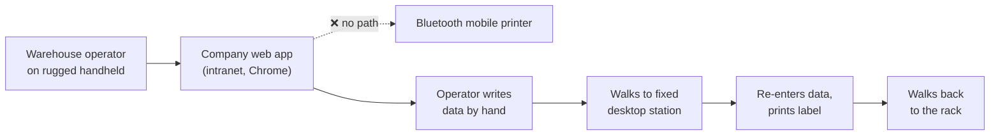
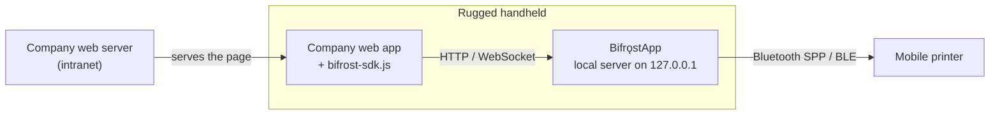

# Problem Statement

| Field | Value |
| --- | --- |
| Document ID | DISC-01 |
| Version | 1.0 |
| Date | 2026-08-22 |
| Status | Approved |
| Owner | Bearing Team |

---

## 1. Summary

Warehouse and inventory staff operate a web-based system on rugged Android handhelds. They need to
print part labels (barcode / QR stickers) and paper slips on a Bluetooth mobile printer carried on
the operator's belt.

**The web browser cannot talk to that printer.** This is not a configuration problem or a missing
driver — it is a hard architectural boundary in the web platform. This document establishes why the
boundary exists, why the common workarounds fail, and what a correct solution must look like.

---

## 2. Current situation

Today an operator who needs a label must leave the aisle, reach a fixed workstation, re-enter the
part number, print, and walk back. Every trip is a chance to transpose a digit, and every trip is
dead time.

---

## 3. Why the browser cannot reach the printer

### 3.1 Web Bluetooth speaks the wrong dialect

The Web Bluetooth API exposes **Bluetooth Low Energy (BLE) via the GATT profile only**. It has no
access to the **Serial Port Profile (SPP)** of Bluetooth Classic, and SPP is exactly what the
majority of mobile receipt and label printers expose. A printer can be paired, powered, and sitting
ten centimetres from the handheld, and `navigator.bluetooth.requestDevice()` will still never list
it.

Even where a printer does offer a BLE service, Web Bluetooth carries further constraints:

| Constraint | Consequence |
| --- | --- |
| Chromium engines only — no Safari, no Firefox | ~76% global browser coverage; zero on iOS |
| Requires a secure context (HTTPS) | Plain-HTTP intranet apps are excluded outright |
| Requires a fresh user gesture per device | No unattended or repeat printing |
| Chooser UI cannot be styled or pre-filtered by name reliably | Operators must identify their own printer from a raw device list, every session |
| GATT MTU is typically 20–512 bytes | A single label must be split into dozens of writes with manual flow control |

### 3.2 `window.print()` targets the wrong device class

Calling `window.print()` hands the job to the **Android Print Framework**, which is modelled around
office paper: A4/Letter page sizes, margins, print preview, page ranges. A 58 mm or 80 mm continuous
receipt, or a 100 × 50 mm die-cut label with a gap sensor, does not fit that model. The result is
scaled, cropped, margin-padded output — and no control at all over barcode density, cut commands, or
label gap advance.

### 3.3 The network is not a way around it

Reaching the printer over the LAN is not an option either. The printers in scope are **battery
powered and Bluetooth only** — they have no Wi-Fi radio and no IP address. And a browser page that
tries to reach any local-network address now faces Chrome's **Local Network Access** permission
prompt on top of mixed-content rules, adding a per-device consent step that operators would have to
clear repeatedly.

---

## 4. Why the obvious workarounds are rejected

| Workaround | Why it fails here |
| --- | --- |
| **Cloud print relay** (e.g. PrintNode-style) | Recurring cost; requires internet egress from an intranet-only network; adds seconds of latency to an action the operator waits on; stops working entirely when the uplink drops |
| **Printer with a built-in HTTP server** (Star CloudPRNT / Epson ePOS) | Only available on specific vendor hardware, mains-powered or Wi-Fi models — not on belt-worn battery printers; locks all future hardware purchasing to one vendor |
| **Generic Android print-service plugin** | Appears in the browser Print menu but offers no programmatic API. The web app cannot choose a template, set label size, or learn whether the job succeeded |
| **Rewrite the web app as a native Android app** | Discards a working system and its entire maintenance history to solve one narrow I/O problem |
| **Desktop bridge** (QZ Tray) | Mature and proven, but Windows/macOS/Linux only. There is no Android build, and the handheld is the whole point |

---

## 5. Business impact

| Impact | Description |
| --- | --- |
| **Wasted operator time** | Every label requires a round trip from the aisle to a fixed print station |
| **Transcription errors** | Part numbers and lot codes are copied by hand between screen and keyboard |
| **Delayed data capture** | Stock movements are recorded after the fact rather than at the rack, so system state lags physical state |
| **Blocked roadmap** | Any future workflow that depends on printing at the point of work — receiving, cycle counting, picking — cannot be built |

---

## 6. What a correct solution must do

A viable solution has to satisfy all of the following. These become the acceptance frame for the
requirements in [SRS](../02-requirements/02-srs.md).

| # | Requirement | Rationale |
| --- | --- | --- |
| P-1 | Reach **Bluetooth Classic SPP** printers, not just BLE | Covers the majority of the mobile printer market |
| P-2 | Be callable from **JavaScript in an ordinary web page** | The existing web app must stay the system of record |
| P-3 | Work over **plain HTTP and HTTPS** | The intranet app is HTTP today and will migrate later |
| P-4 | Require **no internet connection** | The network is intranet-only, and printing must survive Wi-Fi loss |
| P-5 | Give **byte-level control** over the output | Barcode density, label gap advance, and cut position must be exact |
| P-6 | **Never print a label twice** on retry | Duplicate stickers on stock are a data-integrity fault, not a cosmetic one |
| P-7 | Be **deployable and diagnosable across 20–100 devices** by one person | Team capacity is a single developer |

---

## 7. Proposed direction

Introduce **Bifrǫst** — a resident Android application on the handheld that acts as a bridge between
the browser and the printer.

Because the browser and the printer-connected app live on the **same physical device**, the web page
can address the app at `http://127.0.0.1`. Chrome exempts loopback addresses from mixed-content
blocking, so the call works from an HTTPS page without a certificate on the app and without a
Local Network Access prompt. No relay, no cloud, no LAN discovery.

The name is taken from **Bifrǫst**, the rainbow bridge of Norse mythology that connects two worlds
that otherwise cannot touch.

---

## 8. Out of scope

| Item | Note |
| --- | --- |
| Building or modifying the company web application | Bifrǫst ships a library the existing web app imports |
| iOS support | The device fleet is Android-only |
| Printing from a different device over the LAN | Deliberately excluded — see [ADR-001](../03-design/02-adr/ADR-001-loopback-vs-cloud-relay.md) |
| Thai or other complex-script rendering | Confirmed not required; content is English and numeric |
| Commercial distribution of the app | Internal use within one organisation |

---

## 9. Related documents

- [Stakeholder Interview](02-stakeholder-interview.md) — the decisions this statement is built on
- [Competitive Research](03-competitive-research.md) — the market survey behind Section 4
- [Product Requirements](../02-requirements/01-prd.md) — what gets built
