# 01 · ระบบทำงานอย่างไร

> สัญญาทางเทคนิคทั้งหมดในที่เดียว — API, รูปแบบข้อมูล, วงจรงานพิมพ์, ไดรเวอร์ และความปลอดภัย
> ← กลับไปที่ [ภาพรวม](README.md)

---

## 1. เส้นทางของงานพิมพ์หนึ่งงาน

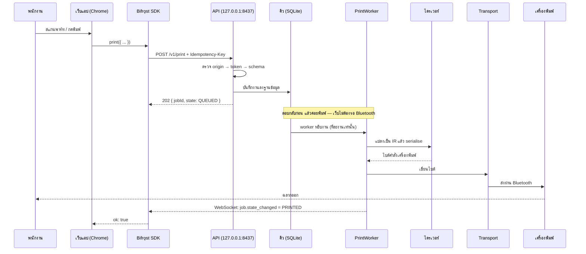

**จุดสำคัญ** — API ตอบ `202` ทันทีที่บันทึกงานลงฐานข้อมูลสำเร็จ **ไม่ใช่ตอนพิมพ์เสร็จ**
เพราะการรอ Bluetooth จะทำให้หน้าเว็บค้าง และถ้า HTTP timeout ไปแล้วเครื่องพิมพ์เพิ่งพิมพ์เสร็จ
ผู้เรียกจะไม่มีทางรู้ผลเลย

---

## 2. API — 10 endpoint

ฐาน: `http://127.0.0.1:8437/v1` · `Content-Type: application/json; charset=utf-8`

| Method | Path | ต้องมี token | ทำอะไร | สถานะปัจจุบัน |
| --- | --- | :-: | --- | :-: |
| `GET` | `/status` | — | สถานะ bridge, เครื่องพิมพ์, คิว — ใช้ตรวจก่อนจับคู่ได้ | ✅ |
| `POST` | `/pair` | — | แลก token จาก QR ที่สแกน | ⬜ |
| `GET` | `/capabilities` | ✓ | ความกว้างพิมพ์, dpi, symbology ที่รองรับ | ⬜ |
| `POST` | `/print` | ✓ | ส่งงานพิมพ์ (ทั้ง 3 ระดับ) | ✅ |
| `POST` | `/preview` | ✓ | เรนเดอร์โดยไม่พิมพ์ | ⬜ v1.1 |
| `GET` | `/jobs` | ✓ | รายการงาน | ⬜ |
| `GET` | `/jobs/{id}` | ✓ | สถานะงานเดียว | ⬜ |
| `POST` | `/jobs/{id}/cancel` | ✓ | ยกเลิกงานที่ยังไม่ส่ง | ⬜ |
| `GET` | `/templates` | ✓ | เทมเพลตบนเครื่องพร้อมฟิลด์ที่ต้องใช้ | ⬜ |
| `WS` | `/events` | ✓ | สถานะสดของงานและเครื่องพิมพ์ | ⬜ |

> ⬜ = SDK เขียนครบตามสเปกแล้ว แต่ bridge ยังตอบ `404` ซึ่ง SDK แปลงเป็น `NOT_FOUND`
> **โค้ดฝั่งเว็บที่เขียนวันนี้ไม่ต้องแก้เมื่อ bridge ทำเสร็จ**

### เหตุการณ์บน WebSocket

| เหตุการณ์ | ส่งเมื่อ | ข้อมูล |
| --- | --- | --- |
| `job.state_changed` | งานเปลี่ยนสถานะ | `jobId`, `state`, `previousState`, `attemptCount`, `error?` |
| `printer.state_changed` | การเชื่อมต่อเปลี่ยน | `state`, `name?`, `transport?` |
| `printer.error` | เครื่องพิมพ์แจ้งข้อผิดพลาด | `code`, `message`, `transient` |
| `printer.battery` | ระดับแบตเปลี่ยนอย่างมีนัย | `percent` |
| `queue.changed` | จำนวนงานในคิวเปลี่ยน | `pending`, `retrying` |
| `bridge.shutdown` | bridge กำลังปิด | `reason` |

---

## 3. รูปแบบข้อมูลที่ส่งพิมพ์ — 3 ระดับ

ทุกระดับยุบลงมาเป็นโครงสร้างกลางเดียวคือ `PrintDocument` **ไดรเวอร์จึงไม่เคยรู้ว่าคำสั่งมาจากระดับไหน**

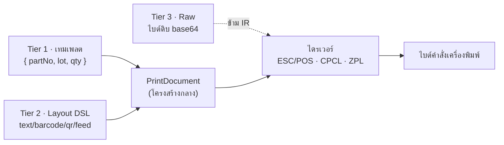

| ระดับ | ใช้เมื่อ | ตัวอย่าง | ใครคุมหน้าตาฉลาก |
| --- | --- | --- | --- |
| **1 เทมเพลต** | 90% ของงานจริง | `template('part-label', { partNo, lot, qty })` | **อยู่บนเครื่อง** — เปลี่ยนได้ไม่ต้อง deploy เว็บ |
| **2 DSL** | หน้าตาขึ้นกับข้อมูล | `doc().text(...).barcode(...).qr(...).feed(3)` | เว็บแอป |
| **3 Raw** | ทางออกฉุกเฉิน | `raw('ESCPOS', bytes)` | ผู้เรียกทั้งหมด |

### ชนิดของ element ใน Tier 2

| ชนิด | ฟิลด์บังคับ | หมายเหตุ |
| --- | --- | --- |
| `text` | `value` | ใช้ฟอนต์ในตัวเครื่องพิมพ์เท่านั้น ไม่แปลงเป็นรูป |
| `barcode` | `format`, `value` | ตรวจความถูกต้องตาม symbology ที่เลือก |
| `qr` | `value` | |
| `image` | `data` | ต้องเป็นเครื่องพิมพ์ที่รองรับ raster |
| `line` | — | เส้นเต็มความกว้าง |
| `feed` | `lines` หรือ `dots` | |
| `cut` | — | ไม่ทำอะไรถ้าเครื่องไม่มีที่ตัด |

### ลำดับการตรวจความถูกต้อง

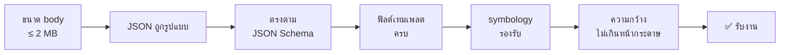

ตรวจจากถูกที่สุดไปแพงที่สุด — การวัดความกว้างต้องเรนเดอร์จริง จึงทำเป็นด่านสุดท้าย

---

## 4. วงจรชีวิตของงานพิมพ์

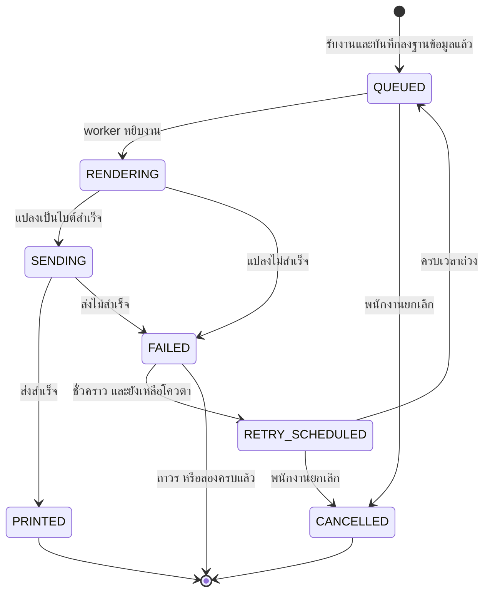

### กฎการลองใหม่

| ประเภทข้อผิดพลาด | ลองใหม่? | ตัวอย่าง |
| --- | :-: | --- |
| ชั่วคราว (`transient: ✓`) | ✅ | กระดาษหมด · เครื่องพิมพ์หลุด · timeout · คิวเต็ม |
| ถาวร (`transient: ✗`) | ❌ | payload ผิด · ฉลากกว้างเกิน · element ที่เครื่องไม่รองรับ · token ผิด |

- ลองสูงสุด **5 ครั้ง** ถ่วงเวลา **2 วิ → 8 วิ → 30 วิ → 120 วิ → 300 วิ**
- **ถ้าเครื่องพิมพ์ยังไม่เชื่อมต่อ จะไม่นับเป็นการลอง** — งานค้างรอที่ `RETRY_SCHEDULED`
  จนกว่าเครื่องพิมพ์กลับมา ไม่งั้นเดินออกนอกระยะ Bluetooth 5 นาทีจะเผาโควตาหมดโดยยังไม่เคยแตะเครื่องพิมพ์เลย

### `SENDING` เมื่อแอปพังกลางคัน — ไม่ลองใหม่อัตโนมัติ

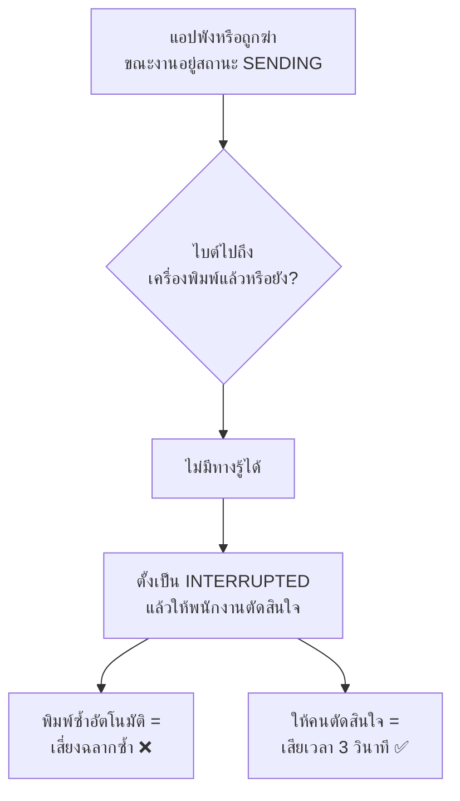

ฉลากซ้ำคือความคลาดเคลื่อนของข้อมูล ส่วนการถามคนคือความไม่สะดวก — เลือกอย่างหลัง

### การกันพิมพ์ซ้ำ (Idempotency)

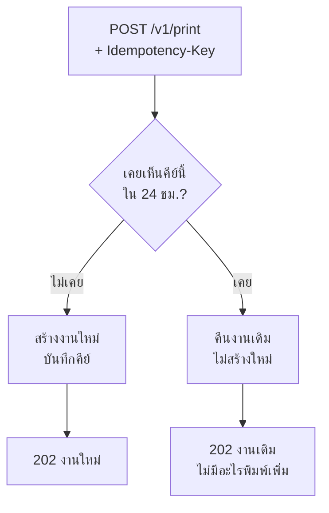

SDK สร้างคีย์ให้อัตโนมัติ และ **ใช้คีย์เดิมซ้ำเมื่อลองใหม่** นี่คือสิ่งที่ทำให้ timeout ที่ไม่รู้ผล
เป็นเรื่องปลอดภัย — ถ้า bridge รับงานไปแล้ว การลองใหม่จะได้งานเดิมกลับมา ไม่ใช่ฉลากใบที่สอง

---

## 5. รหัสข้อผิดพลาด

โครงสร้างเดียวกันทุกครั้ง: `code` (คงที่ ไม่แปล) · `message` (ภาษาคนอ่าน แสดงให้พนักงานได้เลย) ·
`transient` (ลองใหม่แล้วมีโอกาสสำเร็จไหม) · `field` (ตำแหน่งที่ผิด สำหรับ validation)

### ข้อผิดพลาดของ API

| HTTP | รหัส | ชั่วคราว | ความหมาย |
| :-: | --- | :-: | --- |
| 400 | `VALIDATION_ERROR` | ✗ | payload ไม่ผ่าน schema |
| 400 | `MALFORMED_JSON` | ✗ | body ไม่ใช่ JSON |
| 401 | `UNAUTHORIZED` / `INVALID_TOKEN` | ✗ | ไม่มี token หรือ token ผิด |
| 403 | `ORIGIN_NOT_ALLOWED` | ✗ | origin ไม่อยู่ในรายการที่อนุญาต |
| 404 | `JOB_NOT_FOUND` / `TEMPLATE_NOT_FOUND` | ✗ | ไม่พบงานหรือเทมเพลต |
| 409 | `PRINTER_NOT_CONNECTED` | ✓ | ไม่มีการเชื่อมต่อเครื่องพิมพ์ |
| 409 | `JOB_NOT_CANCELLABLE` | ✗ | งานกำลังส่งอยู่ หรือจบไปแล้ว |
| 409/410 | `PAIRING_ALREADY_USED` / `PAIRING_EXPIRED` | ✗ | QR ถูกใช้แล้ว หรือเกิน 5 นาที |
| 413 | `PAYLOAD_TOO_LARGE` | ✗ | body เกิน 2 MB |
| 422 | `CONTENT_TOO_WIDE` | ✗ | ความกว้างที่เรนเดอร์เกินหน้ากระดาษ |
| 422 | `UNSUPPORTED_ELEMENT` | ✗ | เครื่องพิมพ์นี้ไม่รองรับ element นั้น |
| 422 | `MISSING_TEMPLATE_FIELD` | ✗ | ฟิลด์ที่เทมเพลตต้องการหายไป |
| 429 | `QUEUE_FULL` | ✓ | คิวเต็ม 500 งาน |
| 500 | `INTERNAL_ERROR` | ✓ | ข้อผิดพลาดที่ไม่คาดคิด |
| 503 | `BRIDGE_NOT_READY` | ✓ | บริการกำลังเริ่มหรือกำลังปิด |

### ข้อผิดพลาดของเครื่องพิมพ์ — ข้อความที่พนักงานเห็น

| รหัส | ชั่วคราว | ข้อความ / สิ่งที่พนักงานต้องทำ |
| --- | :-: | --- |
| `PRINTER_OUT_OF_PAPER` | ✓ | กระดาษหมด → ใส่ม้วนใหม่ ระบบพิมพ์ต่อเอง |
| `PRINTER_COVER_OPEN` | ✓ | ฝาเปิดอยู่ → ปิดฝาให้แน่น |
| `PRINTER_PAPER_JAM` | ✓ | กระดาษติด → เปิดฝา ดึงออก |
| `PRINTER_BATTERY_LOW` | ✓ | แบตต่ำ → ชาร์จหรือเปลี่ยนก้อน |
| `PRINTER_OVERHEATED` | ✓ | ร้อนเกินไป → รอประมาณ 1 นาที |
| `PRINTER_DISCONNECTED` | ✓ | หลุดการเชื่อมต่อ → เปิดเครื่องพิมพ์ อยู่ในระยะไม่กี่เมตร |
| `TRANSMIT_TIMEOUT` | ✓ | เครื่องพิมพ์หยุดตอบสนอง → ระบบลองใหม่เอง |

### รหัสที่ SDK สร้างเองฝั่งเว็บ (bridge ไม่เคยส่ง)

`BRIDGE_UNAVAILABLE` · `BRIDGE_TIMEOUT` · `JOB_TIMEOUT` · `REQUEST_ABORTED`

> `REQUEST_ABORTED` แยกจาก timeout โดยตั้งใจ เพราะ "ผู้ใช้เปลี่ยนหน้าไปแล้ว" กับ "bridge ค้าง"
> ต้องจัดการคนละแบบ

---

## 6. ไดรเวอร์และการเชื่อมต่อ

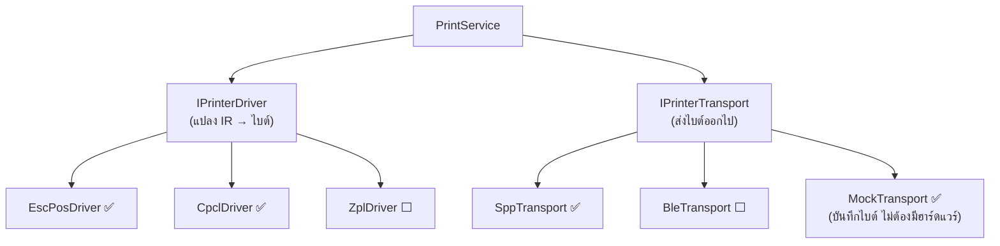

**สองมิตินี้ผันแปรอิสระจากกัน** — ภาษาเครื่องพิมพ์กับวิธีเชื่อมต่อไม่เกี่ยวกัน เครื่อง CPCL อาจต่อ
ผ่าน SPP หรือ BLE ก็ได้ จึงแยกเป็นสอง interface ไม่ใช่ตัวเดียว

### เปรียบเทียบภาษาเครื่องพิมพ์

| ประเด็น | ESC/POS | CPCL | ZPL |
| --- | --- | --- | --- |
| ที่มา | Epson — มาตรฐานโดยพฤตินัยของใบเสร็จ | Zebra (รุ่นมือถือ) | Zebra (ฉลาก) |
| การวางตำแหน่ง | ตามลำดับ (`SEQUENTIAL`) | ระบุพิกัด (`ABSOLUTE`) | ระบุพิกัด |
| สื่อหลัก | ม้วนต่อเนื่อง | ฉลากไดคัท | ฉลากไดคัท |
| รูปแบบคำสั่ง | ไบนารี escape | ข้อความ ASCII | ข้อความ ASCII |
| บาร์โค้ด / QR | `GS k` / `GS ( k` | `BARCODE` / `B QR` | `^BC` / `^BQ` |
| รูปภาพ | `GS v 0` | `EG` | `^GF` |
| ถามสถานะ | `DLE EOT n` | `! U1 getvar` | `~HS` |

### ความกว้างที่พิมพ์ได้จริง

| สื่อ | กว้างพิมพ์ได้ | 203 dpi | 300 dpi |
| --- | :-: | :-: | :-: |
| ม้วน 58 มม. | 48 มม. | 384 dots | 576 dots |
| ม้วน 80 มม. | 72 มม. | **576 dots** | 864 dots |
| ฉลาก 4 นิ้ว | 104 มม. | 832 dots | 1248 dots |

> **ความกว้างที่พิมพ์ได้แคบกว่าความกว้างของสื่อเสมอ** และการเดาค่านี้คือสาเหตุอันดับหนึ่งของฉลาก
> ที่ถูกตัดขอบ — ให้อ่านจาก `getCapabilities()` เสมอ Zebra ZQ320 ที่ใช้ทดสอบอยู่คือ 576 dots

### กฎ 8 ข้อของ BLE ที่ห้ามผ่อนปรน

ส่วนที่เสี่ยงที่สุดของทั้งระบบ และเป็นจุดที่โครงการลักษณะนี้มักพัง

| # | กฎ | ถ้าไม่ทำ |
| :-: | --- | --- |
| 1 | ใช้ write แบบรอ ack เสมอ ไม่ใช่ `NoResponse` | ข้อมูลล้น buffer เครื่องพิมพ์เงียบ ๆ ฉลากขาดกลางใบ |
| 2 | รอ callback ของ chunk ก่อนส่งชิ้นถัดไป | Android BLE stack มีคิวเดียว การส่งพร้อมกันจะถูกทิ้ง |
| 3 | ขนาด chunk = `MTU − 3` ไม่ใช่ `MTU` | 3 ไบต์เป็น overhead ของ ATT |
| 4 | ถ้าเจรจา MTU ไม่สำเร็จ ให้ถอยไปที่ 23 (payload 20 ไบต์) | เครื่องพิมพ์บางรุ่นไม่สนใจ `RequestMtu` เลย |
| 5 | อ่านค่า MTU จริงจาก callback อย่าเชื่อว่าที่ขอไปสำเร็จ | ค่าที่เจรจาได้มักต่ำกว่าที่ขอ |
| 6 | ให้ทุก GATT operation ผ่านคิวตัวเดียว | Android stack ไม่ปลอดภัยต่อการเรียกพร้อมกัน และล้มเหลวแบบเงียบ |
| 7 | ตั้ง timeout ต่อ chunk ที่ 5 วินาที | การเชื่อมต่อที่ตายแล้วจะค้าง worker จนหมดเวลางาน |
| 8 | คำนวณขนาด chunk ใหม่ทุกครั้งที่เชื่อมต่อใหม่ | MTU เจรจาใหม่ทุกการเชื่อมต่อ |

**ความเร็วที่คาดหวัง** — ที่ MTU 512 ประมาณ 8–15 KB/s · ฉลากรูปภาพ 40 KB ใช้เวลา 3–5 วินาที ·
ฉลากข้อความ+บาร์โค้ดปกติไม่ถึง 2 KB จบในไม่ถึงวินาที **นี่คือเหตุผลที่ใช้ฟอนต์ในตัวเครื่องพิมพ์
แทนการแปลงข้อความเป็นรูป**

---

## 7. ความปลอดภัย

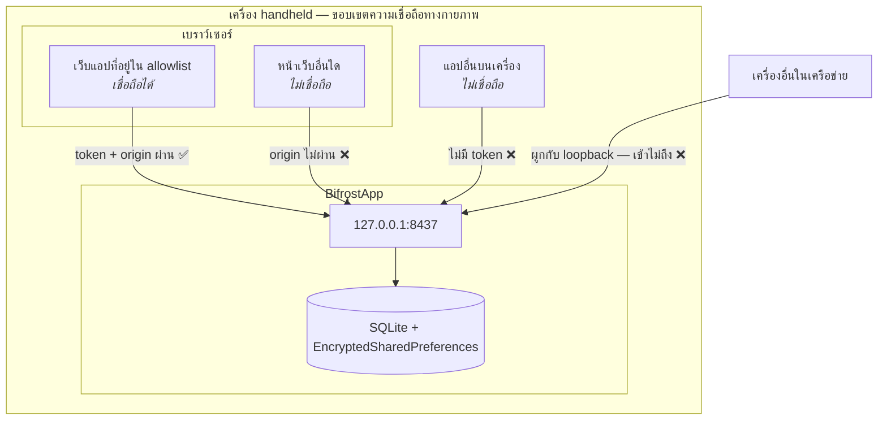

| ขอบเขต | มาตรการ |
| --- | --- |
| เครือข่าย → แอป | ผูก socket กับ loopback เท่านั้น ไม่เคยเป็น `0.0.0.0` |
| แอปอื่นบนเครื่อง → แอป | Bearer token |
| หน้าเว็บอื่น → แอป | Origin allowlist + token |
| แอป → เครื่องพิมพ์ | การจับคู่ Bluetooth ระดับระบบปฏิบัติการ |
| แอป → ที่เก็บข้อมูล | `EncryptedSharedPreferences` สำหรับความลับ |

### ลำดับการตรวจของทุก request

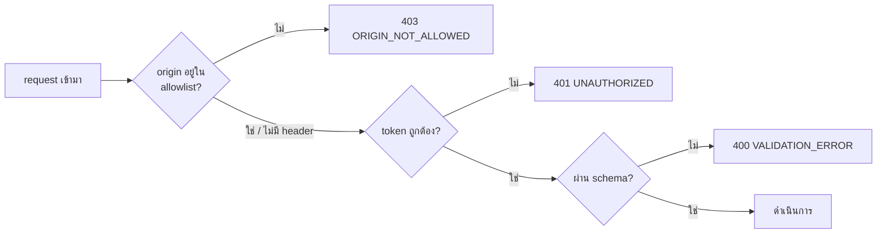

### การจับคู่ด้วย QR

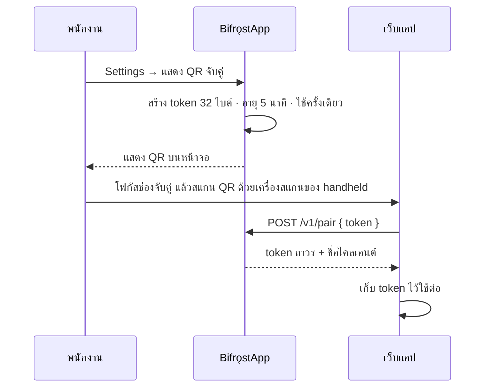

**ใช้เครื่องสแกนที่ handheld มีอยู่แล้ว** แทนการให้พนักงานพิมพ์รหัส 43 ตัวอักษรด้วยมือทั้งที่ใส่ถุงมือ

### สิ่งที่ห้ามหลุดลง log

token · เนื้อหา payload · ไบต์คำสั่งดิบ — เพราะไฟล์ log ถูกส่งออกเป็น diagnostics ให้ IT
มีตัวกรองที่ระดับ sink ของ Serilog บังคับไว้

---

## 8. เครื่องพิมพ์จำลอง (MockTransport)

สิ่งที่ทำให้ 4 เฟสแรกเดินได้โดยไม่ต้องรอซื้อเครื่องพิมพ์ และเป็นสิ่งที่สร้างขึ้นเป็นอันดับแรกของโครงการ

| สถานการณ์จำลอง | ใช้ทดสอบ |
| --- | --- |
| ปกติ | เส้นทางที่ควรสำเร็จ + เก็บไบต์ไว้เทียบแบบ golden output |
| หลุดการเชื่อมต่อ | การลองใหม่และการกู้คืน |
| กระดาษหมด | ข้อความที่พนักงานเห็นและการพิมพ์ต่อ |
| ส่งได้ไม่ครบแล้วตัด (`TruncateAt`) | ทำอาการ BLE ที่เกิดเป็นครั้งคราวให้เกิดซ้ำได้ทุกครั้ง |
| ช้ามาก | timeout |

---

## 9. โครงสร้างการทดสอบ

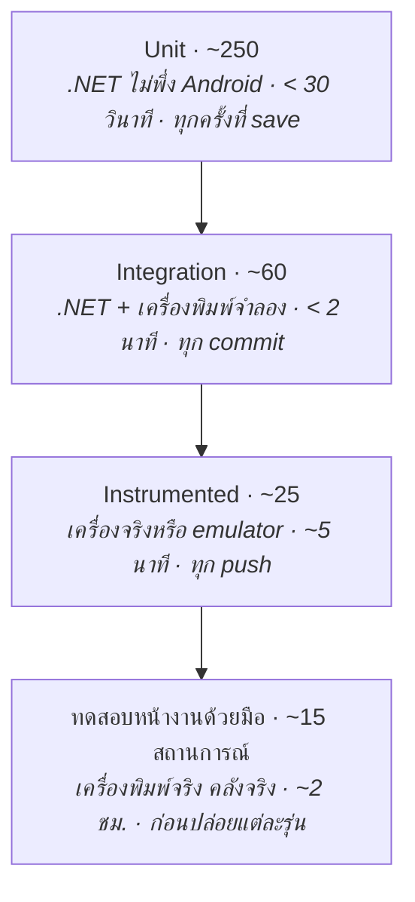

ฐานกว้างโดยตั้งใจ — เมื่อมีผู้พัฒนาคนเดียว ชุดเทสต์ที่ใช้เวลา 10 นาทีคือชุดเทสต์ที่จะเลิกถูกรัน

### สถานการณ์ทดสอบหน้างานที่สำคัญที่สุด

| # | สถานการณ์ | ผลที่ต้องได้ |
| :-: | --- | --- |
| F-02 | ดึงกระดาษออกกลางงาน | เตือนชัดเจน ใส่กระดาษแล้วพิมพ์ต่อเอง **ได้ฉลาก 1 ใบ** |
| F-03 | ปิดเครื่องพิมพ์กลางงาน | ตั้งเป็น `INTERRUPTED` **ไม่พิมพ์ซ้ำอัตโนมัติ** |
| F-06 | กดปุ่มพิมพ์รัว ๆ ตอนกระดาษหมด | ใส่กระดาษแล้วได้ **ฉลากใบเดียว** |
| F-07 | รีบูตเครื่องขณะมีงานค้างคิว | คิวเดินต่อเอง พนักงานไม่ต้องทำอะไร |
| F-08 | ปิด Wi-Fi ทั้งหมดแล้วพิมพ์ | ทำงานปกติ |
| **F-10** | **พิมพ์แล้วสแกนฉลากด้วยเครื่องสแกน** | **บาร์โค้ดและ QR อ่านขึ้นครั้งแรก** |
| F-13 | พนักงานที่ไม่เคยอบรมตั้งค่าเองด้วยเอกสาร 1 หน้า | เสร็จภายใน 3 นาที |

> **F-10 ไม่ใช่ตัวเลือก** — ฉลากที่พิมพ์ออกมาสวยแต่สแกนไม่ขึ้นคือข้อบกพร่องที่โครงการนี้อาจส่งมอบ
> ออกไปโดยไม่มีใครสังเกต

---

## อ่านต่อ

- [คู่มือนักพัฒนา](02-developer-guide.md) — เอาไปใช้จริงอย่างไร
- [คู่มือใช้งานและดูแลระบบ](03-operations.md) — ติดตั้งและแก้ปัญหา
- โค้ดคือแหล่งความจริงที่แม่นกว่าเอกสารเสมอ — `sdk/README.md` และ `clients/dotnet/README.md`
  มีตัวอย่างครบทุกเฟรมเวิร์ก
