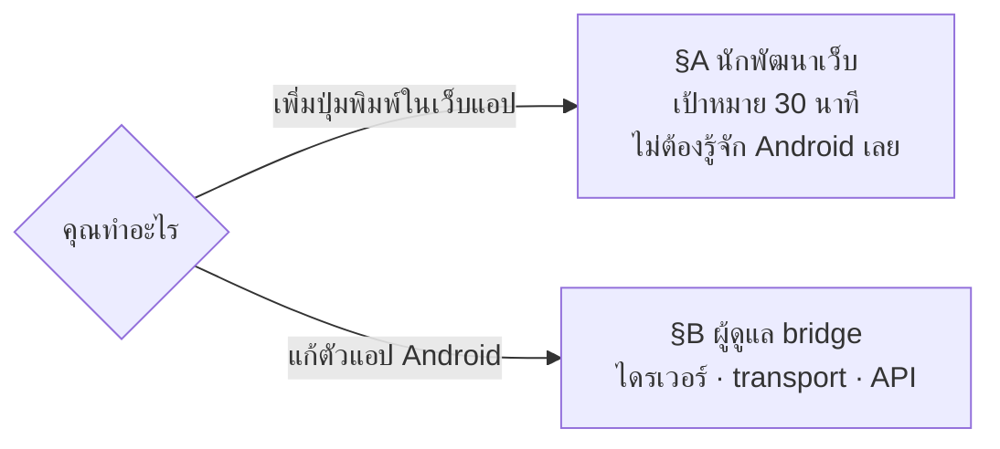
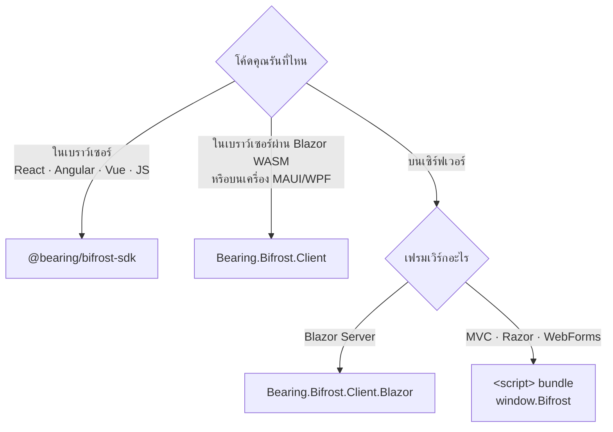
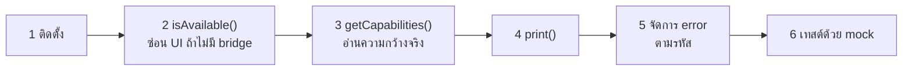
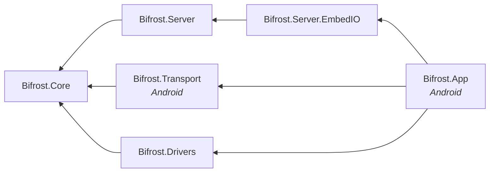
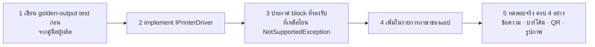
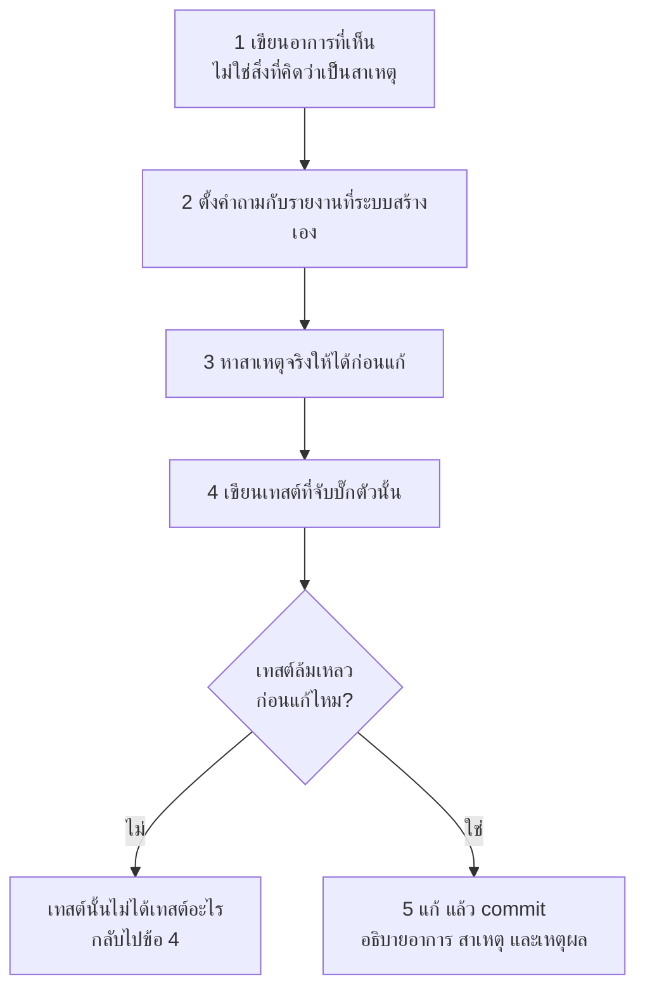

# 02 · คู่มือนักพัฒนา

> นักพัฒนาในโครงการนี้มี 2 กลุ่ม งานคนละแบบสิ้นเชิง
> ← กลับไปที่ [ภาพรวม](README.md) · สัญญาทางเทคนิคอยู่ที่ [ระบบทำงานอย่างไร](01-how-it-works.md)



---

# §A · นักพัฒนาเว็บ

## A.1 เลือกไลบรารีให้ตรง — กฎข้อเดียวคือ *โค้ดของคุณรันที่ไหน*



> **C# ฝั่งเซิร์ฟเวอร์เรียก `http://127.0.0.1:8437` ไม่ได้** — นั่นคือ loopback ของ*เซิร์ฟเวอร์*
> ไม่ใช่ของเครื่องที่พนักงานถือ ไม่มีการตั้งค่าใดแก้ได้ นี่คือราคาที่จ่ายแลกกับการไม่ต้องมีใบรับรอง
> ไม่ต้องมี relay และไม่ต้องเปิดพอร์ตเข้าเครื่อง

## A.2 หกขั้นตอน



### โค้ดทั้งหมดที่ต้องเขียน

```ts
import { BifrostClient, template } from '@bearing/bifrost-sdk';

const bifrost = new BifrostClient();

// 2 — ไม่มีวัน throw หน้าเว็บบนเดสก์ท็อปก็แค่ไม่แสดงปุ่มพิมพ์
if (!(await bifrost.isAvailable())) return hidePrintUi();

// 3 — อย่าเดาความกว้าง นี่คือสาเหตุอันดับหนึ่งของฉลากถูกตัดขอบ
const caps = await bifrost.getCapabilities();

// 4 — Tier 1 เมื่อทำได้ เพราะ layout จะอยู่บนเครื่อง ไม่ต้อง deploy เว็บเมื่อฝ่ายคลังขอแก้ฉลาก
const r = await bifrost.print(
  template('part-label', { partNo: '6205-2RS', lot: 'L2408-0231', qty: 50 }),
);

// 5 — TypeScript จะไม่ยอมให้ลืมเคสล้มเหลว
if (r.ok) return toast(`printed - job ${r.value.jobId}`);

switch (r.error.code) {
  case 'UNAUTHORIZED':         return showPairingDialog();
  case 'PRINTER_OUT_OF_PAPER': return toast(r.error.message);   // แสดงให้พนักงานอ่านได้ตรง ๆ
  case 'CONTENT_TOO_WIDE':     return console.error('layout bug at', r.error.field);
  default:                     return toast(r.error.transient ? 'ขัดข้องชั่วคราว ลองใหม่' : r.error.message);
}
```

### รับสถานะสด — แนะนำอย่างยิ่ง

```ts
bifrost.on('printer.state_changed', ({ state }) => {
  printButton.disabled = state !== 'READY';
});
```

**ปุ่มที่กดไม่ได้ตอนเครื่องพิมพ์ไม่พร้อม ดีกว่าปุ่มที่กดได้แล้วขึ้น error**

### เทสต์โดยไม่ต้องมีเครื่องพิมพ์

```ts
import { MockBifrostClient } from '@bearing/bifrost-sdk/testing';

const bifrost = new MockBifrostClient({ printerState: 'READY' });
await clickPrint(bifrost);
expect(bifrost.printedJobs).toHaveLength(1);

bifrost.setPrinterState('DISCONNECTED');          // ยิง event เหมือน bridge จริง
bifrost.failNext({ code: 'QUEUE_FULL', message: '…', transient: true });
```

mock กันคีย์ idempotency ซ้ำและปฏิเสธการพิมพ์เมื่อเครื่องพิมพ์ไม่พร้อม **เหมือนของจริง**
คอมโพเนนต์ที่ต้องรับมือกับการกดสองครั้งจึงเทสต์ได้โดยไม่ต้องมีฮาร์ดแวร์

## A.3 หลักการที่ต้องเข้าใจ

| หลักการ | รายละเอียด |
| --- | --- |
| **ไม่ throw สำหรับสถานะที่คาดไว้** | กระดาษหมด เครื่องพิมพ์หลุด ไม่มี bridge — คืนเป็นค่า ไม่ใช่ exception |
| **`r.error.message` แสดงให้พนักงานได้ทันที** | เขียนมาให้เป็นภาษาที่ทำอะไรต่อได้แล้ว ไม่ต้องแปลเอง |
| **`r.error.transient` บอกว่าควรลองใหม่ไหม** | อย่าตัดสินเองจากรหัส |
| **`CONTENT_TOO_WIDE` คือบั๊กของคุณ** | ไม่ใช่ปัญหาพนักงาน ให้ log ไม่ใช่ toast |
| **ถ้าเขียน retry เอง ต้องใช้ `Idempotency-Key` เดิม** | สร้างคีย์ใหม่ = การกันซ้ำไม่ทำงาน |

## A.4 ข้อผิดพลาดที่พบบ่อย

| อาการ | สาเหตุ | แก้ |
| --- | --- | --- |
| ได้ `403` ทั้งที่ทุกอย่างดูปกติ | URL ไม่ตรง allowlist ทุกตัวอักษร | `http://intranet.local` ≠ `http://intranet.local:80` — ตรวจ scheme, host, port |
| หน้ารีโหลดทับการสั่งพิมพ์ | ปุ่มใน WebForms ทำ postback | `OnClientClick="printLabel(); return false;"` หรือ `<button type="button">` |
| เปิด event socket ซ้ำซ้อน | สร้าง `BifrostClient` หลายตัว | สร้างตัวเดียวที่ root · React ใช้ `BifrostProvider` |
| ฉลากถูกตัดขอบ | เดาความกว้าง | เรียก `getCapabilities()` |
| ทุกคำขอแก้ฉลากกลายเป็นงาน deploy | เขียน layout ไว้ในโค้ดเว็บ | ใช้ Tier 1 |

---

# §B · ผู้ดูแล bridge

## B.1 เตรียมเครื่องพัฒนา

| ต้องมี | เวอร์ชัน |
| --- | --- |
| .NET SDK | 10.0.300+ |
| .NET Android workload | `dotnet workload install android` |
| Node.js | 20+ |
| เครื่อง Android | API 29+ |
| เครื่องพิมพ์ Bluetooth | Zebra ZQ320 (ปัจจุบัน) — **ไม่จำเป็นสำหรับงาน 80%** |

## B.2 เทคโนโลยีที่ใช้ และที่ตั้งใจไม่ใช้

| ส่วน | เลือก | เพราะ |
| --- | --- | --- |
| ภาษา / รันไทม์ | C# 13 · .NET 10 (LTS) | ภาษาที่องค์กรดูแลต่อได้ · LTS เหมาะกับแอปที่ดูแลโดยคนเดียว |
| แพลตฟอร์ม | `net10.0-android` ไม่ใช้ MAUI | UI มี 6 หน้าจอ เนื้อหาจริงคือ Bluetooth |
| HTTP + WebSocket | EmbedIO หลัง `IBridgeServer` | **ASP.NET Core ไม่มี runtime pack สำหรับ android-arm64** |
| ฐานข้อมูล | Microsoft.Data.Sqlite + Dapper | ไม่ต้องมี ORM · คุมคิวรีของคิวได้เต็มที่ · ประหยัดขนาด APK |
| Serialisation | System.Text.Json แบบ source-generated | เลี่ยง reflection ทำให้ trimming บน Android คาดเดาได้ |
| Log | Serilog + file sink | หมุนไฟล์ตามขนาดได้ในตัว · ตัวกรอง token อยู่ที่ระดับ sink |
| บาร์โค้ด / QR | ZXing.Net | เป็น managed ล้วน รันใน `Drivers` ได้โดยไม่พึ่ง Android |
| ที่เก็บความลับ | AndroidX Security Crypto | `EncryptedSharedPreferences` |

**ที่ตั้งใจไม่ใช้** — ASP.NET Core (ไม่รันบน Android) · MAUI (ไม่คุ้มกับ 6 หน้าจอ) ·
EF Core (หนักเกินสำหรับ 6 ตาราง) · SDK ของผู้ผลิตเครื่องพิมพ์ (ผูกกับยี่ห้อเดียว) ·
`HttpClient` (แอปนี้เป็นเซิร์ฟเวอร์ ไม่เคยเรียกออก) · Firebase/analytics ใด ๆ (ต้องใช้อินเทอร์เน็ต)

## B.3 โครงสร้าง repository และกฎการพึ่งพา

```
BifrǫstApp/
├── Docs/               เอกสาร 5 ฉบับ
├── src/                แอปและแกนกลาง (C#)
├── sdk/                TypeScript SDK + เทสต์ 72 ตัว
├── clients/dotnet/     ไคลเอนต์ .NET
├── tests/              เทสต์ฝั่ง C# 86 ตัว
└── tools/scripts/      verify-boundaries.sh
```



**ลูกศรชี้ทางเดียวเสมอ และ `Core` / `Drivers` / `Server` ห้ามมี `using Android`**

| กฎ | ตรวจโดย | เหตุผล |
| --- | --- | --- |
| `Core`, `Drivers`, `Server` ไม่พึ่ง Android และไม่ target `net10.0-android` | `verify-boundaries.sh` | ทำให้เทสต์ 86 ตัวรันบนเครื่องพัฒนาได้ใน < 1 วินาที ถ้าละเมิดต้องเสียบเครื่องทุกครั้ง |
| `using EmbedIO` อยู่ได้เฉพาะใน `Bifrost.Server.EmbedIO` | `verify-boundaries.sh` | ถ้าหลุดออกมา ทางหนีเมื่อต้องเปลี่ยนไลบรารีเซิร์ฟเวอร์ก็ปิด |
| manifest รุ่น Release ห้ามมีสิทธิ์ `INTERNET` | `verify-boundaries.sh` | ระบบไม่ต่ออินเทอร์เน็ตโดยการออกแบบ และเป็นสิ่งที่ตรวจสอบได้ |
| APK รุ่น Release ≤ 30 MB | `verify-boundaries.sh` | ติดตั้งผ่าน MDM ข้าม 20–100 เครื่อง |

> `using` ที่หลุดมาจะคอมไพล์ผ่านสบาย ๆ และไปกัดเอาตอนที่ต้องการ abstraction จริง ๆ
> จึงตรวจด้วยสคริปต์ ไม่ใช่ด้วยวินัย

## B.4 วงจรการทำงานประจำวัน


```bash
# วงในสุด — ไม่ต้องมี Android ไม่ต้องมีเครื่องพิมพ์
dotnet test tests/Bifrost.Core.Tests/Bifrost.Core.Tests.csproj
dotnet test tests/Bifrost.Drivers.Tests/Bifrost.Drivers.Tests.csproj

cd sdk && npm run verify              # typecheck + test + build
bash tools/scripts/verify-boundaries.sh Release
dotnet build src/Bifrost.App -t:Install -c Debug
```

ผลที่ควรได้ ณ 28 ส.ค. 2026 — **190 เทสต์ผ่านทั้งหมด** (C# 86 · ไคลเอนต์ .NET 32 · SDK 72)

## B.5 มาตรฐานการเขียนโค้ด

| กฎ | เหตุผล |
| --- | --- |
| ใช้ `Result` ไม่ใช่ exception สำหรับความล้มเหลวที่คาดไว้ | กระดาษหมดไม่ใช่เหตุการณ์พิเศษ มันคือสภาพปกติของคลัง |
| ข้อความ error ต้องบอกพนักงานได้ว่าต้องทำอะไรต่อ | "ใส่กระดาษแล้วระบบจะพิมพ์ต่อเอง" ไม่ใช่ `IOException` |
| ห้ามกลืน exception เงียบ ๆ | ปัญหาที่มองไม่เห็นแพงกว่าปัญหาที่เห็น |
| ห้ามให้ token · payload · ไบต์ดิบ หลุดลง log | log ถูกส่งออกเป็นไฟล์ diagnostics ให้ IT |
| ไดรเวอร์ต้องมี golden-output test | เทียบไบต์ต่อไบต์ ไม่ใช่แค่ "เรียกแล้วไม่ error" |
| ส่งงานเข้าเครื่องพิมพ์ครั้งละ 1 งาน | ครึ่งฉลากพิมพ์ทับกันไม่คุ้มกับการประหยัด semaphore ตัวเดียว |
| ข้อความ commit บอกว่า **ทำไม** | ดู `git log` เป็นตัวอย่าง — ทุก commit บอกอาการ สาเหตุจริง และเหตุผลที่เลือกวิธีนี้ |

### Definition of Done

- [ ] `dotnet build` ผ่านโดยเปิด `TreatWarningsAsErrors` (รวม nullable และ trim)
- [ ] `dotnet format --verify-no-changes` ผ่าน
- [ ] มีเทสต์ครอบพฤติกรรมใหม่ และชุดเทสต์ทั้งหมดเขียว
- [ ] error ที่พนักงานเห็นมีข้อความภาษาคนอ่านรู้เรื่อง
- [ ] ไม่มี token · payload · ไบต์ดิบ หลุดลง log
- [ ] ไม่มี `Android.*` ใน `Core`/`Drivers` และไม่มี `EmbedIO` นอกอะแดปเตอร์
- [ ] อัปเดตเอกสารถ้า API, schema หรือค่าคงที่เปลี่ยน
- [ ] **ทดสอบด้วยมือกับเครื่องพิมพ์จริง** หรือกับ `MockTransport` พร้อมเหตุผลว่าทำไมพอ

## B.6 งานที่ทำบ่อย

### เพิ่มไดรเวอร์ภาษาใหม่ (ZPL, TSPL)



`NotSupportedException` จะกลายเป็น `UNSUPPORTED_ELEMENT` แบบถาวร (ไม่ลองใหม่) ให้เอง

### เพิ่ม endpoint ใหม่

1. ประกาศ route ใน `src/Bifrost.Server/BridgeApi.cs` — **ห้ามมี type ของ EmbedIO ในไฟล์นี้**
2. แมป error → HTTP status ที่เมธอด `FromError` **จุดเดียว** เพื่อไม่ให้ error ใหม่หลุดออกไป
   พร้อม status ที่ชวนเข้าใจผิด
3. เพิ่มเมธอดใน SDK และไคลเอนต์ .NET ให้สัญญาตรงกัน แล้วเขียนเทสต์ทั้งสองฝั่ง

### แก้บั๊กที่เจอจากเครื่องจริง



## B.7 บทเรียนจากต้นแบบ

ห้าเรื่องนี้เสียเวลาไปจริง และคนรับช่วงงานควรรู้ก่อน

| บทเรียน | รายละเอียด |
| --- | --- |
| **เครื่องพิมพ์มือถือรับได้ครั้งละ 1 การเชื่อมต่อ** | ตัวตรวจภาษาเคยเปิดการเชื่อมต่อของตัวเองซ้อนกับที่ service ถืออยู่ จึงล้มเหลวก่อนถึงเครื่องพิมพ์ แล้วรายงานว่า "ไม่ตอบ" — ต้องใช้การเชื่อมต่อที่มีอยู่แล้วเสมอ |
| **`Stream.ReadAsync` บน `BluetoothSocket.InputStream` ไม่สนใจ CancellationToken** | เป็น Java stream การอ่านจะบล็อกตลอดกาลแม้ `CancelAfter` ยิงตรงเวลา ต้องแข่งกับตัวจับเวลาจริง |
| **"เครื่องพิมพ์ตอบไหม" ≠ "เครื่องพิมพ์พูดภาษาอะไร"** | เครื่องที่ตั้งเป็น line_print ก็ตอบ แต่จะพิมพ์คำสั่งออกมาเป็นตัวหนังสือ ต้องอ่าน**เนื้อหา**ที่ตอบกลับ |
| **ไดรเวอร์เข้ารหัส ASCII เท่านั้น** | อักขระนอก ASCII กลายเป็น `?` เงียบ ๆ จึงปฏิเสธตั้งแต่ต้นทางแทนที่จะพิมพ์ผิดออกมา |
| **ฉลากทดสอบต้องมีครบ 4 อย่าง** | ข้อความ · บาร์โค้ด · QR · รูปภาพ พังแยกจากกันได้ การทดสอบแค่สองอย่างแรกเคยทำให้ไดรเวอร์ ESC/POS "ดูปกติ" บนเครื่องที่พูด CPCL |

> **จุดร่วมของสองข้อแรก** — ทั้งคู่ให้ข้อสรุปผิดอันเดียวกันคือ "เครื่องพิมพ์ไม่ตอบ" ทั้งที่เครื่องพิมพ์
> ตอบตลอด อย่าเชื่อรายงานที่ระบบสร้างเอง จนกว่าจะพิสูจน์ว่ากลไกที่สร้างรายงานนั้นถูกต้อง

## B.8 สิ่งที่รอทำในเฟสถัดไป

| เฟส | ต้องทำ | ไฟล์ที่เกี่ยวข้องวันนี้ |
| :-: | --- | --- |
| 2 | คิว SQLite · `IdempotencyGuard` · `RetryPolicy` | `PrintService.cs` — ปัจจุบันเป็นตัวแทนชั่วคราวของ `PrintWorker` |
| 3 | ตัวแก้เทมเพลต · ตรวจ JSON Schema | `DslCompiler.cs` |
| 4 | ไดรเวอร์ ZPL | `src/Bifrost.Drivers/` |
| 5 | BLE + `ChunkWriter` + `GattOperationQueue` | `src/Bifrost.Transport/` |
| 6 | อีก 8 endpoint · auth interceptor · WebSocket hub | `BridgeApi.cs` |
| 7 | หน้าจอครบชุด · first-run · diagnostics | `MainActivity.cs` |

`PrintService` และ `MainActivity` มีคอมเมนต์ระบุขอบเขตสาธิตกำกับไว้แล้ว ว่าอะไรที่ตั้งใจตัดออก
และจะถูกแทนที่ด้วยอะไรในเฟสไหน

---

## อ้างอิงเพิ่มเติม

| เรื่อง | ที่ไหน |
| --- | --- |
| ตัวอย่าง SDK ครบทุกเฟรมเวิร์ก | `sdk/README.md` |
| ไคลเอนต์ .NET | `clients/dotnet/README.md` |
| API · payload · error · ไดรเวอร์ · ความปลอดภัย | [01 · ระบบทำงานอย่างไร](01-how-it-works.md) |
| สเปกฉบับเต็มเดิม (ก่อนรวบเอกสาร) | `git show a76a494:Docs/03-design/` |
