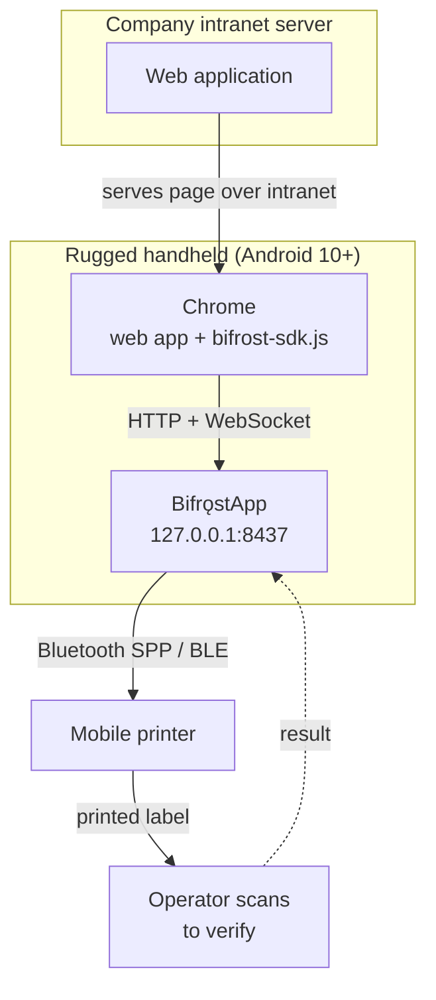

# Product Requirements Document

| Field | Value |
| --- | --- |
| Document ID | REQ-01 |
| Version | 1.0 |
| Date | 2026-08-22 |
| Status | Approved |
| Product | BifrǫstApp v1.0 |

---

## 1. Vision

> Let any web application print to a Bluetooth mobile printer with a single JavaScript call —
> reliably, with no cloud, no vendor lock-in, and no duplicate labels.

Bifrǫst removes a hard boundary in the web platform. Warehouse staff print at the rack instead of
walking to a print station, and the existing web application stays the system of record.

---

## 2. Product summary

Bifrǫst has two shipped components:

| Component | Artefact | Description |
| --- | --- | --- |
| **BifrǫstApp** | `bifrost-<version>.apk` | Resident Android app. Runs a local HTTP/WebSocket server on `127.0.0.1:8437`, holds the Bluetooth connection to the printer, queues and renders jobs, drives the printer |
| **Bifrǫst SDK** | `@bearing/bifrost-sdk` | Zero-dependency TypeScript/JavaScript library the web app imports. Wraps the local API in a typed, promise-based interface |

Both live on, or are loaded onto, the same rugged handheld. The company web server serves the page;
it never talks to Bifrǫst directly.

---

## 3. Personas

### 3.1 Warehouse Operator — primary user

| | |
| --- | --- |
| **Context** | On foot in the aisles, handheld in one hand, printer on belt. Gloves, poor lighting, background noise |
| **Goal** | Print a correct, scannable label at the rack without leaving the aisle |
| **Technical level** | Low. Does not know what Bluetooth pairing or a print queue is |
| **Needs** | One tap to print; unmistakable success/failure feedback; recovery from paper-out without calling IT |
| **Frustrations** | Silent failures; having to re-enter data; labels that print but will not scan later |

### 3.2 Web Application Developer — integrator

| | |
| --- | --- |
| **Context** | Maintains the company web app. Has never written Android code and does not want to |
| **Goal** | Add printing to a page with minimal, readable code |
| **Technical level** | High in web, none in printer command languages |
| **Needs** | Typed API; clear errors; ability to test without a physical printer; no need to learn ESC/POS |
| **Frustrations** | Undocumented byte protocols; APIs that fail without saying why |

### 3.3 IT Support — operator of the fleet

| | |
| --- | --- |
| **Context** | Supports 20–100 handhelds; usually diagnoses remotely by phone |
| **Goal** | Deploy, configure, and troubleshoot without physically holding each device |
| **Technical level** | Medium. Comfortable with MDM, not with Android internals |
| **Needs** | Bulk deployment; central configuration; a diagnostics bundle the operator can send |
| **Frustrations** | "It doesn't print" with no further detail |

---

## 4. Goals and non-goals

### 4.1 Goals

| ID | Goal |
| --- | --- |
| G-1 | A web page can print a label or receipt with one SDK call |
| G-2 | Printing survives Wi-Fi loss, printer power-off, and app restart |
| G-3 | The same job is never printed twice, regardless of retries |
| G-4 | Support Bluetooth Classic SPP and BLE across multiple printer vendors |
| G-5 | Deployable and diagnosable across 20–100 devices by one person |
| G-6 | An integrator needs no knowledge of ESC/POS, ZPL, or CPCL |
| G-7 | Label layout can change without redeploying the web application |

### 4.2 Non-goals

| ID | Non-goal | Rationale |
| --- | --- | --- |
| NG-1 | Building or replacing the company web application | Bifrǫst is a library and a bridge (D-05) |
| NG-2 | Printing from a device other than the one running the app | Same-device topology is the core simplification (D-01, [ADR-001](../03-design/02-adr/ADR-001-loopback-vs-cloud-relay.md)) |
| NG-3 | iOS support | Fleet is Android-only |
| NG-4 | Cloud services, accounts, or telemetry | Intranet-only network (D-02) |
| NG-5 | Thai or complex-script text rendering | Content is English/numeric (D-09) |
| NG-6 | Commercial distribution | Internal use, one organisation |
| NG-7 | Per-user authentication and audit | Deferred; devices are physically controlled (D-15) |

---

## 5. Success metrics

| ID | Metric | Target | Measurement |
| --- | --- | --- | --- |
| M-1 | Print success rate | ≥ 99% of submitted jobs reach `PRINTED` | Job history export |
| M-2 | Submit-to-paper latency (p95) | ≤ 3 s for a standard label | In-app timing, `SUBMITTED` → `PRINTED` |
| M-3 | Duplicate prints | **0** | Idempotency test suite + field reports |
| M-4 | Integration effort | Working print from a new page in ≤ 30 min | Developer walkthrough |
| M-5 | Unassisted recovery | ≥ 90% of paper-out / disconnect events resolved by the operator without IT | Support ticket volume |
| M-6 | Trips to the print station | Eliminated for labelling workflows | Operations observation |

---

## 6. Feature scope

### 6.1 MVP — v1.0 (must ship)

| Feature | Description |
| --- | --- |
| Local HTTP API | `POST /v1/print`, `GET /v1/status`, `GET /v1/capabilities`, `GET /v1/jobs/{id}` |
| WebSocket events | Live printer and job state at `WS /v1/events` |
| JavaScript SDK | Typed client, ESM + UMD builds, no runtime dependencies |
| Tier 1 — Templates | Device-side templates with data binding |
| Tier 2 — Layout DSL | `text`, `barcode`, `qr`, `line`, `feed`, `cut` elements |
| Tier 3 — Raw | Base64 command passthrough |
| Bluetooth Classic (SPP) | Connect, auto-reconnect, keep-alive |
| Bluetooth LE (GATT) | Including MTU negotiation and chunked writes |
| ESC/POS driver | Receipt and slip output |
| ZPL + CPCL drivers | Label output (Zebra class) |
| Persistent job queue | SQLite-backed; survives app restart and reboot |
| Retry with backoff | Automatic, bounded |
| Idempotency | `Idempotency-Key` with a dedup window |
| Origin allowlist + token | Request authentication |
| Scan-to-pair | QR pairing using the handheld's scanner |
| Foreground service | `connectedDevice` type, persistent notification |
| App UI | Pairing, printer setup, queue, history, settings, diagnostics |
| Diagnostics export | Single-file support bundle |

### 6.2 v1.1 — planned next

| Feature | Rationale |
| --- | --- |
| Print verification loop | High value, but needs a chosen scanner integration path (Q-01, Q-02) |
| Preview API | Depends on the render pipeline being stable |
| TSPL driver | Only if non-Zebra label hardware is purchased |
| Template editor in-app | Currently templates are provisioned as files |
| Custom URL scheme fallback | Only needed if loopback HTTP is ever blocked by policy |

### 6.3 Backlog

Multi-printer routing · USB OTG transport · Wi-Fi/TCP transport · per-user auth · central config
push · image/logo element · fleet telemetry dashboard.

---

## 7. User journeys

### 7.1 First-time setup — Operator + IT

1. IT installs the APK via MDM and grants Bluetooth permissions.
2. Operator opens BifrǫstApp; it lists paired Bluetooth devices.
3. Operator selects the printer; the app connects and reads its capabilities.
4. App displays a pairing QR code; operator scans it with the handheld's scanner.
5. The web app stores the token. Setup is complete and persists across restarts.

### 7.2 Printing a part label — Operator

1. Operator scans a part barcode in the web app.
2. Web app calls `bifrost.print({ template: 'part-label', data: {...} })`.
3. SDK POSTs to `http://127.0.0.1:8437/v1/print` with an idempotency key.
4. App enqueues, renders to CPCL, writes over Bluetooth.
5. Label prints; job reaches `PRINTED`; the promise resolves.
6. Web app shows a confirmation. Total elapsed time under three seconds.

### 7.3 Printer runs out of paper — Operator

1. Operator prints; the printer reports media-out.
2. Job moves to `FAILED` with `PRINTER_OUT_OF_PAPER`; the WebSocket pushes the state.
3. Web app shows *"Printer out of paper"*; the app notification says the same.
4. Operator loads media.
5. The queued job retries automatically and prints. No data is re-entered, and it prints **once**.

### 7.4 Adding printing to a new page — Developer

1. Import the SDK; call `bifrost.connect()`.
2. Call `getCapabilities()` to learn print width.
3. Send a Tier 1 template call.
4. Handle the typed error union for the failure cases.
5. Test against the mock printer harness with no hardware present.

---

## 8. Constraints

| Constraint | Source | Impact |
| --- | --- | --- |
| Intranet only, no internet | D-02 | No cloud services, no external telemetry, no CDN for the SDK |
| Same-device topology | D-01 | Loopback only; no LAN or remote printing |
| Android 10+ (min SDK 29) | D-13 | Must handle both legacy and Android 12+ Bluetooth permission models |
| One developer, AI-assisted | D-16 | Single-language stack; minimal moving parts; docs must be executable-grade |
| Printer not yet selected | D-07 | Driver layer must be vendor-neutral from day one |
| English/numeric content only | D-09 | Native font commands; no text bitmap pipeline |
| 20–100 devices | D-11 | MDM deployment; no fleet-telemetry backend |

---

## 9. Assumptions

| ID | Assumption | Risk if wrong |
| --- | --- | --- |
| A-1 | Chrome (or a Chromium WebView) is the browser on the handheld | Non-Chromium browsers may treat loopback differently |
| A-2 | Devices allow installing an APK outside the Play Store | Deployment path must change |
| A-3 | The purchased printer supports ESC/POS, ZPL, or CPCL | A new driver would be needed |
| A-4 | Operators can be trained in a short session | Onboarding cost rises |
| A-5 | Battery optimisation can be disabled for the app via MDM | Background disconnects become frequent |
| A-6 | The chosen printer handles both label and receipt media (D-08) | A second printer per operator would be required |

---

## 10. Related documents

- [Problem Statement](../01-discovery/01-problem-statement.md)
- [Software Requirements Specification](02-srs.md)
- [User Stories](03-user-stories.md)
- [Architecture](../03-design/01-architecture.md)
- [Roadmap](../07-project/01-roadmap.md)
