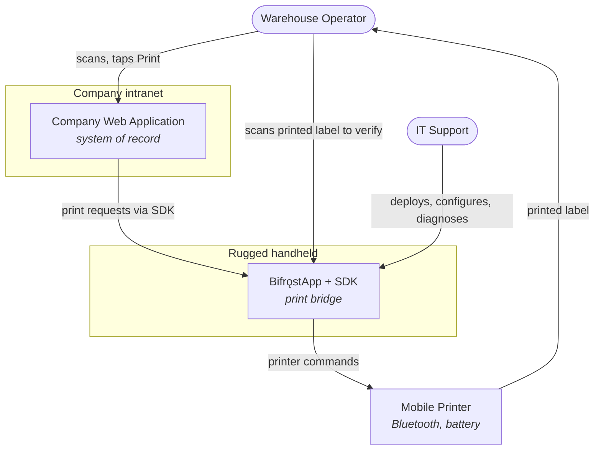
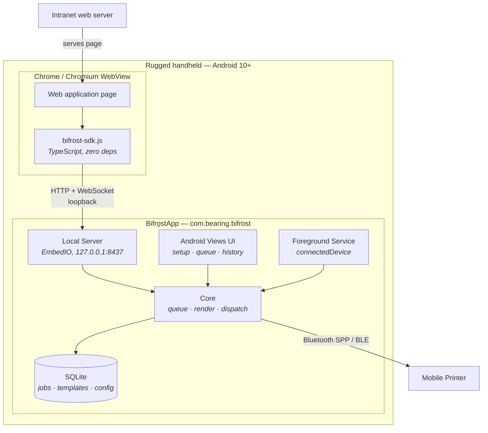
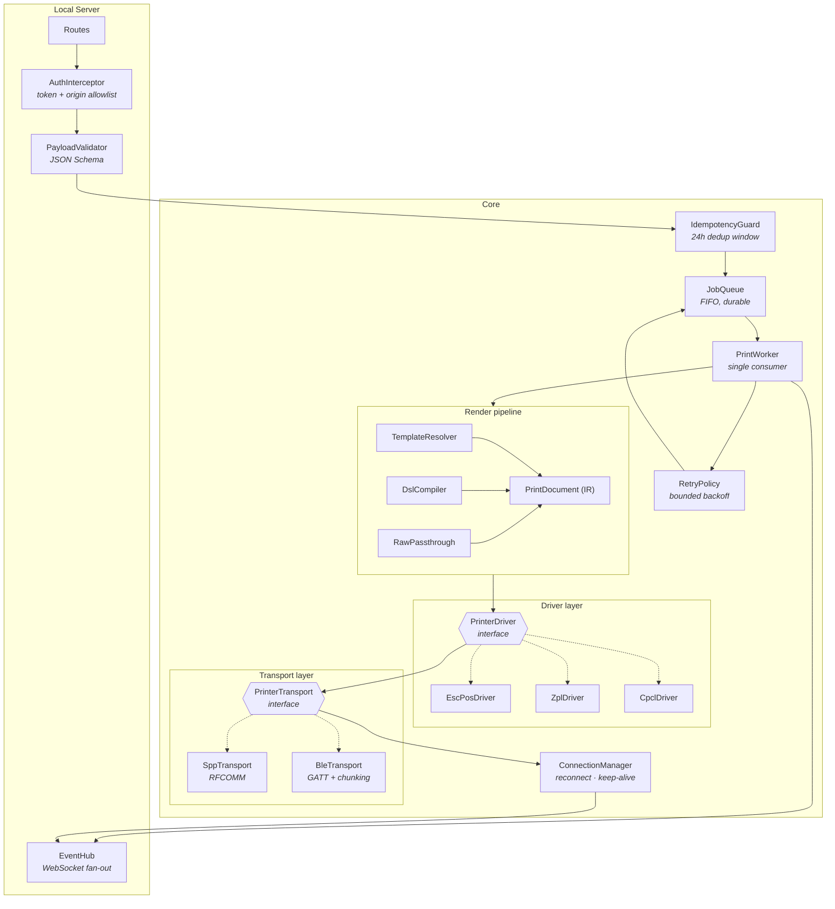
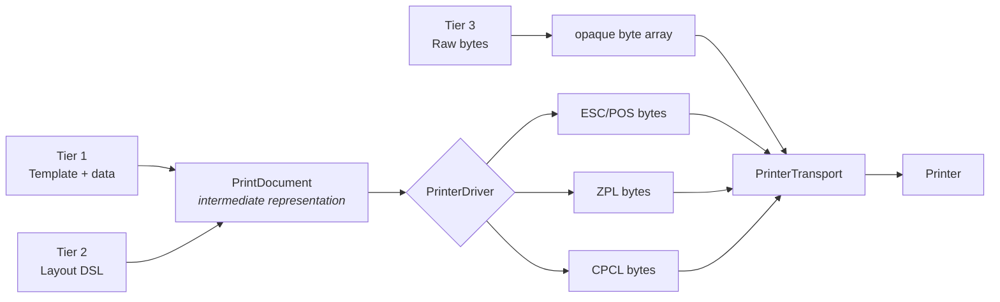
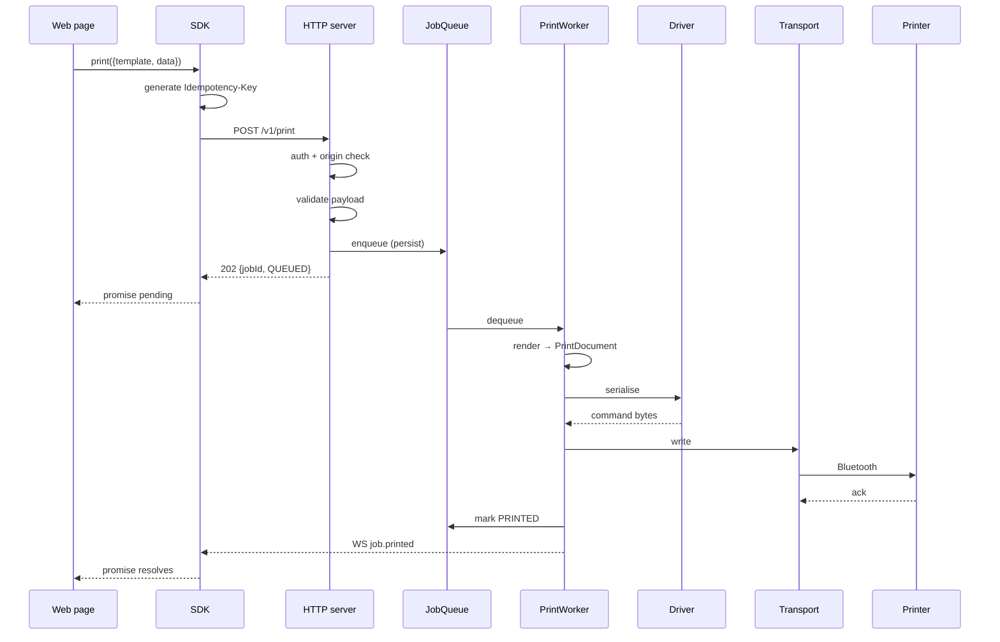
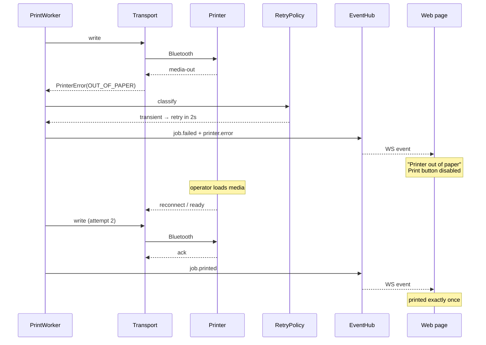
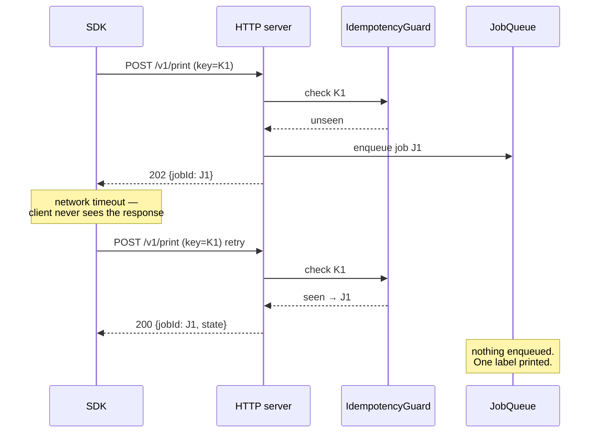
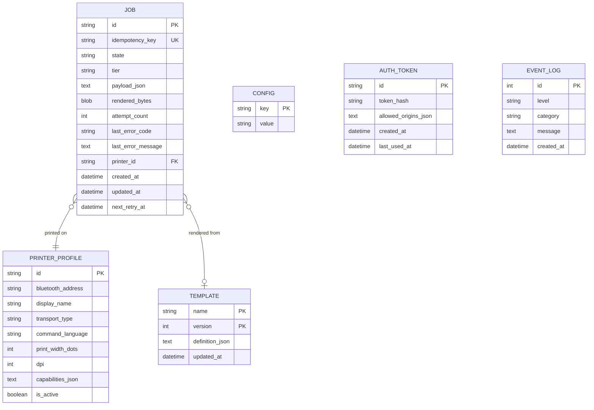
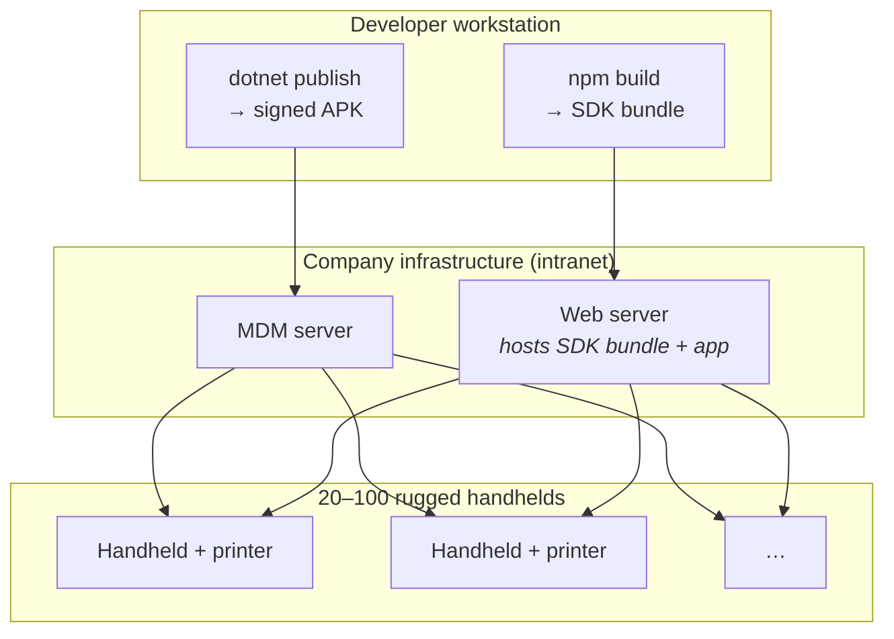

# Architecture

| Field | Value |
| --- | --- |
| Document ID | DES-01 |
| Version | 2.0 |
| Date | 2026-08-22 |
| Status | Approved |

> **Version 2.0** — technology names updated for .NET following
> [ADR-008](02-adr/ADR-008-dotnet-for-android.md). **The architecture itself is unchanged**: same
> containers, same components, same boundaries, same runtime flows. Only the libraries filling them
> differ. That a platform change touched no structure is the clearest evidence these decisions were
> made at the right level.

---

## 1. Architectural drivers

The design is shaped by five forces, in priority order:

| # | Driver | Source | Architectural consequence |
| --- | --- | --- | --- |
| 1 | Browser and printer are on the **same device** | D-01 | Loopback transport. No discovery, no relay, no remote queue |
| 2 | **Never print twice** | D-12, NFR-202 | Idempotency is a first-class concern in the API and the queue, not a transport retry detail |
| 3 | **Printer vendor is unknown** | D-07 | A driver abstraction must exist before any driver does |
| 4 | **One developer** | D-16 | Single language, few moving parts, testable without hardware |
| 5 | **Three payload tiers** | D-14 | A shared intermediate representation, or the rendering logic triples |

---

## 2. C4 Level 1 — System context

**Boundary note.** The web application runs *in the operator's browser on the handheld*, even though
it is served from an intranet server. The server never contacts Bifrǫst; only the browser does.
This is the single most important fact in the architecture.

---

## 3. C4 Level 2 — Containers

| Container | Technology | Responsibility |
| --- | --- | --- |
| **bifrost-sdk.js** | TypeScript, ESM + UMD | Typed client; idempotency key generation; token storage; WebSocket reconnection |
| **Local Server** | EmbedIO behind `IBridgeServer` | HTTP + WebSocket endpoints; authentication; CORS; payload validation |
| **Core** | C#, `async`/`await`, Channels | Queue, render pipeline, driver dispatch, transport management, retry policy |
| **SQLite** | Microsoft.Data.Sqlite + Dapper | Durable job queue, job history, templates, configuration |
| **UI** | Android Views + AXML, Material Components | Operator and IT surfaces |
| **Foreground Service** | Android service, `connectedDevice` | Keeps the process and Bluetooth connection alive; persistent notification |

---

## 4. C4 Level 3 — Components inside Core

### 4.1 Component responsibilities

| Component | Responsibility | Key requirements |
| --- | --- | --- |
| `AuthInterceptor` | Validate bearer token and `Origin` before any handler runs | FR-502, FR-503, FR-508 |
| `PayloadValidator` | Validate against the tier's JSON Schema; produce field-level errors | FR-308 |
| `IdempotencyGuard` | Look up the key; return the existing job or admit a new one | FR-102 |
| `JobQueue` | Durable FIFO backed by SQLite; survives process death | FR-103, FR-105, FR-109 |
| `PrintWorker` | Single consumer: render → drive → transmit → record outcome | FR-101 |
| `RetryPolicy` | Classify failures transient vs. permanent; schedule backoff | FR-106, FR-107 |
| `TemplateResolver` | Bind data into a stored template, yielding a `PrintDocument` | FR-301, FR-302 |
| `DslCompiler` | Compile DSL elements into a `PrintDocument` | FR-303, FR-304 |
| `PrinterDriver` | Serialise a `PrintDocument` into one command language | FR-605, FR-610 |
| `PrinterTransport` | Move bytes to the printer; handle MTU and flow control | FR-601, FR-602, FR-604 |
| `ConnectionManager` | Own connection lifecycle, reconnection, status polling | FR-603, FR-608 |
| `EventHub` | Fan out job and printer state to WebSocket subscribers | FR-203 |

---

## 5. The rendering pipeline

The three payload tiers converge on one intermediate representation, so drivers are written once.

Tier 1 lowers to Tier 2 (a template *is* a parameterised element list), and Tier 2 lowers to the
`PrintDocument`. Tier 3 bypasses rendering entirely and enters at the transport, but still passes
through the queue, retry, and idempotency machinery — an escape hatch for content, not for
reliability.

**Consequence:** adding a printer language costs one `PrinterDriver` implementation. Adding a
transport costs one `PrinterTransport` implementation. Neither touches the API, the queue, or the
renderers. This satisfies FR-610 and is what keeps the vendor-unknown risk (D-07) manageable.

---

## 6. Runtime views

### 6.1 Successful print

### 6.2 Failure and recovery

### 6.3 Idempotent replay

---

## 7. Data architecture

**Retention.** `JOB` rows are pruned at 30 days or 1000 records, whichever comes first (FR-110).
`EVENT_LOG` rotates at 7 days / 10 MB (NFR-703). `rendered_bytes` is cleared once a job reaches a
terminal state, keeping the database small while leaving reprint able to re-render from `payload_json`.

**Token storage.** `AUTH_TOKEN` holds a **hash**, never the token itself. The plaintext token lives
only in EncryptedSharedPreferences for QR display (FR-507, NFR-304).

---

## 8. Deployment view

The SDK is served from the company web server alongside the application — there is no internet
egress and therefore no public CDN (D-02). The APK is distributed by MDM, not the Play Store
(NFR-701).

---

## 9. Cross-cutting concerns

| Concern | Approach |
| --- | --- |
| **Concurrency** | `async`/`await` with `System.Threading.Channels`. One `PrintWorker` consumer `Task` per printer guarantees serialised transmission; the server handles requests concurrently but only enqueues |
| **Error handling** | Sealed error hierarchy classified transient vs. permanent at a single point (`RetryPolicy`). Wire errors carry a stable machine code plus an operator-readable message (NFR-501) |
| **Logging** | Structured, categorised, on-device only. Rotated. Tokens and payload content are never logged (NFR-304, NFR-306) |
| **Configuration** | SQLite `CONFIG` table, seeded from defaults, overridable by MDM managed configuration and by the settings UI (NFR-702) |
| **Time** | All timestamps stored UTC; displayed in device local time |
| **Versioning** | API version in the URL path (`/v1`). SDK and APK versioned independently but declare a compatible API range (NFR-603) |
| **Testability** | `Bifrost.Core` and `Bifrost.Drivers` target `net10.0`, not `net10.0-android`, so Android types are not even resolvable there and queue, render, and driver logic run as plain .NET tests. A mock transport substitutes for hardware (NFR-601, NFR-602) |

---

## 10. Architectural risks

| Risk | Impact | Mitigation | Full entry |
| --- | --- | --- | --- |
| BLE MTU and flow control are the classic failure point for chunked printing | Corrupt or truncated output | Confirm-before-next-write; conservative MTU fallback; a dedicated test at multiple payload sizes | [R-02](../07-project/02-risk-register.md) |
| Android battery optimisation kills the service, dropping the connection silently | Prints fail while the app appears healthy | Foreground service typed `connectedDevice`; guided battery-optimisation exemption; MDM enforcement | [R-03](../07-project/02-risk-register.md) |
| The purchased printer supports none of the implemented languages | Driver work restarts | Driver abstraction exists before any driver; hardware recommendation restricts the choice to known-supported languages | [R-01](../07-project/02-risk-register.md) |
| Device policy blocks loopback HTTP | Bridge unreachable | `bifrost://` deep-link fallback specified (FR-104) | [R-05](../07-project/02-risk-register.md) |

---

## 11. Decision records

| ADR | Decision |
| --- | --- |
| [ADR-001](02-adr/ADR-001-loopback-vs-cloud-relay.md) | Loopback local server rather than cloud relay or LAN service |
| [ADR-002](02-adr/ADR-002-kotlin-native-vs-flutter.md) | ~~Native Kotlin rather than Flutter or KMP~~ — **superseded by ADR-008** |
| [ADR-003](02-adr/ADR-003-three-tier-payload-api.md) | Three payload tiers over a shared intermediate representation |
| [ADR-004](02-adr/ADR-004-ktor-embedded-server.md) | ~~Ktor as the embedded HTTP/WebSocket server~~ — **superseded by ADR-009** |
| [ADR-005](02-adr/ADR-005-persistent-queue-room.md) | Database-backed durable queue with a single consumer |
| [ADR-006](02-adr/ADR-006-origin-allowlist-token-auth.md) | Origin allowlist plus bearer token, established by QR pairing |
| [ADR-007](02-adr/ADR-007-printer-language-abstraction.md) | Driver and transport abstractions defined before any implementation |
| [ADR-008](02-adr/ADR-008-dotnet-for-android.md) | **.NET for Android** rather than native Kotlin — supersedes ADR-002 |
| [ADR-009](02-adr/ADR-009-embedded-http-server.md) | **EmbedIO** behind an abstraction, since ASP.NET Core does not run on Android — supersedes ADR-004 |

---

## 12. Related documents

- [Local API Specification](03-local-api-spec.md)
- [Print Payload Schema](05-print-payload-schema.md)
- [Printer Abstraction](06-printer-abstraction.md)
- [Job Lifecycle](07-job-lifecycle.md)
- [Security Design](08-security-design.md)
- [Tech Stack](../04-implementation/01-tech-stack.md)
