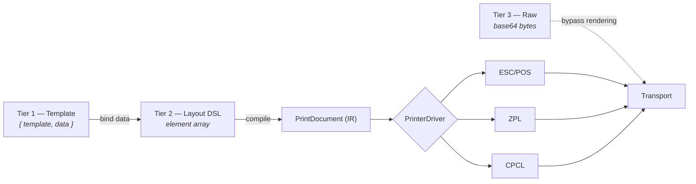

# ADR-003 — Three payload tiers over a shared intermediate representation

| Field | Value |
| --- | --- |
| Status | Accepted |
| Date | 2026-08-22 |
| Deciders | Bearing Team |

---

## Context

The web application must describe what to print. The level of abstraction determines where
complexity lives — in the web app, or on the device.

Stakeholder decision **D-14** requires all three levels. This ADR records how they coexist without
tripling the rendering code.

The forces in tension:

- Web developers do not know ESC/POS, ZPL, or CPCL and should not have to (G-6)
- The printer model is unknown (D-07), so the web app cannot safely hard-code a command language
- Label layouts change; redeploying the web app for a layout tweak is expensive (G-7)
- Some future requirement will inevitably need something the SDK does not model

## Options considered

### A. Single high-level API only (template)

- **+** Simplest possible caller code
- **−** Any unmodelled requirement blocks the web team until the app ships a new template feature
- **−** Runtime-variable layouts cannot be expressed

### B. Single low-level API only (raw bytes)

- **+** Smallest app surface; maximum flexibility
- **−** Pushes command-language knowledge into the web app — exactly what G-6 forbids
- **−** Changing printer vendor would require rewriting web code (D-07 makes this likely)

### C. Three independent APIs

- **+** Each tier optimal for its use
- **−** Three rendering paths, three validation paths, three sets of bugs
- **−** Behaviour drifts between tiers over time

### D. Three tiers that lower onto one intermediate representation

- **+** All the flexibility of C
- **+** One rendering path, one driver interface, consistent behaviour
- **−** Requires designing the IR carefully up front

## Decision

**Adopt option D.** Three caller-facing tiers, lowering onto a single `PrintDocument` intermediate
representation which is the only thing drivers ever see.

| Tier | Caller sends | Layout owned by | Use |
| --- | --- | --- | --- |
| 1 — Template | `{ template, data }` | Device | The everyday case |
| 2 — DSL | Ordered element array | Web app | Runtime-variable layouts |
| 3 — Raw | Base64 command bytes | Web app | Escape hatch |

**Tier 1 lowers to Tier 2** — a template is a parameterised element list, so it reuses the DSL
compiler rather than duplicating it.

**Tier 3 bypasses rendering but not reliability.** Raw payloads still pass through validation,
the queue, retry, and idempotency (FR-306). It is an escape hatch for *content*, never for
correctness guarantees.

## Consequences

**Positive**

- The project cannot be blocked by a missing SDK feature — tier 3 always works
- Label layout changes via templates need no web deployment (G-7, idea 6.5)
- Adding a printer language costs one driver, because drivers only consume the IR (FR-610)
- Behaviour is consistent across tiers because they share a compiler

**Negative**

- Largest single scope item in v1.0. Mitigated by building tier 2 first, then tier 1 on top of it,
  then tier 3 — which is nearly free once the transport exists
- The IR must express everything the DSL can, or tier 2 loses expressiveness. Designed up front in
  [DES-05 §5](../05-print-payload-schema.md)

**Neutral**

- Tier 3 lets a caller send bytes for the wrong language. The app warns but transmits — the caller
  has explicitly taken responsibility

## Verification

- FR-307: the same logical label expressed in tier 1 and tier 2 produces identical driver output
- FR-306: a tier 3 payload reaches the printer unmodified, byte-for-byte
- FR-610: a newly added driver requires no change to API, queue, or renderer modules

## Related

- [Print Payload Schema](../05-print-payload-schema.md)
- [Printer Abstraction](../06-printer-abstraction.md)
- [ADR-007](ADR-007-printer-language-abstraction.md)
