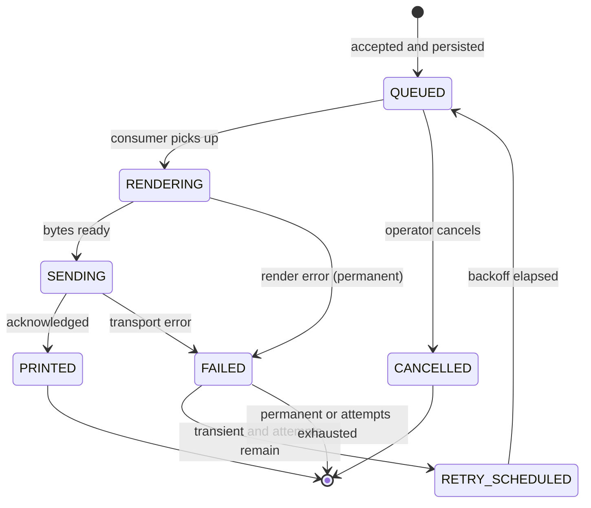

# ADR-005 — Database-backed durable queue with a single consumer

| Field | Value |
| --- | --- |
| Status | **Accepted** — technology revised 2026-08-22 |
| Date | 2026-08-22 |
| Deciders | Bearing Team |
| Revised by | [ADR-008](ADR-008-dotnet-for-android.md) |

> **Revision note.** This ADR originally named **Room** as the persistence library. After
> [ADR-008](ADR-008-dotnet-for-android.md) moved the app to .NET, the library changed to
> **Microsoft.Data.Sqlite + Dapper** with a hand-written versioned migration runner. See
> [Revision — .NET substitution](#revision--net-substitution) at the end of this document.
>
> **The decision itself is unchanged**: a durable SQLite-backed queue as the single source of truth,
> drained by exactly one consumer per printer, with a background scheduler used only as a recovery
> trigger. Every argument below holds; only the library names differ. That the decision survived a
> platform change intact indicates it was made at the right level of abstraction.

---

## Context

**D-12** requires a persistent queue with automatic retry, and guarantees that no accepted job is
lost (NFR-201) and no job prints twice (NFR-202).

The operating reality is hostile: printers run out of paper mid-shift, go out of Bluetooth range,
and switch off when the battery dies. Android may kill the process. Devices reboot. Every one of
these must be survivable without the operator re-entering data.

## Options considered

### A. In-memory queue

- **+** Trivial
- **−** Loses everything on process death — **fails NFR-201 outright**

### B. WorkManager, one WorkRequest per job

- **+** Survives process death and reboot; retry and backoff built in
- **−** WorkManager schedules on system terms, and its minimum backoff of 10 s is far too slow for an
  operator standing at a rack waiting for a label
- **−** Ordering across independent WorkRequests is not guaranteed, breaking FIFO (FR-105)
- **−** Doze and battery optimisation can defer execution indefinitely
- **−** Job state would live in two places: WorkManager's store and ours

### C. Room table as the queue, with an in-process coroutine consumer

- **+** Job state persists in the same database as history, in one place
- **+** Full control over ordering, backoff timing, and retry classification
- **+** Immediate dispatch — no scheduler latency
- **+** Queryable directly by the queue UI (FR-403) and history UI (FR-404)
- **−** The consumer must be kept alive by the foreground service
- **−** Reboot recovery must be implemented explicitly

### D. Room queue + WorkManager as a safety net

- **+** C's responsiveness, plus a guaranteed wake-up if the process is killed while jobs are pending
- **−** Two mechanisms to reason about

## Decision

**Adopt option D: a Room table as the authoritative queue, drained by a single coroutine consumer
inside the foreground service, with WorkManager used only as a recovery trigger.**

- **Room `JOB` table** is the single source of truth for queue and history alike
- **`PrintWorker`** is one coroutine per printer, consuming strictly in FIFO order. Because there is
  exactly one consumer per printer, transmission is serialised without locking, and two jobs can
  never interleave on one Bluetooth link
- **Foreground service** (`connectedDevice`) keeps the consumer alive while jobs are pending
  (FR-407)
- **WorkManager** carries one periodic job whose only responsibility is: *if pending jobs exist and
  the service is not running, start it*. It never transports print data
- **`BOOT_COMPLETED` receiver** restarts the service when pending jobs exist (FR-408)

Persist-before-acknowledge is mandatory: `POST /v1/print` writes the row inside a transaction and
only then returns `202` (FR-103). A job the caller believes was accepted always exists on disk.

## Consequences

**Positive**

- Survives process kill, crash, and reboot without losing accepted work (NFR-201)
- Single consumer per printer makes serialised transmission structural rather than a locking
  discipline that can be got wrong
- Queue and history share one table, so the queue UI and history UI are two queries over one model
- Immediate dispatch keeps p95 latency within the 3 s target (NFR-101), which WorkManager-scheduled
  execution could not

**Negative**

- Reboot and process-death recovery are our code to write and test, not the framework's
- The foreground service notification is permanently visible. Turned into an asset: it displays live
  printer connection state (NFR-502)

**Neutral**

- Multi-printer support later means one consumer coroutine per printer — the design already assumes
  per-printer consumers

## Verification

- NFR-201: kill the process immediately after `202`; the job is present and prints after restart
- NFR-202: replay the same idempotency key across a restart; exactly one label is produced
- FR-105: submit 20 jobs rapidly; they print in submission order
- FR-408: reboot with pending jobs; the queue drains with no operator action
- FR-106: verify the observed backoff sequence is 2 s, 8 s, 30 s, 120 s, 300 s and stops at 5 attempts

## Revision — .NET substitution

Applied 2026-08-22 following [ADR-008](ADR-008-dotnet-for-android.md).

| Role | Original (Kotlin) | Revised (.NET) |
| --- | --- | --- |
| Queue storage | Room over SQLite | **Microsoft.Data.Sqlite** over the same SQLite |
| Query mapping | Room DAOs | **Dapper** — ~50 KB, `netstandard2.0`, no code generation |
| Migrations | Room `@Database(version)` migrations | Hand-written versioned migration runner |
| Consumer | Coroutine per printer | `Task` per printer, driven by `System.Threading.Channels` |
| Recovery trigger | WorkManager | Same WorkManager, via `Xamarin.AndroidX.Work.Runtime` |
| Boot receiver | `BOOT_COMPLETED` receiver | Unchanged — Android component, C# binding |

### Why not Entity Framework Core

EF Core would have been the closer analogue to Room, and was rejected:

| Concern | Assessment |
| --- | --- |
| Startup cost | EF Core's model building measurably delays cold start, against NFR-105 (≤ 3 s) |
| Size | Adds several MB to an APK already growing under .NET (see [IMP-01 §6](../../04-implementation/01-tech-stack.md)) |
| Trimming | EF Core's reflection makes trimming and AOT on Android fragile — a category of build failure a single developer should not be debugging |
| Fit | The schema is six tables and the queue queries are index-sensitive and hand-tuned. An ORM's abstraction is a cost here, not a saving |

Dapper gives the mapping convenience without the model layer, and hand-written migrations are
explicit and testable **in both directions** — which matters, because a rollback that cannot reverse
its migration strands the fleet ([OPS-01 §6.3](../../06-operations/01-deployment-guide.md)).

### What did not change

The `UNIQUE` constraint on `idempotency_key` still enforces deduplication at the database level, so
concurrent submissions are resolved by SQLite rather than by application locking
([DES-07 §5.2](../07-job-lifecycle.md)). This is unaffected by the choice of client library — it was
always a property of the schema, not of the ORM.

---

## Related

- [Job Lifecycle](../07-job-lifecycle.md)
- [Architecture §7](../01-architecture.md)
- [ADR-008 — .NET for Android](ADR-008-dotnet-for-android.md)
