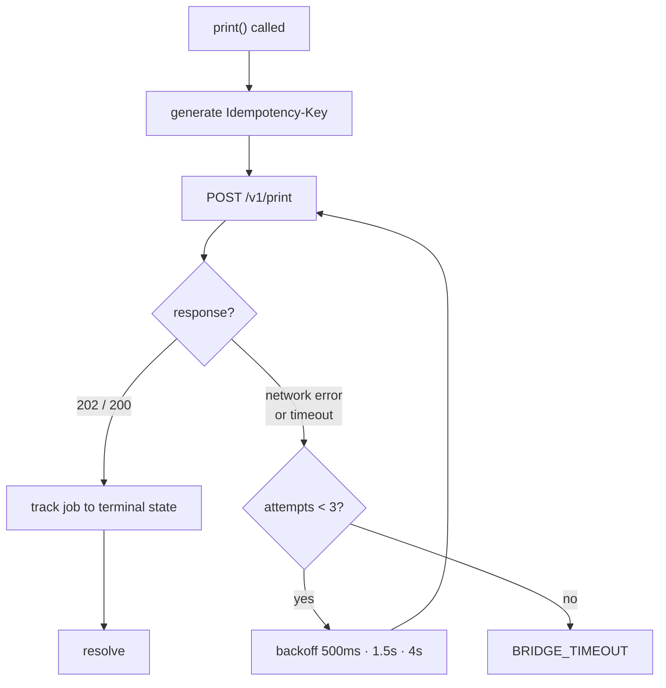

# JavaScript SDK Specification

| Field | Value |
| --- | --- |
| Document ID | DES-04 |
| Version | 1.0 |
| Date | 2026-08-22 |
| Status | Approved |
| Package | `@bearing/bifrost-sdk` |

---

## 1. Purpose and design principles

The SDK is the surface the web developer actually touches. It wraps
[the local API](03-local-api-spec.md) so that printing costs one call and no knowledge of ESC/POS,
ZPL, or Bluetooth.

| Principle | Consequence |
| --- | --- |
| **Zero runtime dependencies** (FR-703) | Ships as a single file; nothing to audit or update transitively |
| **Typed all the way through** (FR-702) | Payloads, results, and errors are exhaustively typed; wrong shapes fail at compile time |
| **Never throw for expected states** | A missing bridge is a normal condition, not an exception (FR-708) |
| **Correct by default** | Idempotency keys are generated automatically (FR-705); nothing has to be remembered to be safe |
| **Errors say what to do** | Every error carries an operator-safe message and a `transient` flag (FR-706) |

---

## 2. Distribution

| Format | File | Use |
| --- | --- | --- |
| ESM | `dist/bifrost.esm.js` | Bundlers — Vite, webpack, Rollup |
| UMD | `dist/bifrost.umd.js` | Plain `<script>`; exposes global `Bifrost` |
| Types | `dist/index.d.ts` | TypeScript |

Because the network is intranet-only (D-02) there is no public CDN. The bundle is served from the
company web server alongside the application.

```html
<!-- Plain script tag -->
<script src="/assets/bifrost.umd.js"></script>
<script>
  const bifrost = new Bifrost.BifrostClient();
</script>
```

```ts
// Bundler
import { BifrostClient } from '@bearing/bifrost-sdk';
const bifrost = new BifrostClient();
```

Target: ES2020. Chrome/Chromium 90+ (NFR-403). No polyfills required.

---

## 3. Quick start

```ts
import { BifrostClient } from '@bearing/bifrost-sdk';

const bifrost = new BifrostClient();

if (!(await bifrost.isAvailable())) {
  showBanner('Print bridge not running. Open BifrǫstApp on this device.');
  return;
}

const result = await bifrost.print({
  tier: 'template',
  template: 'part-label',
  data: { partNo: '6205-2RS', lot: 'L2408-0231', qty: 50 },
});

if (result.ok) {
  toast(`Printed — job ${result.job.jobId}`);
} else {
  toast(result.error.message);           // already operator-safe
}
```

---

## 4. Client construction

```ts
interface BifrostOptions {
  /** Default 'http://127.0.0.1:8437' */
  baseUrl?: string;
  /** Explicit token. Omit to use the stored one from pairing. */
  token?: string;
  /** localStorage key for the token. Default 'bifrost.token' */
  storageKey?: string;
  /** Per-request timeout in ms. Default 10000 */
  timeoutMs?: number;
  /** Wait for the job to reach a terminal state before resolving. Default true */
  waitForCompletion?: boolean;
  /** Max wait for terminal state in ms. Default 30000 */
  completionTimeoutMs?: number;
  /** Auto-connect the event stream on first use. Default true */
  autoConnectEvents?: boolean;
}

new BifrostClient(options?: BifrostOptions)
```

---

## 5. API reference

### 5.1 `isAvailable(): Promise<boolean>`

Detects the bridge without throwing (FR-708). Resolves `false` when the app is absent, stopped, or
unreachable — a page can use this to hide a Print button rather than showing an error.

```ts
if (await bifrost.isAvailable()) enablePrintButton();
```

### 5.2 `getStatus(): Promise<Result<BridgeStatus>>`

Bridge, printer, and queue state. Works unpaired.

```ts
const r = await bifrost.getStatus();
if (r.ok && r.value.printer?.state !== 'READY') {
  disablePrintButton(r.value.printer?.lastError?.message);
}
```

### 5.3 `pair(token: string, clientName?: string): Promise<Result<PairInfo>>`

Completes pairing with a token scanned from the app's QR code (FR-501). On success the token is
persisted to `localStorage` (FR-709).

```ts
// Handheld scanner acts as a keyboard wedge into a focused input
scanInput.addEventListener('change', async (e) => {
  const r = await bifrost.pair(e.target.value, 'Warehouse WMS');
  if (r.ok) toast('Printer paired'); else toast(r.error.message);
});
```

### 5.4 `getCapabilities(): Promise<Result<Capabilities>>`

What the connected printer can do (FR-201). Use it instead of hard-coding a print width.

```ts
const caps = await bifrost.getCapabilities();
if (caps.ok) {
  const width = caps.value.media.printWidthDots;
  const canQr = caps.value.barcodes.includes('QR');
}
```

### 5.5 `print(payload, options?): Promise<Result<Job>>`

The primary call. Accepts all three tiers (FR-701).

```ts
interface PrintOptions {
  idempotencyKey?: string;     // auto-generated UUIDv4 when omitted (FR-705)
  copies?: number;             // default 1
  waitForCompletion?: boolean; // overrides the client default
  signal?: AbortSignal;
}
```

**Tier 1 — Template**

```ts
await bifrost.print({
  tier: 'template',
  template: 'part-label',
  data: { partNo: '6205-2RS', lot: 'L2408-0231', qty: 50, location: 'A-12-03' },
});
```

**Tier 2 — Layout DSL**

```ts
await bifrost.print({
  tier: 'dsl',
  document: {
    widthDots: 832,
    elements: [
      { type: 'text',    value: '6205-2RS', size: 3, bold: true, align: 'center' },
      { type: 'barcode', format: 'CODE128', value: '6205-2RS', heightDots: 80, showText: true },
      { type: 'qr',      value: 'PN=6205-2RS;LOT=L2408-0231', scale: 6 },
      { type: 'feed',    lines: 3 },
    ],
  },
});
```

**Tier 3 — Raw**

```ts
await bifrost.print({
  tier: 'raw',
  language: 'ESCPOS',
  data: btoa('\x1B@\x1Ba\x016205-2RS\n\n\x1DV\x00'),
});
```

**Builder helpers** — optional sugar over Tier 2 for readability:

```ts
import { doc } from '@bearing/bifrost-sdk';

await bifrost.print(
  doc(832)
    .text('6205-2RS', { size: 3, bold: true, align: 'center' })
    .barcode('CODE128', '6205-2RS', { heightDots: 80, showText: true })
    .qr('PN=6205-2RS;LOT=L2408-0231', { scale: 6 })
    .feed(3)
    .build()
);
```

**Completion semantics.** With `waitForCompletion: true` (the default) the promise resolves when the
job reaches a terminal state, resolved via the event stream where connected and by polling
otherwise. With `false` it resolves as soon as the job is accepted, and `result.value.state` is
`QUEUED`.

### 5.6 `getJob(jobId): Promise<Result<Job>>` · `listJobs(query?): Promise<Result<JobPage>>` · `cancelJob(jobId): Promise<Result<Job>>`

Job inspection and cancellation (FR-205, FR-207, FR-108).

### 5.7 `getTemplates(): Promise<Result<TemplateInfo[]>>`

Templates available on the device, with required and optional field names (FR-302). Useful for
validating input before submitting.

### 5.8 `on(event, handler): () => void`

Subscribe to the event stream (FR-707). Returns an unsubscribe function. The socket connects lazily
on first subscription and reconnects automatically with backoff.

```ts
const off = bifrost.on('printer.state_changed', ({ state }) => {
  printButton.disabled = state !== 'READY';
});

bifrost.on('printer.error', ({ message }) => toast(message));
bifrost.on('job.state_changed', ({ jobId, state }) => updateRow(jobId, state));

// later
off();
```

| Event | Payload |
| --- | --- |
| `printer.state_changed` | `{ state, name?, transport? }` |
| `printer.error` | `{ code, message, transient }` |
| `printer.battery` | `{ percent }` |
| `job.state_changed` | `{ jobId, state, previousState, attemptCount, error? }` |
| `job.verified` | `{ jobId, verified, scannedValue? }` *(v1.1)* |
| `queue.changed` | `{ pending, retrying }` |
| `connection.changed` | `{ connected }` — SDK-synthesised, socket health |

### 5.9 `preview(payload): Promise<Result<PreviewImage>>` *(v1.1)*

Renders without printing (FR-202). Returns a base64 PNG suitable for an ``.

---

## 6. Result and error model

The SDK never throws for expected conditions. Every call returns a discriminated union, so
TypeScript forces the failure case to be handled (FR-706).

```ts
type Result<T> =
  | { ok: true;  value: T }
  | { ok: false; error: BifrostError };

interface BifrostError {
  code: BifrostErrorCode;
  message: string;      // operator-safe, plain English
  transient: boolean;   // could a retry succeed?
  field?: string;       // JSON path, for validation errors
  details?: unknown;
}

type BifrostErrorCode =
  // bridge reachability (SDK-synthesised)
  | 'BRIDGE_UNAVAILABLE' | 'BRIDGE_TIMEOUT'
  // auth
  | 'UNAUTHORIZED' | 'ORIGIN_NOT_ALLOWED' | 'INVALID_TOKEN'
  | 'PAIRING_EXPIRED' | 'PAIRING_ALREADY_USED'
  // validation
  | 'VALIDATION_ERROR' | 'CONTENT_TOO_WIDE' | 'UNSUPPORTED_ELEMENT'
  | 'MISSING_TEMPLATE_FIELD' | 'TEMPLATE_NOT_FOUND' | 'PAYLOAD_TOO_LARGE'
  // printer
  | 'PRINTER_NOT_CONNECTED' | 'PRINTER_OUT_OF_PAPER' | 'PRINTER_COVER_OPEN'
  | 'PRINTER_BATTERY_LOW' | 'PRINTER_OVERHEATED' | 'PRINTER_PAPER_JAM'
  | 'PRINTER_DISCONNECTED' | 'PRINTER_UNSUPPORTED_COMMAND' | 'TRANSMIT_TIMEOUT'
  // queue and job
  | 'QUEUE_FULL' | 'JOB_NOT_FOUND' | 'JOB_NOT_CANCELLABLE' | 'JOB_TIMEOUT'
  // other
  | 'INTERNAL_ERROR' | 'BRIDGE_NOT_READY';
```

Error codes mirror [the API error table](03-local-api-spec.md#41-error-code-reference) exactly, plus
three the SDK raises locally: `BRIDGE_UNAVAILABLE`, `BRIDGE_TIMEOUT`, and `JOB_TIMEOUT`.

**Handling pattern**

```ts
const r = await bifrost.print(payload);
if (r.ok) return onPrinted(r.value);

switch (r.error.code) {
  case 'UNAUTHORIZED':
    return showPairingDialog();
  case 'PRINTER_NOT_CONNECTED':
  case 'PRINTER_OUT_OF_PAPER':
    return toast(r.error.message);       // already actionable
  case 'CONTENT_TOO_WIDE':
    return console.error('Layout bug at', r.error.field);
  default:
    return toast(r.error.transient ? 'Temporary problem, try again' : r.error.message);
}
```

---

## 7. Retry and idempotency behaviour

The SDK generates a UUIDv4 idempotency key per logical print unless one is supplied (FR-705).



The **same key** is reused across SDK-level retries. This is the mechanism that makes an ambiguous
timeout safe: if the app already accepted the job, the retry returns the existing job and nothing
prints twice (NFR-202).

The SDK retries **only** on network-level failures. It never retries a `4xx`, and never retries a
`5xx` automatically — the app's own queue already owns server-side retry (FR-106), and a second
retry layer would only add confusion.

---

## 8. Token storage

| Aspect | Behaviour |
| --- | --- |
| Location | `localStorage`, key `bifrost.token` (configurable) (FR-709) |
| Scope | Per browser origin, which is already the allowlist unit |
| Lifetime | Until cleared or the app regenerates the token |
| On `401` | The stored token is discarded and `UNAUTHORIZED` is surfaced so the page can re-pair |

Storing a bearer token in `localStorage` is acceptable here because the token authorises printing on
one device from an already-allowlisted origin. It grants no data access and no lateral movement. See
[Security Design §6](08-security-design.md).

---

## 9. Framework integration

```ts
// React
export function usePrinterStatus(bifrost: BifrostClient) {
  const [state, setState] = useState<PrinterState>('DISCONNECTED');
  useEffect(() => bifrost.on('printer.state_changed', e => setState(e.state)), [bifrost]);
  return state;
}
```

```ts
// Vue
export function usePrinterStatus(bifrost: BifrostClient) {
  const state = ref<PrinterState>('DISCONNECTED');
  let off: (() => void) | undefined;
  onMounted(() => { off = bifrost.on('printer.state_changed', e => (state.value = e.state)); });
  onUnmounted(() => off?.());
  return state;
}
```

The SDK is framework-agnostic; `on()` returning an unsubscribe function is all any framework's
cleanup contract needs.

---

## 10. Testing support

```ts
import { MockBifrostClient } from '@bearing/bifrost-sdk/testing';

const bifrost = new MockBifrostClient({
  printerState: 'READY',
  capabilities: { media: { printWidthDots: 832, dpi: 203 } },
});

bifrost.simulate('printer.error', { code: 'PRINTER_OUT_OF_PAPER', transient: true });

expect(bifrost.printedJobs).toHaveLength(1);
expect(bifrost.printedJobs[0].payload.template).toBe('part-label');
```

`MockBifrostClient` implements the same interface with no network, so web app tests run with neither
the bridge nor a printer present (NFR-602).

---

## 11. Versioning

Semantic versioning. The SDK declares the API version range it supports and warns once to the console
if the bridge reports an incompatible version.

| Change | Version bump |
| --- | --- |
| New optional option or method | minor |
| New error code | minor |
| New event type | minor |
| Removing or renaming a method | major |
| Changing a return shape | major |

---

## 12. Related documents

- [Local API Specification](03-local-api-spec.md)
- [Print Payload Schema](05-print-payload-schema.md)
- [Coding Standards](../04-implementation/03-coding-standards.md)
- [Test Strategy](../05-testing/01-test-strategy.md)
