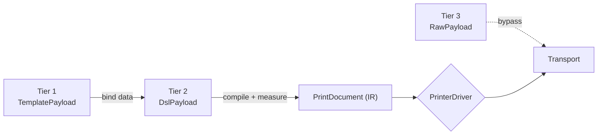
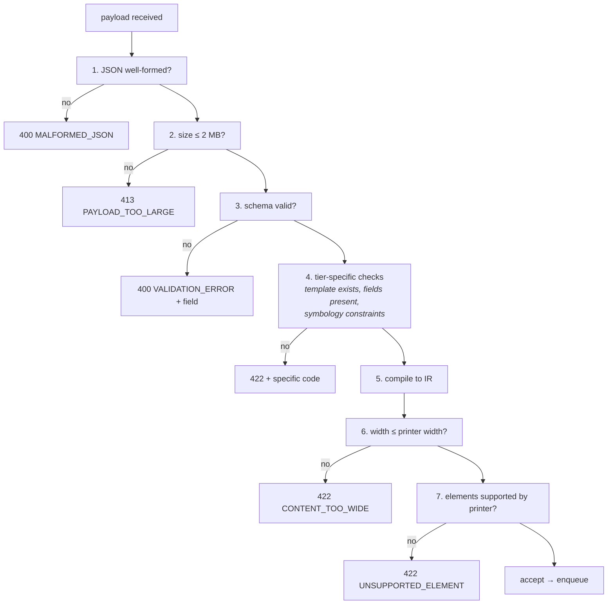

# Print Payload Schema

| Field | Value |
| --- | --- |
| Document ID | DES-05 |
| Version | 1.0 |
| Date | 2026-08-22 |
| Status | Approved |

---

## 1. Overview

Three caller-facing payload tiers lower onto one intermediate representation, per
[ADR-003](02-adr/ADR-003-three-tier-payload-api.md). This document is the authoritative schema for
all three and for the IR.



All payloads are discriminated on `tier`.

```jsonc
{ "tier": "template" | "dsl" | "raw", /* … */ }
```

---

## 2. Common envelope

```json
{
  "tier": "template",
  "options": {
    "copies": 1,
    "mediaType": "LABEL_GAP",
    "cutAfter": false,
    "verifyAfterPrint": false
  }
}
```

| Field | Type | Default | Notes |
| --- | --- | --- | --- |
| `options.copies` | integer 1–99 | `1` | Each copy is one transmission; the job is atomic across copies |
| `options.mediaType` | enum | printer default | `LABEL_GAP`, `LABEL_BLACKMARK`, `CONTINUOUS`, `LINERLESS` |
| `options.cutAfter` | boolean | `false` | Ignored where `capabilities.features.cutter` is `false` |
| `options.verifyAfterPrint` | boolean | `false` | Requests the verification loop (FR-405, v1.1) |

---

## 3. Tier 1 — Template

Layout lives on the device; the caller sends only data (FR-301). This is the everyday case, and the
tier that lets label layout change without a web deployment (G-7).

### 3.1 Payload

```json
{
  "tier": "template",
  "template": "part-label",
  "templateVersion": 3,
  "data": {
    "partNo": "6205-2RS",
    "lot": "L2408-0231",
    "qty": 50,
    "location": "A-12-03"
  },
  "options": { "copies": 1 }
}
```

| Field | Type | Required | Notes |
| --- | --- | :-: | --- |
| `template` | string | ✓ | Name as listed by `GET /v1/templates` |
| `templateVersion` | integer | | Pin a version; latest is used when omitted |
| `data` | object | ✓ | Flat key/value. Values may be string, number, or boolean |

**Errors** — `TEMPLATE_NOT_FOUND` · `MISSING_TEMPLATE_FIELD` (`field` names the missing key).

### 3.2 Template definition format

Stored on the device as JSON. A template is a **DSL document with placeholders**, which is why
Tier 1 lowers to Tier 2 rather than needing its own renderer.

```json
{
  "name": "part-label",
  "version": 3,
  "description": "Bearing part label, 104 × 50 mm",
  "widthDots": 832,
  "fields": {
    "partNo":   { "type": "string", "required": true,  "maxLength": 32 },
    "lot":      { "type": "string", "required": true,  "maxLength": 24 },
    "qty":      { "type": "number", "required": true,  "min": 0 },
    "location": { "type": "string", "required": false, "default": "" }
  },
  "elements": [
    { "type": "text",    "value": "{{partNo}}", "size": 3, "bold": true, "align": "center" },
    { "type": "text",    "value": "Lot {{lot}}  ×{{qty}}", "size": 1, "align": "center" },
    { "type": "barcode", "format": "CODE128", "value": "{{partNo}}", "heightDots": 80, "align": "center", "showText": true },
    { "type": "qr",      "value": "PN={{partNo}};LOT={{lot}};QTY={{qty}}", "scale": 5, "align": "center" },
    { "type": "text",    "value": "{{location}}", "size": 1, "align": "right", "omitIfEmpty": true },
    { "type": "feed",    "lines": 2 }
  ]
}
```

**Placeholder rules**

| Rule | Behaviour |
| --- | --- |
| `{{field}}` | Replaced by the value from `data` |
| Missing required field | `MISSING_TEMPLATE_FIELD`, job rejected, not retried |
| Missing optional field | Replaced by `default`, or empty string |
| `omitIfEmpty: true` | The element is dropped entirely when its resolved value is empty |
| Numbers | Rendered with no thousands separator unless the field declares `format` |
| Escaping | `{{` and `}}` inside a literal must be doubled |

**Validation happens before rendering** — field types and constraints from `fields` are enforced
against `data`, so a typo produces a field-level error rather than a malformed label (FR-308).

---

## 4. Tier 2 — Layout DSL

The caller composes the layout element by element (FR-303, FR-304).

### 4.1 Payload

```json
{
  "tier": "dsl",
  "document": {
    "widthDots": 832,
    "elements": [ /* … */ ]
  },
  "options": { "copies": 1 }
}
```

`document.widthDots` is optional; the connected printer's width is used when omitted. If it is
supplied and exceeds the printer's width, the job is rejected with `CONTENT_TOO_WIDE` (FR-310).

### 4.2 Element types

#### `text`

```json
{
  "type": "text",
  "value": "6205-2RS",
  "size": 3,
  "bold": true,
  "underline": false,
  "invert": false,
  "align": "center",
  "font": "0",
  "maxLines": 1,
  "overflow": "truncate"
}
```

| Field | Type | Default | Notes |
| --- | --- | --- | --- |
| `value` | string | — | Required. ASCII/Latin-1 only (D-09) |
| `size` | 1–8 | `1` | Multiplier on the base font; not a point size |
| `bold` / `underline` / `invert` | boolean | `false` | Realised where the language supports it |
| `align` | `left`/`center`/`right` | `left` | |
| `font` | string | printer default | Font id from `GET /v1/capabilities` |
| `maxLines` | integer | unbounded | |
| `overflow` | `truncate`/`wrap`/`error` | `wrap` | `error` rejects rather than silently losing content |

#### `barcode`

```json
{
  "type": "barcode",
  "format": "CODE128",
  "value": "6205-2RS",
  "heightDots": 80,
  "moduleWidth": 2,
  "align": "center",
  "showText": true
}
```

| Field | Type | Default | Notes |
| --- | --- | --- | --- |
| `format` | enum | — | `CODE128`, `CODE39`, `EAN13`, `ITF`, `UPCA` (FR-309) |
| `value` | string | — | Validated against the symbology's character set and check digits |
| `heightDots` | integer | `80` | |
| `moduleWidth` | 1–6 | `2` | Narrow-bar width. **The main driver of scannability** |
| `showText` | boolean | `true` | Human-readable line beneath |

**Symbology constraints — validated before printing**

| Format | Character set | Length |
| --- | --- | --- |
| `CODE128` | ASCII 0–127 | 1–48 |
| `CODE39` | `0-9 A-Z - . $ / + % space` | 1–43 |
| `EAN13` | digits | exactly 12 or 13 (check digit computed when 12) |
| `ITF` | digits | even count, 2–30 |
| `UPCA` | digits | exactly 11 or 12 |

Violations produce `VALIDATION_ERROR` with `field` pointing at the element — a scannability defect
caught at submit time rather than discovered on a shelf.

#### `qr`

```json
{
  "type": "qr",
  "value": "PN=6205-2RS;LOT=L2408-0231",
  "scale": 6,
  "errorCorrection": "M",
  "align": "center"
}
```

| Field | Type | Default | Notes |
| --- | --- | --- | --- |
| `scale` | 1–16 | `4` | Module size in dots |
| `errorCorrection` | `L`/`M`/`Q`/`H` | `M` | `Q` or `H` recommended for warehouse labels |
| `value` | string | — | Max 2953 bytes; longer produces `VALIDATION_ERROR` |

#### `image` *(optional, FR-305)*

```json
{
  "type": "image",
  "data": "iVBORw0KGgoAAAANSUhEUg…",
  "widthDots": 200,
  "align": "center",
  "dither": "FLOYD_STEINBERG"
}
```

Base64 PNG or JPEG, converted to 1-bit monochrome. `dither` is `NONE`, `THRESHOLD`, or
`FLOYD_STEINBERG`. Rejected with `UNSUPPORTED_ELEMENT` where
`capabilities.features.imageSupport` is `false`.

#### `line`

```json
{ "type": "line", "style": "solid", "thicknessDots": 2 }
```

`style` — `solid`, `dashed`, `dotted`. Spans the full print width.

#### `feed`

```json
{ "type": "feed", "lines": 3 }
```

Or `{ "type": "feed", "dots": 60 }`. Exactly one of `lines` or `dots`.

#### `cut`

```json
{ "type": "cut", "mode": "PARTIAL" }
```

`mode` — `FULL` or `PARTIAL`. Silently ignored where the printer has no cutter.

### 4.3 Element summary

| Type | Required fields | Notes |
| --- | --- | --- |
| `text` | `value` | Native font commands only (FR-311) |
| `barcode` | `format`, `value` | Validated against the symbology |
| `qr` | `value` | |
| `image` | `data` | Requires `imageSupport` |
| `line` | — | Full width |
| `feed` | `lines` or `dots` | |
| `cut` | — | No-op without a cutter |

---

## 5. Tier 3 — Raw

Pre-encoded printer commands, passed through unmodified (FR-306).

```json
{
  "tier": "raw",
  "language": "ESCPOS",
  "data": "G0AbYQEGMjA1LTJSUwoKHWkA",
  "options": { "copies": 1 }
}
```

| Field | Type | Required | Notes |
| --- | --- | :-: | --- |
| `language` | enum | ✓ | `ESCPOS`, `ZPL`, `CPCL`, `TSPL` |
| `data` | string | ✓ | Base64-encoded command bytes. Max 2 MB decoded |

**Rules**

1. Bytes reach the printer **unmodified** — no validation, no transformation
2. If `language` differs from the connected printer's, the app logs a warning and **still
   transmits**. The caller has explicitly taken responsibility
3. Queue, retry, and idempotency still apply. Tier 3 is an escape hatch for content, never for
   reliability guarantees
4. Because the app cannot inspect the content, `CONTENT_TOO_WIDE` cannot be detected for Tier 3

---

## 6. Intermediate representation — `PrintDocument`

The only thing a driver ever sees ([ADR-007](02-adr/ADR-007-printer-language-abstraction.md)).

```csharp
public sealed record PrintDocument(
    int WidthDots,
    MediaType MediaType,
    IReadOnlyList<PrintBlock> Blocks,
    int Copies = 1,
    bool CutAfter = false);

public abstract record PrintBlock(Alignment Align)
{
    public sealed record Text(
        string Value,
        int SizeMultiplier,
        bool Bold,
        bool Underline,
        bool Invert,
        string? FontId,
        Alignment Align) : PrintBlock(Align);

    public sealed record Barcode(
        Symbology Symbology,
        string Value,
        int HeightDots,
        int ModuleWidth,
        bool ShowText,
        Alignment Align) : PrintBlock(Align);

    public sealed record QrCode(
        string Value,
        int Scale,
        EccLevel ErrorCorrection,
        Alignment Align) : PrintBlock(Align);

    public sealed record Image(
        MonochromeBitmap Bitmap,        // already dithered to 1-bit
        int WidthDots,
        Alignment Align) : PrintBlock(Align);

    public sealed record Rule(LineStyle Style, int ThicknessDots, Alignment Align) : PrintBlock(Align);
    public sealed record Feed(int Dots, Alignment Align = Alignment.Left) : PrintBlock(Align);
    public sealed record Cut(CutMode Mode, Alignment Align = Alignment.Left) : PrintBlock(Align);
}
```

`MonochromeBitmap` is defined in `Bifrost.Core`, not `Android.Graphics.Bitmap` — the IR must stay
free of Android types so that drivers remain unit-testable off-device
([IMP-02 §2.1](../04-implementation/02-project-structure.md)). `Bifrost.App` converts at the
boundary.

### 6.1 Design notes

**The IR models intent, not pixels.** A `Barcode` block says *"CODE128, this value, 80 dots high"* —
not where the bars go. This matters because ZPL positions elements absolutely on a defined label
canvas while ESC/POS streams sequentially down a continuous roll. Each driver realises the same
intent in its own idiom. An IR of absolute coordinates would have forced the ESC/POS driver to
emulate a page model it does not have.

**Images are dithered before the IR.** Converting to 1-bit is a rendering concern, not a driver
concern, so every driver receives a bitmap it can transmit directly.

**Text is never rasterised.** Because content is English and numeric (D-09), native font commands are
used throughout — smaller payloads and faster prints over Bluetooth (FR-311).

**Measurement happens at IR construction.** Width validation against the printer's capabilities runs
once, at compile time, so `CONTENT_TOO_WIDE` (FR-310) is raised before any driver is invoked.

---

## 7. JSON Schema

Machine-readable schemas live in `app/src/main/assets/schemas/` and are used both for runtime
validation (FR-308) and for SDK type generation.

```
schemas/
├── print-request.schema.json     # oneOf over the three tiers
├── template-payload.schema.json
├── dsl-payload.schema.json
├── raw-payload.schema.json
├── element.schema.json           # element union
└── template-definition.schema.json
```

Root:

```json
{
  "$schema": "https://json-schema.org/draft/2020-12/schema",
  "$id": "https://bearing.local/bifrost/print-request.schema.json",
  "title": "Bifrost print request",
  "oneOf": [
    { "$ref": "template-payload.schema.json" },
    { "$ref": "dsl-payload.schema.json" },
    { "$ref": "raw-payload.schema.json" }
  ]
}
```

Element union:

```json
{
  "$id": "https://bearing.local/bifrost/element.schema.json",
  "type": "object",
  "required": ["type"],
  "discriminator": { "propertyName": "type" },
  "oneOf": [
    { "$ref": "#/$defs/text" },
    { "$ref": "#/$defs/barcode" },
    { "$ref": "#/$defs/qr" },
    { "$ref": "#/$defs/image" },
    { "$ref": "#/$defs/line" },
    { "$ref": "#/$defs/feed" },
    { "$ref": "#/$defs/cut" }
  ],
  "$defs": {
    "barcode": {
      "type": "object",
      "properties": {
        "type":        { "const": "barcode" },
        "format":      { "enum": ["CODE128", "CODE39", "EAN13", "ITF", "UPCA"] },
        "value":       { "type": "string", "minLength": 1, "maxLength": 48 },
        "heightDots":  { "type": "integer", "minimum": 8,  "maximum": 400, "default": 80 },
        "moduleWidth": { "type": "integer", "minimum": 1,  "maximum": 6,   "default": 2 },
        "align":       { "enum": ["left", "center", "right"], "default": "left" },
        "showText":    { "type": "boolean", "default": true }
      },
      "required": ["type", "format", "value"],
      "additionalProperties": false
    }
  }
}
```

Every example in this document validates against these schemas; that check runs in CI.

---

## 8. Worked example — one label, three tiers

The same bearing part label expressed at each level, producing equivalent output (FR-307).

**Tier 1**

```json
{
  "tier": "template",
  "template": "part-label",
  "data": { "partNo": "6205-2RS", "lot": "L2408-0231", "qty": 50 }
}
```

**Tier 2** — what Tier 1 lowers to

```json
{
  "tier": "dsl",
  "document": {
    "widthDots": 832,
    "elements": [
      { "type": "text",    "value": "6205-2RS", "size": 3, "bold": true, "align": "center" },
      { "type": "text",    "value": "Lot L2408-0231  ×50", "size": 1, "align": "center" },
      { "type": "barcode", "format": "CODE128", "value": "6205-2RS", "heightDots": 80, "align": "center", "showText": true },
      { "type": "qr",      "value": "PN=6205-2RS;LOT=L2408-0231;QTY=50", "scale": 5, "align": "center" },
      { "type": "feed",    "lines": 2 }
    ]
  }
}
```

**Tier 3** — the CPCL the driver emits for the above, sent directly

```
! 0 200 200 406 1
CENTER
TEXT 4 0 0 20 6205-2RS
TEXT 7 0 0 70 Lot L2408-0231  x50
BARCODE 128 2 1 80 0 110 6205-2RS
BARCODE-TEXT 7 0 5
B QR 0 220 M 2 U 5
MA,PN=6205-2RS;LOT=L2408-0231;QTY=50
ENDQR
FORM
PRINT
```

base64-encoded into `data`.

---

## 9. Validation order

Failing fast at the cheapest possible point:



Steps 1–4 need no printer connection, so a malformed payload is rejected even while the printer is
offline. Steps 6–7 require capabilities and are therefore deferred until dispatch if the printer was
disconnected at submit time.

---

## 10. Related documents

- [Local API Specification](03-local-api-spec.md)
- [JavaScript SDK Specification](04-js-sdk-spec.md)
- [Printer Abstraction](06-printer-abstraction.md)
- [ADR-003 — Three payload tiers](02-adr/ADR-003-three-tier-payload-api.md)
