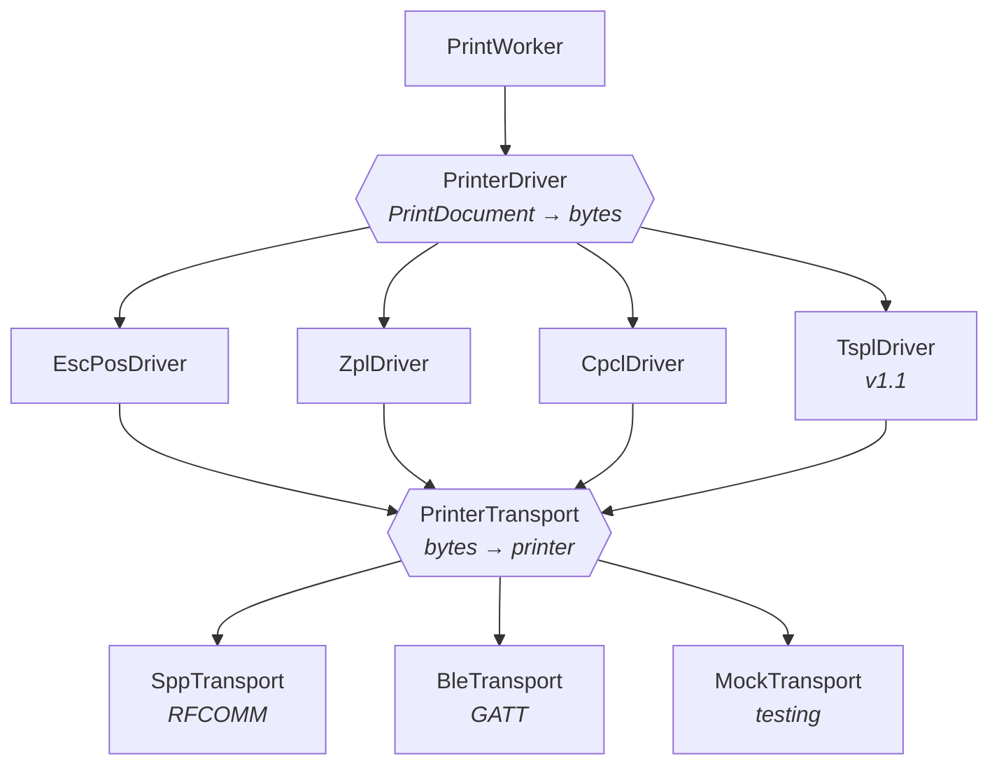
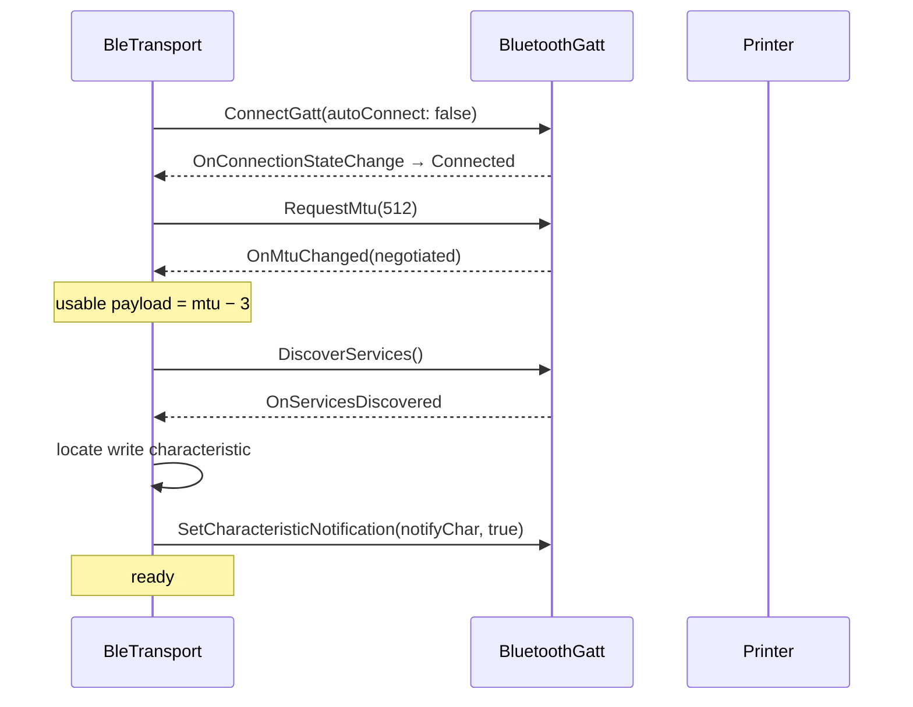

# Printer Abstraction

| Field | Value |
| --- | --- |
| Document ID | DES-06 |
| Version | 2.0 |
| Date | 2026-08-22 |
| Status | Approved |

> **Version 2.0** — code samples rewritten in C# following
> [ADR-008](02-adr/ADR-008-dotnet-for-android.md). The abstractions, the language comparison, and
> especially the **eight BLE rules in §7.3** are unchanged in substance. .NET for Android binds the
> Android SDK directly, so `BluetoothSocket`, `BluetoothGatt`, and their semantics are identical —
> only the casing and the async idiom differ.

---

## 1. Purpose

The printer has not been purchased (D-07) and the fleet may later mix vendors. This document defines
the two abstractions — **driver** (what to say) and **transport** (how to send it) — that keep that
uncertainty out of the rest of the system, per
[ADR-007](02-adr/ADR-007-printer-language-abstraction.md).



**Separation invariant:** drivers never touch Bluetooth; transports never interpret command bytes.
Any code that violates this is a defect, because it is what would reintroduce vendor coupling.

---

## 2. Driver interface

```csharp
public interface IPrinterDriver
{
    PrinterLanguage Language { get; }
    DriverCapabilities Capabilities { get; }

    /// <summary>Serialise a rendered document into this language's command bytes.</summary>
    byte[] Serialise(PrintDocument document, PrinterProfile printer);

    /// <summary>Bytes that ask the printer for status, or null if it cannot be asked.</summary>
    byte[]? StatusQuery();

    /// <summary>Interpret a status response. Never called when StatusQuery() returns null.</summary>
    PrinterStatus ParseStatus(ReadOnlySpan<byte> response);

    /// <summary>Identify this language from an identification response, if possible.</summary>
    bool Matches(ReadOnlySpan<byte> identificationResponse);
}

public enum PrinterLanguage { EscPos, Zpl, Cpcl, Tspl }

public sealed record DriverCapabilities(
    IReadOnlySet<Symbology> SupportedSymbologies,
    bool SupportsQr,
    bool SupportsImages,
    bool SupportsCut,
    bool SupportsStatusQuery,
    bool SupportsInvert,
    int MaxTextSizeMultiplier,
    PositioningModel PositioningModel);

public enum PositioningModel { Sequential, Absolute }
```

`StatusQuery()` returns `byte[]?` deliberately — with `Nullable` enabled project-wide, a caller that
forgets a printer might not answer gets a compiler warning, which under
`TreatWarningsAsErrors` is a build failure (FR-608).

`PositioningModel` is the one structural difference between the language families and the reason the
IR models intent rather than coordinates (see [DES-05 §6.1](05-print-payload-schema.md)).

---

## 3. Language comparison

| Aspect | ESC/POS | ZPL | CPCL | TSPL |
| --- | --- | --- | --- | --- |
| Origin | Epson, de-facto receipt standard | Zebra | Zebra (mobile) | TSC / generic Asian label printers |
| Positioning | `SEQUENTIAL` | `ABSOLUTE` | `ABSOLUTE` | `ABSOLUTE` |
| Primary media | Continuous receipt | Die-cut labels | Die-cut labels | Die-cut labels |
| Encoding | Binary escape sequences | ASCII text commands | ASCII text commands | ASCII text commands |
| Barcodes | `GS k` | `^BC` `^B3` `^BE` | `BARCODE` | `BARCODE` |
| QR | `GS ( k` (model-dependent) | `^BQ` | `B QR` | `QRCODE` |
| Images | `GS v 0` raster | `^GF` | `EG` / `CG` | `BITMAP` |
| Status query | `DLE EOT n` | `~HS` | `! U1 getvar` | `<ESC>!?` |
| Cut | `GS V` | `^MMC` | rarely present | `CUT` |
| Label gap handling | n/a | `^LL` `^MN` | `! 0 200 200 <h> 1` | `GAP` |
| Readability of output | Poor (binary) | Good | Good | Good |

### 3.1 Command examples — the same label

**ESC/POS** (receipt, sequential)

```
1B 40                      ESC @        initialise
1B 61 01                   ESC a 1      centre
1D 21 22                   GS ! 0x22    double width + height
"6205-2RS" 0A
1D 21 00                   GS ! 0       normal size
1D 68 50                   GS h 80      barcode height 80
1D 77 02                   GS w 2       module width 2
1D 6B 49 08 "6205-2RS"     GS k 73      CODE128
0A 0A 0A
1D 56 00                   GS V 0       full cut
```

**ZPL** (label, absolute)

```
^XA
^CI28
^FO0,20^FB832,1,0,C^A0N,60,60^FD6205-2RS^FS
^FO0,90^FB832,1,0,C^A0N,28,28^FDLot L2408-0231^FS
^FO100,130^BY2,2,80^BCN,80,Y,N,N^FD6205-2RS^FS
^FO320,230^BQN,2,5^FDMA,PN=6205-2RS;LOT=L2408-0231^FS
^XZ
```

**CPCL** (mobile label, absolute — the Zebra ZQ family's native language)

```
! 0 200 200 406 1
CENTER
TEXT 4 0 0 20 6205-2RS
TEXT 7 0 0 70 Lot L2408-0231
BARCODE 128 2 1 80 0 110 6205-2RS
BARCODE-TEXT 7 0 5
B QR 0 220 M 2 U 5
MA,PN=6205-2RS;LOT=L2408-0231
ENDQR
FORM
PRINT
```

---

## 4. Driver implementation notes

### 4.1 ESC/POS

| Concern | Approach |
| --- | --- |
| Sequential model | Blocks emit in order; alignment is a mode set before each block |
| Text size | `GS ! n` where the high nibble is width and the low nibble is height multiplier, both 0–7 |
| Barcode height | `GS h n`, module width `GS w n` (2–6) |
| QR support | Varies by model. Probe with `GS ( k` capability request; fall back to rendering the QR as a raster image if unsupported |
| Status | `DLE EOT 1..4` returns real-time status. Not universal on cheap clones — hence `statusQuery()` may return null |
| Encoding | ASCII only (D-09). No code page switching required |

### 4.2 ZPL

| Concern | Approach |
| --- | --- |
| Absolute model | A layout pass assigns Y coordinates by accumulating block heights; X follows alignment |
| Label length | `^LL` from the media height; `^MN` selects gap or black-mark sensing |
| Field blocks | `^FB<width>,1,0,<justify>` gives centring without manual pixel maths |
| Barcode | `^BY<module>,<ratio>,<height>` then `^BC` (CODE128), `^B3` (CODE39), `^BE` (EAN13) |
| Data escaping | `^` and `~` are control characters and must be escaped in `^FD` payloads |
| Status | `~HS` returns three comma-separated lines including paper-out and pause state |

### 4.3 CPCL

| Concern | Approach |
| --- | --- |
| Header | `! <offset> <xdpi> <ydpi> <height> <qty>` — height must be computed by the layout pass before emission |
| Absolute model | Same layout pass as ZPL, reusing the shared `AbsoluteLayoutEngine` |
| Alignment | `CENTER` / `LEFT` / `RIGHT` are modal and persist until changed |
| Barcode | `BARCODE <type> <width> <ratio> <height> <x> <y> <data>`, plus `BARCODE-TEXT` for the human-readable line |
| QR | `B QR <x> <y> M 2 U <scale>` … `ENDQR`, with the data line prefixed `MA,` |
| Terminator | `FORM` then `PRINT`. Omitting `FORM` on gap media misfeeds the next label |
| Status | `! U1 getvar "media.status"` on Link-OS firmware |

### 4.4 Shared layout engine

ZPL, CPCL, and TSPL are all `ABSOLUTE`, so coordinate assignment is written once:

```csharp
public sealed class AbsoluteLayoutEngine(int widthDots)
{
    // accumulates Y from measured block heights; derives X from alignment and measured width
    public IReadOnlyList<PositionedBlock> Layout(IReadOnlyList<PrintBlock> blocks);
}
```

Only ESC/POS bypasses it. This is where most of the driver code would otherwise have been
triplicated.

---

## 5. Transport interface

```csharp
public interface IPrinterTransport : IAsyncDisposable
{
    TransportType Type { get; }
    IStateStream<ConnectionState> ConnectionState { get; }

    Task<Result> ConnectAsync(string address, CancellationToken ct);
    Task<Result> WriteAsync(ReadOnlyMemory<byte> bytes, CancellationToken ct);  // chunking is internal
    Task<Result<byte[]>> ReadAsync(TimeSpan timeout, CancellationToken ct);
    Task DisconnectAsync();
}

public enum TransportType { BtClassic, Ble, Mock }

public abstract record ConnectionState
{
    public sealed record Disconnected : ConnectionState;
    public sealed record Connecting : ConnectionState;
    public sealed record Connected(string DeviceName, int? Mtu) : ConnectionState;
    public sealed record Failed(PrinterError Error) : ConnectionState;
}
```

`WriteAsync()` accepts a whole payload. Callers never see the MTU — that is the point of the
abstraction (FR-602, FR-604).

`IStateStream<T>` is the project's `StateFlow` equivalent: a current value plus an
`IAsyncEnumerable<T>` of subsequent changes, implemented over `System.Threading.Channels` in
`Bifrost.Core`. A dozen lines, and no reactive-framework dependency
([IMP-01 §2.3](../04-implementation/01-tech-stack.md)).

---

## 6. Bluetooth Classic (SPP)

The straightforward transport, and the one most mobile printers expose.

```csharp
private static readonly UUID SppUuid =
    UUID.FromString("00001101-0000-1000-8000-00805F9B34FB")!;

public async Task<Result> ConnectAsync(string address, CancellationToken ct)
{
    var device = _adapter.GetRemoteDevice(address);
    _adapter.CancelDiscovery();          // discovery cripples connection throughput
    _socket = device!.CreateRfcommSocketToServiceRecord(SppUuid);
    await _socket!.ConnectAsync().ConfigureAwait(false);
    _out = _socket.OutputStream;         // an ordinary .NET Stream
    _in  = _socket.InputStream;
    // …
}
```

A convenience of .NET for Android: `BluetoothSocket.InputStream` and `OutputStream` surface as
ordinary `System.IO.Stream` objects, so the SPP transport is plain C# stream I/O with
`ReadAsync`/`WriteAsync` and full `CancellationToken` support — no interop shim.

| Concern | Approach |
| --- | --- |
| Discovery interference | Always `cancelDiscovery()` before connecting — an active scan makes RFCOMM connects fail intermittently |
| Pairing | Assumed already done in Android Bluetooth settings. The app lists bonded devices only (FR-401) |
| Write chunking | Not required by the protocol, but writes are chunked at 4 KB anyway so a stall is detected promptly |
| Flow control | RFCOMM handles it. A blocked `write()` means the printer's buffer is full — apply the 30 s job timeout (FR-609) |
| Reconnection | Exponential backoff 1 s, 2 s, 4 s, 8 s, 16 s, then every 30 s while a printer is configured (FR-603) |
| Permissions | `BLUETOOTH` + `BLUETOOTH_ADMIN` on API ≤ 30; `BLUETOOTH_CONNECT` on API ≥ 31 (NFR-402) |

---

## 7. Bluetooth LE (GATT)

**The highest-risk component in the system.** Chunking and flow control are where this class of
project usually fails, so the rules below are prescriptive.

### 7.1 Connection sequence



### 7.2 Chunked write with flow control

```csharp
public async Task<Result> WriteAsync(ReadOnlyMemory<byte> bytes, CancellationToken ct)
{
    var chunkSize = _negotiatedMtu - 3;                     // ATT header overhead

    for (var offset = 0; offset < bytes.Length; offset += chunkSize)
    {
        var chunk = bytes.Slice(offset, Math.Min(chunkSize, bytes.Length - offset));

        _characteristic.WriteType = GattWriteType.Default;  // NOT NoResponse
        _characteristic.SetValue(chunk.ToArray());
        _gatt.WriteCharacteristic(_characteristic);

        // await OnCharacteristicWrite — never queue the next chunk optimistically
        var acked = await _writeAck.Reader
            .ReadWithTimeoutAsync(WriteAckTimeout, ct)      // 5 s
            .ConfigureAwait(false);

        if (!acked) return Result.Fail(new PrinterError.TransmitTimeout());
    }

    return Result.Ok();
}
```

`_writeAck` is a `Channel<bool>` written by the `OnCharacteristicWrite` GATT callback. The channel
has capacity 1 and is drained per chunk, so an unexpected duplicate callback cannot advance the loop
early.

### 7.3 Rules that must not be relaxed

| # | Rule | Why |
| --- | --- | --- |
| 1 | Use `GattWriteType.Default`, never `NoResponse` | Without acknowledgement, chunks silently overrun the printer buffer and output is truncated mid-label |
| 2 | Await `OnCharacteristicWrite` before sending the next chunk | The Android BLE stack has a single outstanding-operation queue; issuing concurrent writes drops them |
| 3 | Chunk size is `MTU − 3`, never `MTU` | Three bytes are ATT protocol overhead |
| 4 | Fall back to MTU 23 (20 payload bytes) if negotiation fails | Some printers ignore `RequestMtu` entirely |
| 5 | Never assume `RequestMtu` succeeded — read the value from `OnMtuChanged` | Negotiated MTU is frequently lower than requested |
| 6 | Serialise all GATT operations through `GattOperationQueue` — one consumer `Task` | Android's stack is not concurrency-safe and fails silently under parallel use |
| 7 | Apply a per-chunk acknowledgement timeout of 5 s | A dead connection otherwise hangs the worker until the job timeout |
| 8 | Recompute chunking on reconnect | MTU is renegotiated per connection |

> These eight rules are the highest-risk part of the system
> ([R-02](../07-project/02-risk-register.md), score 20). They are unchanged by the move to .NET —
> they are properties of the Android BLE stack, not of the language calling it. Every one carries a
> code comment naming this section, precisely because each looks removable and is not
> ([IMP-03 §9](../04-implementation/03-coding-standards.md)).

### 7.4 Throughput expectation

At MTU 512 (509 payload bytes) with acknowledged writes, expect roughly 8–15 KB/s. A 40 KB raster
label therefore takes 3–5 seconds. Text-and-barcode labels are typically under 2 KB and complete in
well under a second — which is another reason native fonts are preferred over rasterised text
(FR-311).

---

## 8. Capability model

Effective capabilities are the intersection of what the language supports and what the specific
printer supports.

```csharp
public sealed record PrinterProfile(
    string Id,
    string BluetoothAddress,
    string DisplayName,
    TransportType TransportType,
    PrinterLanguage Language,
    int PrintWidthDots,
    int Dpi,
    MediaType MediaType,
    bool HasCutter,
    bool SupportsStatusQuery,
    int? MaxImageWidthDots);

public static Capabilities EffectiveCapabilities(IPrinterDriver driver, PrinterProfile profile);
```

This is what `GET /v1/capabilities` returns (FR-201), and what `CONTENT_TOO_WIDE` and
`UNSUPPORTED_ELEMENT` are evaluated against.

### 8.1 Common print widths

| Media | Width mm | 203 dpi | 300 dpi |
| --- | --- | --- | --- |
| 58 mm receipt | 48 printable | 384 dots | 576 dots |
| 80 mm receipt | 72 printable | 576 dots | 864 dots |
| 4 in label | 104 printable | 832 dots | 1248 dots |

Printable width is always narrower than media width. Getting this wrong is the most common cause of
clipped labels, so the app derives width from the printer's reported capability where available and
from an explicit profile setting otherwise — never from the media size.

---

## 9. Language detection

Per FR-607: automatic where possible, manual where not.

```mermaid
flowchart TD
    A["connected"] --> B["send CPCL identity query<br/><i>! U1 getvar \"device.languages\"</i>"]
    B --> C{"response?"}
    C -->|yes| D["driver.matches() → select"]
    C -->|no| E["send ZPL ~HI"]
    E --> F{"response?"}
    F -->|yes| G["select ZPL"]
    F -->|no| H["send ESC/POS DLE EOT 1"]
    H --> I{"response?"}
    I -->|yes| J["select ESC/POS"]
    I -->|no| K["prompt operator to select<br/>language in settings"]
    D & G & J & K --> L["persist to PrinterProfile"]
```

Detection runs once per printer and the result is stored. Probing is safe: each query is a no-op in
the languages it does not belong to. Where nothing responds — common on write-only clones — the app
asks the operator once and remembers.

---

## 10. Mock transport

Enables hardware-free development and testing (NFR-602), and is what allows work to begin before the
hardware decision (Q-01) is made.

```csharp
public sealed class MockTransport(MockScenario? scenario = null) : IPrinterTransport
{
    private readonly MockScenario _scenario = scenario ?? new MockScenario.Ideal();

    public IReadOnlyList<byte[]> Written => _written;   // assert on emitted commands
}

public abstract record MockScenario
{
    public sealed record Ideal : MockScenario;
    public sealed record OutOfPaper : MockScenario;
    public sealed record CoverOpen : MockScenario;
    public sealed record DisconnectAfter(int Bytes) : MockScenario;
    public sealed record SlowWrite(int BytesPerSecond) : MockScenario;
    public sealed record FailNTimesThenSucceed(int N) : MockScenario;
    public sealed record TruncateAt(int Bytes) : MockScenario;  // simulates BLE flow-control failure
}
```

`TruncateAt` exists specifically to reproduce the §7.3 failure modes deterministically, so the rules
there are regression-tested rather than trusted.

---

## 11. Adding a new printer language

The FR-610 checklist. If a step outside this list is needed, the abstraction has leaked.

1. Implement `IPrinterDriver` in `Bifrost.Drivers`
2. Declare `DriverCapabilities` honestly — under-declaring degrades gracefully, over-declaring
   produces broken output
3. Reuse `AbsoluteLayoutEngine` if the language is `ABSOLUTE`
4. Implement `matches()` for auto-detection, or return `false` for manual selection only
5. Register in `DriverRegistry`
6. Add golden-output tests: `PrintDocument` → expected bytes
7. Add the language to the `raw` payload enum in the schema

**No change is required** to the API layer, the queue, the render pipeline, or the SDK.

---

## 12. Related documents

- [ADR-007 — Driver and transport abstractions](02-adr/ADR-007-printer-language-abstraction.md)
- [Print Payload Schema](05-print-payload-schema.md)
- [Hardware Recommendation](../06-operations/03-hardware-recommendation.md)
- [Test Strategy](../05-testing/01-test-strategy.md)
