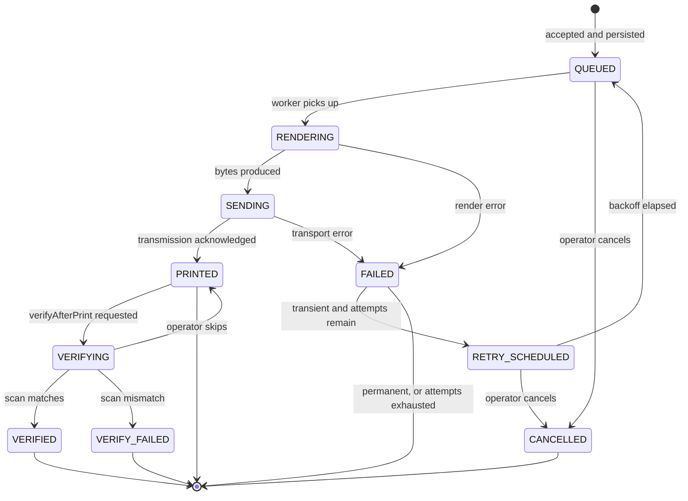
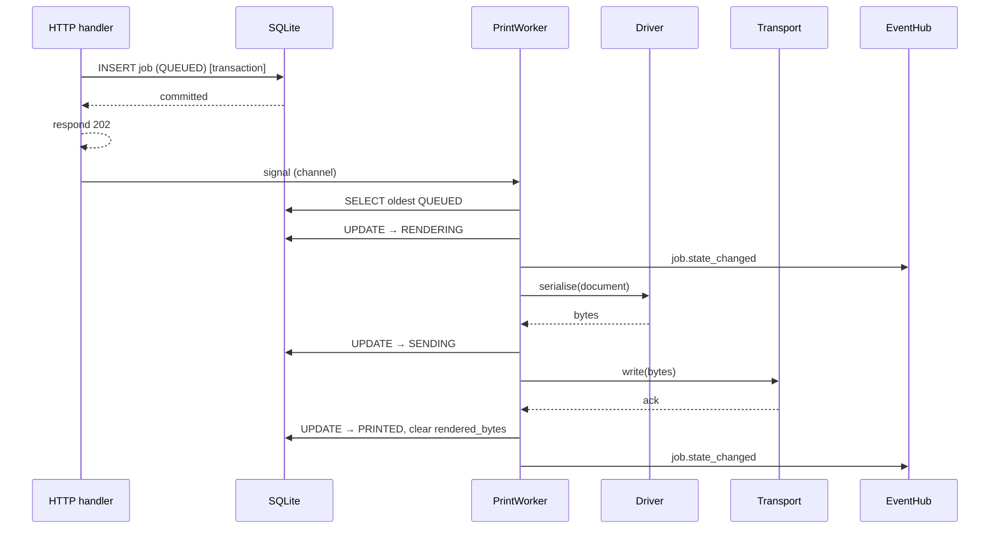
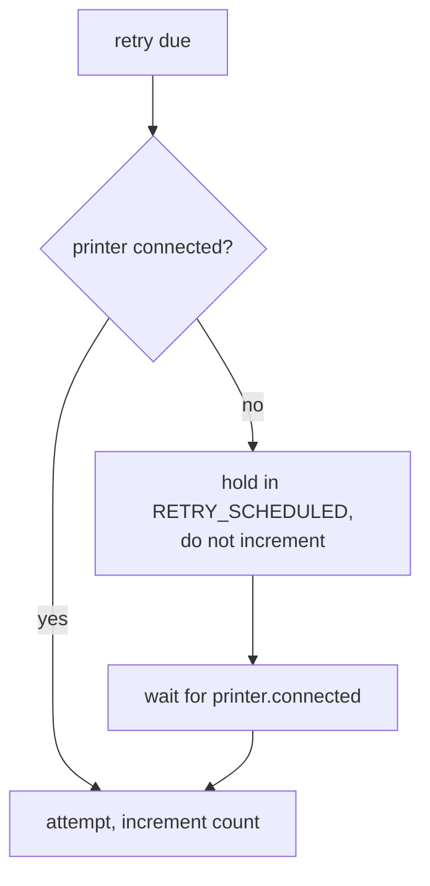
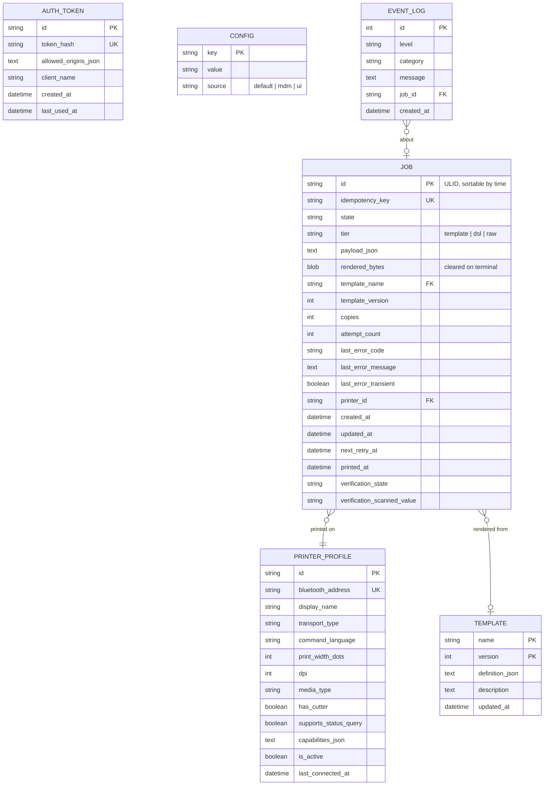
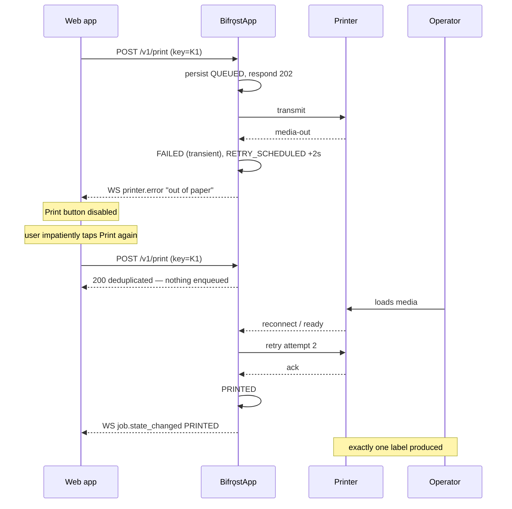

# Job Lifecycle & Data Model

| Field | Value |
| --- | --- |
| Document ID | DES-07 |
| Version | 1.0 |
| Date | 2026-08-22 |
| Status | Approved |

---

## 1. Purpose

Defines the state machine every print job passes through, the persistence model behind it, and the
rules that deliver the two guarantees in D-12:

- **No accepted job is ever lost** (NFR-201)
- **No job is ever printed twice** (NFR-202)

These are stronger than "the network retried successfully". A duplicate physical label means two
bins claim the same identity — a data-integrity fault, not a cosmetic one.

---

## 2. State machine



### 2.1 States

| State | Terminal | Meaning |
| --- | :-: | --- |
| `QUEUED` | | Persisted and awaiting the worker |
| `RENDERING` | | Compiling payload → IR → command bytes |
| `SENDING` | | Bytes are being transmitted to the printer |
| `PRINTED` | ✓ | Transmission acknowledged. **Paper has moved** |
| `FAILED` | ✓* | An error occurred. Terminal unless a retry is scheduled |
| `RETRY_SCHEDULED` | | Awaiting backoff expiry |
| `CANCELLED` | ✓ | Cancelled before transmission began |
| `VERIFYING` | | Awaiting an operator scan *(v1.1)* |
| `VERIFIED` | ✓ | The printed barcode scanned back correctly *(v1.1)* |
| `VERIFY_FAILED` | ✓ | The scan did not match what was sent *(v1.1)* |

### 2.2 Transition rules

| # | Rule |
| --- | --- |
| 1 | `QUEUED` is only reachable after a **committed** database write. The API never acknowledges a job that is not on disk (FR-103) |
| 2 | `SENDING` → `PRINTED` is the only transition that implies paper moved. Everything downstream of it treats the job as physically complete |
| 3 | A job in `SENDING` **cannot be cancelled** — bytes are already in flight and the printer's state is unknown (FR-108) |
| 4 | `FAILED` → `RETRY_SCHEDULED` requires both `transient == true` **and** `attemptCount < 5` (FR-106, FR-107) |
| 5 | Verification never blocks completion. A skipped or failed verification leaves the print itself successful |
| 6 | Every transition is written to the database before the corresponding WebSocket event is emitted, so a client never observes a state the device has not committed |

---

## 3. The single-consumer model

Per [ADR-005](02-adr/ADR-005-persistent-queue-room.md), exactly one `PrintWorker` consumer `Task`
runs per printer.



Because there is one consumer, two jobs can never interleave on one Bluetooth link. Serialisation is
structural rather than a locking discipline that can be got wrong — the failure mode it prevents is
two half-labels printed on top of each other, which no amount of retry logic can undo.

The consumer is a long-running `Task` reading from a `System.Threading.Channels.Channel<string>` of
job IDs, signalled by the HTTP handler after each committed insert. The channel carries only a
wake-up signal; the database remains the source of truth, so a signal lost to a process kill costs
nothing — the recovery path in §6 finds the row regardless.

---

## 4. Retry policy

### 4.1 Classification

Retry is decided by the error's `transient` flag, evaluated at exactly one place.

```csharp
public static Disposition Classify(PrinterError error) => error switch
{
    // transient — the world may change
    PrinterError.OutOfPaper or PrinterError.CoverOpen or PrinterError.BatteryLow
        or PrinterError.Overheated or PrinterError.PaperJam or PrinterError.Disconnected
        or PrinterError.TransmitTimeout or PrinterError.ConnectionFailed
        or PrinterError.InternalError            => Disposition.Retry,

    // permanent — retrying cannot help
    PrinterError.ValidationError or PrinterError.ContentTooWide
        or PrinterError.UnsupportedElement or PrinterError.TemplateNotFound
        or PrinterError.MissingTemplateField or PrinterError.PayloadTooLarge
        or PrinterError.UnsupportedCommand       => Disposition.Fail,

    _ => throw new UnreachableException($"Unclassified error: {error.Code}"),
};
```

The `_` arm exists to make an omission loud. `PrinterError` is a closed hierarchy of nested records,
so adding a new error without classifying it produces a compiler warning — which, under
`TreatWarningsAsErrors` ([IMP-03 §1](../04-implementation/03-coding-standards.md)), fails the
build. The throw is the second line of defence, not the first.

A malformed payload will be just as malformed in five minutes. Retrying it wastes battery and hides
the real error from the operator (FR-107).

### 4.2 Backoff schedule

| Attempt | Delay before it | Cumulative |
| :-: | --- | --- |
| 1 | — | 0 |
| 2 | 2 s | 2 s |
| 3 | 8 s | 10 s |
| 4 | 30 s | 40 s |
| 5 | 120 s | 2 min 40 s |
| — | 300 s *(final wait)* | 7 min 40 s |

After five attempts the job is terminally `FAILED` and remains visible in history for manual reprint
(FR-404).

The early delays are deliberately short: the most common transient cause is media-out, and an
operator who loads paper expects the label within seconds, not on the next scheduler tick. This
responsiveness is precisely why WorkManager was rejected as the queue mechanism.

### 4.3 Connection-aware scheduling

When the printer is disconnected, retries do not burn through the attempt budget against a printer
that is not there:



A job queued while the printer is off therefore still has all five attempts available the moment it
reconnects (NFR-206).

---

## 5. Idempotency

The mechanism behind NFR-202.

### 5.1 Rules

| # | Rule |
| --- | --- |
| 1 | `Idempotency-Key` is any caller string ≤ 128 chars. The SDK always sends one (FR-705) |
| 2 | Keys are retained **24 hours** from first receipt |
| 3 | A key seen within the window returns the original job with `deduplicated: true` and HTTP `200`. **Nothing prints** |
| 4 | A key seen after expiry starts a new job |
| 5 | Deduplication compares the **key only**. A different body under a reused key still returns the original job — the key is the caller's assertion that it is the same request |
| 6 | The key is stored with a `UNIQUE` constraint, so the database enforces it even under concurrent submission |
| 7 | Reprints from the app UI create a new job with a new key, deliberately bypassing deduplication (US-502) |
| 8 | `options.copies: 3` is **one** job producing three copies — not three jobs. Retrying it reprints all three, because the job is the atomic unit |

### 5.2 Concurrency

Two simultaneous requests with the same key are resolved by the database, not by application
locking:

```sql
INSERT INTO job (id, idempotency_key, …) VALUES (…);
-- UNIQUE violation on idempotency_key → SELECT the existing row and return it
```

The loser of the race returns the winner's job. No lock, no window in which both could enqueue.

---

## 6. Crash and restart recovery

Recovering the states that are ambiguous after process death.

| State at crash | On restart | Reasoning |
| --- | --- | --- |
| `QUEUED` | Stays `QUEUED`, processed normally | Nothing was attempted |
| `RETRY_SCHEDULED` | Stays; retries when `next_retry_at` passes | Timer is persisted, not in memory |
| `RENDERING` | Reset to `QUEUED` | Rendering is pure — no paper moved |
| `SENDING` | **Marked `FAILED` with `INTERRUPTED`, not retried automatically** | See below |
| `PRINTED` / `FAILED` / `CANCELLED` | Unchanged | Terminal |

### 6.1 Why `SENDING` is not auto-retried

A job interrupted mid-transmission is genuinely ambiguous: the printer may have printed all of it,
part of it, or none. Automatically retrying risks a duplicate label — the exact outcome NFR-202
exists to prevent.

The job is therefore surfaced to the operator as *"Interrupted — may or may not have printed. Check
the printer and reprint if needed."* The operator can see the physical printer; the software cannot.
Deferring to the person holding it is the only correct resolution.

---

## 7. Data model



### 7.1 Indexes

| Table | Index | Purpose |
| --- | --- | --- |
| `JOB` | `idempotency_key` UNIQUE | Deduplication, enforced by the database (§5.2) |
| `JOB` | `(state, created_at)` | Worker dequeue: oldest `QUEUED` first |
| `JOB` | `(state, next_retry_at)` | Retry scheduler scan |
| `JOB` | `created_at DESC` | History listing |
| `EVENT_LOG` | `created_at` | Rotation and diagnostics export |

### 7.2 Job identifiers

ULIDs, prefixed `job_`: `job_01J8XKQ4M2N7P9R3T5V6W8Y0AB`. Lexicographically sortable by creation
time, so the dequeue index doubles as chronological ordering, and they are URL-safe and readable
aloud during phone support.

### 7.3 Retention

| Data | Retention | Requirement |
| --- | --- | --- |
| Terminal jobs | 30 days or 1000 rows, whichever first | FR-110 |
| `rendered_bytes` | Cleared as soon as a job reaches a terminal state | — |
| Idempotency keys | 24 hours (the key column persists with the job; lookups are window-scoped) | FR-102 |
| `EVENT_LOG` | 7 days, max 10 MB, rotated | NFR-703 |

Clearing `rendered_bytes` on completion is what keeps the database small. Reprint re-renders from
`payload_json`, which is small and also guarantees a reprint picks up any template correction made
since.

---

## 8. Queue capacity

| Limit | Value | Behaviour |
| --- | --- | --- |
| Pending jobs (`QUEUED` + `RETRY_SCHEDULED`) | 500 | Further submissions rejected with `429 QUEUE_FULL` |
| Warning threshold | 400 | `queue.changed` event carries a warning flag; the app notification turns amber |

500 pending jobs on a handheld means something is already wrong — most likely a printer that has been
off for hours. The cap prevents the database growing without bound while the operator remains unaware.

---

## 9. Events

Every transition emits on `WS /v1/events` (FR-203) **after** the database write commits.

| Transition | Event | Notable payload |
| --- | --- | --- |
| any → any | `job.state_changed` | `jobId`, `state`, `previousState`, `attemptCount`, `error?` |
| → `PRINTED` | `job.state_changed` | plus `printedAt` |
| → `VERIFIED` / `VERIFY_FAILED` | `job.verified` | `verified`, `scannedValue?` |
| queue depth change | `queue.changed` | `pending`, `retrying` |
| transient error | `printer.error` | `code`, `message`, `transient` |

Ordering is guaranteed per job: a client never sees `PRINTED` before the `SENDING` that preceded it.

---

## 10. Worked scenario — media-out mid-shift

Demonstrating every guarantee at once.



The impatient second tap is the case that breaks naive implementations. Here the idempotency key
absorbs it, and one label is produced.

---

## 11. Related documents

- [ADR-005 — durable database-backed queue](02-adr/ADR-005-persistent-queue-room.md)
- [Local API Specification](03-local-api-spec.md)
- [Architecture §7](01-architecture.md)
- [Test Cases](../05-testing/02-test-cases.md)
