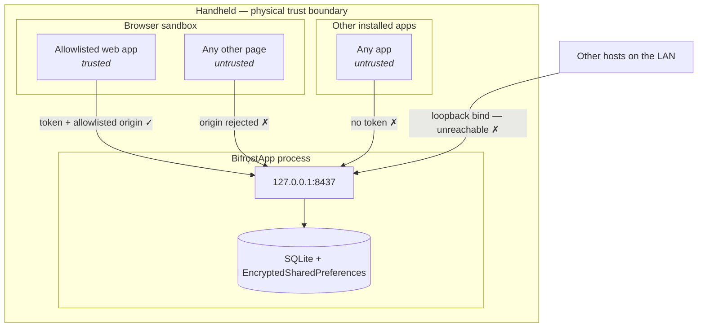
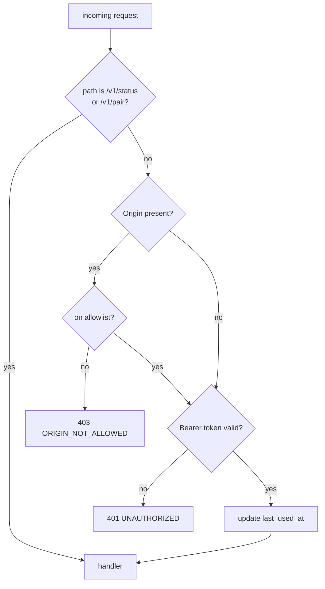

# Security Design

| Field | Value |
| --- | --- |
| Document ID | DES-08 |
| Version | 2.0 |
| Date | 2026-08-22 |
| Status | Approved |

> **Version 2.0** — technology names updated for .NET
> ([ADR-008](02-adr/ADR-008-dotnet-for-android.md)). **Every security property, threat, and control is
> unchanged.** The Android permission model, manifest hardening, and EncryptedSharedPreferences are
> identical — .NET for Android binds the same platform components.

---

## 1. Security context

| Property | Value | Consequence |
| --- | --- | --- |
| Network | Intranet only, no internet egress (D-02) | No external attack surface; no data leaves the site |
| Deployment | Internal, one organisation (D-15) | No untrusted tenants |
| Devices | Company-owned rugged handhelds, physically controlled | Physical access is a defended perimeter, not an open one |
| Listening surface | Loopback `127.0.0.1:8437` only (ADR-001) | Not reachable from any other host |
| Data handled | Part numbers, lot codes, quantities, locations | Operationally sensitive; not personal or financial |
| Required level | Origin allowlist + token (D-15) | Full per-user auth deferred (NG-7) |

**The asset being protected is not data confidentiality — it is the physical printer.** An attacker
who can print can put wrong labels on real stock. That is a data-integrity attack on the warehouse
itself, and it is why an unauthenticated loopback port is unacceptable even on a trusted network.

---

## 2. Trust boundaries



| Boundary | Control |
| --- | --- |
| LAN → app | Loopback-only socket bind (FR-504) |
| Other local app → app | Bearer token (FR-502) |
| Other web page → app | Origin allowlist (FR-503) + token |
| App → printer | Bluetooth pairing at the OS level |
| App → storage | EncryptedSharedPreferences for secrets (FR-507) |

---

## 3. Threat model (STRIDE)

| # | Threat | Category | Likelihood | Impact | Mitigation |
| --- | --- | --- | :-: | :-: | --- |
| T-1 | A malicious web page on the device prints forged labels onto real stock | Tampering | Medium | **High** | Origin allowlist (FR-503) + token (FR-502). Both required |
| T-2 | Another installed app calls the print API | Spoofing | Low | High | Token required; `Origin` cannot substitute for it since native callers can forge headers |
| T-3 | A host on the LAN reaches the bridge | Spoofing | Low | High | Loopback bind (FR-504). Verified by test |
| T-4 | Token stolen from `localStorage` by script | Info disclosure | Low | Medium | Same-origin policy; that origin is allowlisted, so it is authorised anyway. Token grants printing on one device only |
| T-5 | Token recovered from device storage | Info disclosure | Low | Medium | EncryptedSharedPreferences; only a hash is in the database (FR-507) |
| T-6 | Token leaked through logs or diagnostics | Info disclosure | Medium | Medium | Redaction at the logging layer; CI test greps the bundle (NFR-304) |
| T-7 | Print flood exhausts media or battery | DoS | Low | Medium | Queue cap of 500 (FR-109); the caller is already authenticated |
| T-8 | Malformed payload crashes the app | DoS | Medium | Medium | Schema validation before processing (FR-308); fuzz tests (NFR-205) |
| T-9 | Lost device used to print | Elevation | Low | Medium | Token revocation (FR-505); MDM remote wipe |
| T-10 | Pairing QR photographed and reused | Spoofing | Low | Medium | 5-minute validity, single use (FR-506) |
| T-11 | Malicious raw (Tier 3) payload reconfigures the printer | Tampering | Low | Low | Requires an authenticated allowlisted caller. Accepted: Tier 3 is an intentional escape hatch |
| T-12 | Job history read from device storage | Info disclosure | Low | Low | Android app sandbox; data is operational, not personal |

### 3.1 Accepted risks

| Risk | Rationale |
| --- | --- |
| An allowlisted origin has full printing rights | That is what allowlisting means. Origin granularity matches the deployment: one web app per device |
| Tier 3 raw payloads are not inspected | By design (FR-306). An authenticated caller has taken responsibility |
| No per-user attribution | Deferred by NG-7. Devices are individually assigned, so device identity is a usable proxy |
| Token does not expire automatically | Rotation without an operator present would break printing mid-shift. Revocation is manual and immediate (FR-505) |

---

## 4. Authentication design

Per [ADR-006](02-adr/ADR-006-origin-allowlist-token-auth.md), two independent controls.

### 4.1 Request pipeline



The check runs as a single `IRequestInterceptor` registered through `IBridgeServer.UseInterceptor`,
ahead of all routing, so no endpoint can accidentally omit it
([ADR-009](02-adr/ADR-009-embedded-http-server.md)). Origin is evaluated **before** the token so that
a stolen token from a foreign origin fails on the first control.

Because the interceptor sits in `Bifrost.Server` and not in the EmbedIO adapter, the security
pipeline is testable without opening a socket — and it survives a change of server library
untouched.

### 4.2 Token properties

| Property | Value | Requirement |
| --- | --- | --- |
| Entropy | 32 bytes from `RandomNumberGenerator.GetBytes(32)` | NFR-303 |
| Encoding | base64url, no padding — 43 chars | — |
| Storage (app) | EncryptedSharedPreferences (plaintext, for QR display) | FR-507 |
| Storage (database) | SHA-256 hash only | FR-507 |
| Comparison | Constant-time, via `CryptographicOperations.FixedTimeEquals` over the hash | — |
| Storage (web) | `localStorage`, key `bifrost.token` | FR-709 |
| Expiry | None automatic; revocable at any time | FR-505 |
| Logging | Never, anywhere | NFR-304 |

### 4.3 Pairing flow

```mermaid
sequenceDiagram
    participant OP as Operator
    participant APP as BifrǫstApp
    participant WEB as Web app + SDK

    OP->>APP: open Pairing
    APP->>APP: token = Base64Url(RandomNumberGenerator.GetBytes(32))
    APP->>APP: store hash in DB; plaintext in EncryptedSharedPreferences
    APP->>APP: mark QR valid 5 min, unused
    APP-->>OP: display QR
    OP->>WEB: focus field, scan QR with device scanner
    WEB->>APP: POST /v1/pair { token, origin, clientName }
    APP->>APP: verify hash, window, unused
    APP->>APP: add origin to allowlist; consume QR
    APP-->>WEB: 200 { paired: true }
    WEB->>WEB: localStorage['bifrost.token'] = token
```

**Why QR rather than typing.** The handhelds carry an integrated scanner (D-13). Displaying the token
as a QR turns a 43-character secret into a one-second scan, removing both the transcription error and
the temptation to choose a short token. Security improved by using hardware already in the
operator's hand.

**Single use and short validity** (FR-506) bound the window in which a photographed code is useful
(T-10).

---

## 5. Origin allowlist

| Aspect | Behaviour |
| --- | --- |
| Format | Full origin — scheme, host, port. `http://intranet.company.local` |
| Matching | Exact string, case-insensitive on host. **No wildcards** |
| Population | Added at pairing; editable in settings; settable by MDM (NFR-702) |
| Absent `Origin` | Allowed through to the token check. Only browsers send `Origin`; a native caller is stopped by the token instead |
| CORS | Permissive headers emitted **only** for allowlisted origins (FR-508) |

Wildcards are excluded deliberately: `*.company.local` would authorise any compromised subdomain to
print onto physical stock.

### 5.1 CORS response

For an allowlisted origin:

```http
Access-Control-Allow-Origin: http://intranet.company.local
Access-Control-Allow-Methods: GET, POST, OPTIONS
Access-Control-Allow-Headers: Authorization, Content-Type, Idempotency-Key
Access-Control-Max-Age: 86400
Vary: Origin
```

For anything else, no `Access-Control-Allow-*` headers at all. `Vary: Origin` is always sent so an
intermediate cache cannot serve one origin's permissive response to another.

---

## 6. Android platform security

### 6.1 Permissions

| Permission | API levels | Why | Type |
| --- | --- | --- | --- |
| `BLUETOOTH` | ≤ 30 | Legacy Bluetooth access | Install-time |
| `BLUETOOTH_ADMIN` | ≤ 30 | Legacy connection management | Install-time |
| `BLUETOOTH_CONNECT` | ≥ 31 | Connect to a bonded printer | **Runtime** |
| `BLUETOOTH_SCAN` | ≥ 31 | Discover printers *(only if in-app discovery is added)* | **Runtime** |
| `FOREGROUND_SERVICE` | all | Keep the bridge alive | Install-time |
| `FOREGROUND_SERVICE_CONNECTED_DEVICE` | ≥ 34 | Required for the `connectedDevice` service type | Install-time |
| `POST_NOTIFICATIONS` | ≥ 33 | Persistent status notification | **Runtime** |
| `RECEIVE_BOOT_COMPLETED` | all | Restart the queue after reboot (FR-408) | Install-time |

**Not requested:** `INTERNET` — the app never makes an outbound network call, and its absence is a
verifiable guarantee that print content cannot leave the device (NFR-306). Also not requested:
location. `BLUETOOTH_SCAN` is declared with `neverForLocation` so no location permission is implied
on API 31+.

Least privilege is a requirement, not a preference (NFR-305).

### 6.2 Manifest hardening

```xml
<application
    android:allowBackup="false"
    android:usesCleartextTraffic="false"
    android:networkSecurityConfig="@xml/network_security_config">

    <service
        android:name=".service.BridgeService"
        android:foregroundServiceType="connectedDevice"
        android:exported="false" />

    <receiver
        android:name=".service.BootReceiver"
        android:exported="true">
        <intent-filter>
            <action android:name="android.intent.action.BOOT_COMPLETED" />
        </intent-filter>
    </receiver>
</application>
```

| Setting | Reason |
| --- | --- |
| `allowBackup="false"` | Prevents the token and job history reaching a device backup |
| `exported="false"` on the service | No other app can bind to it |
| `foregroundServiceType="connectedDevice"` | Required from Android 14 for Bluetooth work (FR-407) |
| `BootReceiver` exported | Necessary to receive the system broadcast; it performs no work beyond starting the service |

### 6.3 Data at rest

| Data | Storage | Protection |
| --- | --- | --- |
| Pairing token (plaintext) | EncryptedSharedPreferences | Android Keystore-backed AES-256 |
| Token hash | SQLite | SHA-256; the plaintext is not recoverable from it |
| Job payloads and history | SQLite | App sandbox; `allowBackup="false"` |
| Templates | App assets + SQLite | Not secret |
| Logs | App-private files | Rotated; redacted |

Full-database encryption (SQLCipher) is **not** used. It would protect against an attacker with root
on a device they physically hold — who could also simply read the screen or print directly. The cost
in complexity and performance is not matched by a reduction in real risk here.

---

## 7. Logging and diagnostics

### 7.1 Redaction rules

| Data | Logged? |
| --- | --- |
| Pairing token, any fragment of it | **Never** (NFR-304) |
| `Authorization` header | Never — logged as `Bearer <redacted>` |
| Print payload content | Never in full. Metadata only: tier, template name, byte size |
| Raw command bytes | Never. Length only |
| Origins | Yes — needed to diagnose allowlist problems |
| Job IDs, states, error codes | Yes |
| Printer identity and capabilities | Yes |

### 7.2 Diagnostics bundle

Produced by FR-406, and by design safe to share over any channel:

```
bifrost-diagnostics-2026-08-22T14-03-11.json
├── app          version, build, install source
├── device       model, Android version, API level
├── permissions  granted / denied per permission
├── battery      optimisation state, level
├── printer      name, address (last 4 chars only), language, capabilities
├── queue        current depth, state counts
├── jobs         last 50 — id, state, error code, timestamps. NO payload content
└── log          last 7 days, redacted
```

A CI test greps a generated bundle for the active token and fails the build if it appears
(NFR-304).

---

## 8. Security testing

| Test | Verifies | Requirement |
| --- | --- | --- |
| Request the API from another LAN host | Connection refused | FR-504, T-3 |
| Call a protected endpoint with no token | `401` | FR-502, T-2 |
| Call with a valid token from a non-allowlisted origin | `403` | FR-503, T-1 |
| CORS preflight from a foreign origin | No permissive headers | FR-508 |
| Scan a QR older than 5 minutes | `410 PAIRING_EXPIRED` | FR-506, T-10 |
| Scan an already-used QR | `409 PAIRING_ALREADY_USED` | FR-506 |
| Regenerate the token, then call with the old one | `401` | FR-505, T-9 |
| Inspect app storage for a plaintext token | Absent outside EncryptedSharedPreferences | FR-507, T-5 |
| Grep logs and diagnostics bundle for the token | No match | NFR-304, T-6 |
| Fuzz `POST /v1/print` with malformed payloads | No crash; queue remains consistent | NFR-205, T-8 |
| Submit 600 jobs | `429` after 500; app stable | FR-109, T-7 |
| Inspect the manifest for `INTERNET` | Absent | NFR-306 |

Full cases in [Test Cases §6](../05-testing/02-test-cases.md).

---

## 9. Incident response

| Scenario | Action |
| --- | --- |
| Device lost or stolen | MDM remote wipe. The token is device-local, so no other device is affected |
| Token believed compromised | Regenerate in-app (FR-505); re-pair the web app by scanning the new QR |
| Unexpected labels printed | Export diagnostics; review the auth-failure log (FR-509) and job history for the originating origin |
| Malicious page suspected on the fleet | Narrow the allowlist via MDM to the single known-good origin |

---

## 10. Future strengthening

Not in v1.0; recorded so the path is known.

| Enhancement | Trigger |
| --- | --- |
| Request signing (QZ Tray model) | Deployment beyond a physically controlled fleet |
| Per-user authentication and audit trail | An audit requirement naming individual operators |
| Certificate-pinned HTTPS on loopback | Loopback plaintext becomes a compliance finding |
| Token rotation on a schedule | A policy mandating maximum credential lifetime |
| SQLCipher database encryption | Job content becomes classified as sensitive |

---

## 11. Related documents

- [ADR-001 — Loopback topology](02-adr/ADR-001-loopback-vs-cloud-relay.md)
- [ADR-006 — Origin allowlist + token](02-adr/ADR-006-origin-allowlist-token-auth.md)
- [Local API Specification §2](03-local-api-spec.md)
- [Test Cases](../05-testing/02-test-cases.md)
