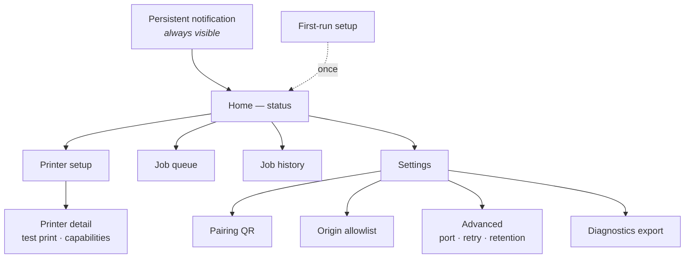
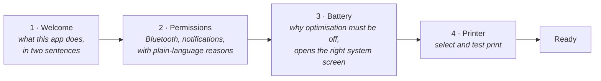

# UI/UX Specification

| Field | Value |
| --- | --- |
| Document ID | DES-09 |
| Version | 1.0 |
| Date | 2026-08-22 |
| Status | Approved |

---

## 1. Design context

BifrǫstApp is **not** the application the operator works in. The web app is. Bifrǫst is
infrastructure: it should be invisible when working and unmistakably clear when not.

| Constraint | Design consequence |
| --- | --- |
| Used while walking, one-handed, often gloved | Touch targets ≥ 48 dp (NFR-504); no gestures beyond tap and scroll |
| Warehouse lighting, sometimes cold storage | High contrast; body text ≥ 14 sp (NFR-505) |
| Operators are not technical (Persona 3.1) | No jargon in the primary message. "Printer out of paper", not `ERR_MEDIA_OUT` |
| Rugged handhelds — small, often 4–5 in, sometimes 480×800 | Single-column layouts; nothing depends on width |
| Opened only when something is wrong | The most important state must be legible in one second |
| Setup by an operator without IT (NFR-503) | First run is a guided sequence, not a settings screen |

**Design principle:** every screen answers *"is it working?"* before it offers anything else.

---

## 2. Information architecture



Bottom navigation: **Home · Queue · History · Settings**. Printer setup is reached from Home because
it is a setup task, not a daily one.

---

## 3. Colour and state language

One colour vocabulary, used identically in the notification, on Home, and on every job row.

| State | Colour | Icon | Meaning |
| --- | --- | --- | --- |
| Ready | Green | ✓ filled circle | Connected, able to print |
| Working | Blue | ↻ | Connecting, rendering, or sending |
| Attention | Amber | ⚠ | Recoverable by the operator — paper, cover, battery |
| Error | Red | ✕ | Failed, or not configured |
| Idle | Grey | ○ | Nothing to report |

**Amber always means "you can fix this".** Red means "this needs IT, or it is finished and failed".
Operators learn this distinction in one shift, and it determines whether they call for help.

---

## 4. Persistent notification

The single most-seen surface in the product (FR-407, NFR-502). Most operators will never open the
app; this is their entire experience of it.

```
┌──────────────────────────────────────────┐
│ ✓  Bifrǫst — Printer ready               │
│    ZQ521-A17 · battery 62%               │
└──────────────────────────────────────────┘

┌──────────────────────────────────────────┐
│ ⚠  Bifrǫst — Printer out of paper        │
│    2 jobs waiting · load media to resume  │
│    [ Open ]                               │
└──────────────────────────────────────────┘

┌──────────────────────────────────────────┐
│ ✕  Bifrǫst — Printer disconnected        │
│    Switch the printer on or move closer   │
│    [ Open ]  [ Retry now ]                │
└──────────────────────────────────────────┘
```

| Rule | Reason |
| --- | --- |
| Title always carries the state in words | Glanceable without opening anything |
| Second line states the **action**, not the diagnosis | "Load media to resume" beats "media sensor reports empty" |
| Low priority when ready; default priority on attention or error | Ready state must never buzz |
| Never dismissible | It is a foreground service requirement and a status indicator both |

---

## 5. Screens

### 5.1 Home

```
┌────────────────────────────────────┐
│  Bifrǫst                      ⚙    │
├────────────────────────────────────┤
│                                    │
│         ┌──────────────┐           │
│         │      ✓       │           │
│         │    READY     │           │
│         └──────────────┘           │
│                                    │
│   ZQ521-A17                        │
│   Bluetooth · CPCL · 104 mm        │
│   Battery 62%                      │
│                                    │
│  ┌──────────────────────────────┐  │
│  │  Queue            0 waiting  │  │
│  ├──────────────────────────────┤  │
│  │  Printed today            47 │  │
│  └──────────────────────────────┘  │
│                                    │
│  [    Test print    ]              │
│  [  Printer setup   ]              │
│                                    │
├────────────────────────────────────┤
│  Home   Queue   History   Settings │
└────────────────────────────────────┘
```

The status block occupies the top third and is readable at arm's length. In an attention or error
state it turns amber or red and gains a one-line instruction plus a single primary action:

```
│         ┌──────────────┐           │
│         │      ⚠       │           │
│         │ OUT OF PAPER │           │
│         └──────────────┘           │
│                                    │
│   Load media and printing will      │
│   resume automatically.             │
│                                    │
│   2 jobs waiting                    │
│                                    │
│  [   I've loaded paper — retry  ]   │
```

The retry button is redundant — the queue retries on its own — but it exists because an operator who
has just fixed something wants to confirm it, and waiting for an invisible timer feels like failure.

### 5.2 Printer setup

```
┌────────────────────────────────────┐
│  ←  Printer setup                  │
├────────────────────────────────────┤
│  PAIRED BLUETOOTH DEVICES          │
│                                    │
│  ┌──────────────────────────────┐  │
│  │ ● ZQ521-A17          ACTIVE  │  │
│  │   AC:3F:A4:…:17              │  │
│  └──────────────────────────────┘  │
│  ┌──────────────────────────────┐  │
│  │ ○ RP4-B22                    │  │
│  │   88:6B:0F:…:22              │  │
│  └──────────────────────────────┘  │
│                                    │
│  Don't see your printer?            │
│  Pair it in Android Bluetooth       │
│  settings first.                    │
│  [ Open Bluetooth settings ]        │
└────────────────────────────────────┘
```

Only bonded devices are listed (FR-401). Pairing itself is delegated to Android settings — reusing a
flow operators may already know, and avoiding a second discovery UI that could disagree with the
system one.

Selecting a printer runs connect → detect language → read capabilities, with each step shown:

```
│  Connecting to ZQ521-A17…           │
│  ✓ Connected                        │
│  ✓ Language detected: CPCL          │
│  ↻ Reading capabilities…            │
```

Visible steps mean a failure names *which* step failed, which is most of a support call.

### 5.3 Printer detail

Capabilities as returned by `GET /v1/capabilities` (FR-201), plus **Test print** (FR-402) and a
manual language override for printers that cannot be probed (FR-607).

The test print (FR-402) produces a self-check label showing printer name, language, print width, DPI,
a CODE128 barcode, and a QR — so a single sheet proves the whole path end-to-end and can be
photographed for a support ticket.

### 5.4 Queue

```
┌────────────────────────────────────┐
│  Job queue                     2   │
├────────────────────────────────────┤
│  ↻  job_01J8XKQ4…      SENDING     │
│     part-label · 6205-2RS          │
│                                    │
│  ⚠  job_01J8XKQ5…   RETRY in 8s    │
│     part-label · 6206-ZZ           │
│     Printer out of paper           │
│     attempt 2 of 5      [ Cancel ] │
└────────────────────────────────────┘
```

Each row shows state, what it is printing, and — when failed — the reason and the attempt count
(FR-403). Cancel appears only when the job is actually cancellable; a disabled button that never
enables teaches nothing.

Empty state: *"Nothing waiting. Jobs sent from the web app appear here."* — which also tells a
confused operator where jobs come from.

### 5.5 History

```
┌────────────────────────────────────┐
│  History              🔍 Search    │
├────────────────────────────────────┤
│  TODAY                             │
│  ✓ 14:32  part-label  6205-2RS  ⟳ │
│  ✓ 14:28  part-label  6206-ZZ   ⟳ │
│  ✕ 14:11  part-label  6204-RS   ⟳ │
│     Failed after 5 attempts        │
└────────────────────────────────────┘
```

The ⟳ button reprints (FR-404) — the feature that turns a torn sticker from a workflow round trip
into one tap. Reprint creates a **new job with a new idempotency key**, deliberately bypassing
deduplication (US-502), and says so on confirmation: *"Reprinting — this will print again."*

Retention is stated at the list foot: *"History is kept for 30 days."* (FR-110)

### 5.6 Settings

| Group | Items |
| --- | --- |
| **Pairing** | Show pairing QR · Regenerate token · Paired clients list |
| **Origins** | Allowlist view, add, remove |
| **Printing** | Default media type · Language override · Copies default |
| **Reliability** | Max retry attempts · Job retention days |
| **Advanced** | Listening port · Log level |
| **Diagnostics** | Export bundle · View log · App version |

Values set by MDM show a lock icon and a note: *"Set by your IT administrator"* (NFR-702) — so an
operator does not repeatedly try to change something that will be overwritten.

### 5.7 Pairing screen

```
┌────────────────────────────────────┐
│  ←  Pair a web app                 │
├────────────────────────────────────┤
│                                    │
│      ███████████████████           │
│      ██ ▄▄▄▄▄ █▀▄█ ▄▄▄▄▄ ██        │
│      ██ █   █ █▀▀█ █   █ ██        │
│      ██ █▄▄▄█ █▄ █ █▄▄▄█ ██        │
│      ███████████████████           │
│                                    │
│  Scan this code with the           │
│  scanner on this device, with      │
│  the web app's pairing field       │
│  focused.                          │
│                                    │
│  Expires in 4:32                   │
│                                    │
│  [ Show code as text ]             │
└────────────────────────────────────┘
```

A live countdown makes the 5-minute expiry (FR-506) visible rather than a surprise. *"Show code as
text"* is the fallback for a device whose scanner is broken — an escape hatch, one tap away, not the
default.

### 5.8 First-run setup

Four steps, no skipping (FR-409, NFR-503):



Step 3 matters more than it looks. Battery optimisation silently killing the service is the single
most likely cause of intermittent field failures ([R-03](../07-project/02-risk-register.md)), and the
system screen for it is buried differently on every OEM. The app detects the state, explains the
consequence — *"Android may switch the printer connection off in the background"* — and deep-links
to the correct screen.

---

## 6. Error presentation

Every operator-facing error follows one structure (NFR-501):

```
┌──────────────────────────────────┐
│  ⚠  Printer out of paper          │   ← what happened, plain English
│                                   │
│  Load media and printing will     │   ← what to do
│  resume automatically.            │
│                                   │
│  [ I've loaded paper ]            │   ← the action, if there is one
│                                   │
│  PRINTER_OUT_OF_PAPER  ▾          │   ← code, collapsed, for support
└──────────────────────────────────┘
```

The machine code is present but subordinate: useless to the operator, essential to IT on a phone
call. Collapsing it serves both without either paying for the other.

### 6.1 Message catalogue

| Code | Operator message | Action |
| --- | --- | --- |
| `PRINTER_OUT_OF_PAPER` | Printer out of paper | Load media and printing will resume automatically |
| `PRINTER_COVER_OPEN` | Printer cover is open | Close the cover |
| `PRINTER_BATTERY_LOW` | Printer battery is low | Charge or swap the battery |
| `PRINTER_OVERHEATED` | Printer is too hot | Wait about a minute for it to cool |
| `PRINTER_PAPER_JAM` | Paper jam | Open the cover and clear the jam |
| `PRINTER_DISCONNECTED` | Printer not connected | Switch it on and keep it within a few metres |
| `PRINTER_NOT_CONNECTED` | No printer selected | Choose your printer in Printer setup |
| `QUEUE_FULL` | Too many jobs waiting | Printing is stopped. Check the printer, or call IT |
| `TRANSMIT_TIMEOUT` | Printer stopped responding | Retrying automatically |
| `CONTENT_TOO_WIDE` | This label is too wide for the printer | Call IT — the label design needs changing |
| `UNAUTHORIZED` | Web app is not paired | Open Settings → Show pairing QR and scan it |
| `INTERNAL_ERROR` | Something went wrong | Export diagnostics from Settings and send it to IT |

Note where the message says *call IT*: those are the cases the operator genuinely cannot fix, and
saying so immediately is better than implying a fix that does not exist.

---

## 7. Accessibility and ruggedised use

| Requirement | Implementation |
| --- | --- |
| Touch targets ≥ 48 dp (NFR-504) | All interactive elements; primary actions 56 dp |
| Body text ≥ 14 sp, status text ≥ 20 sp (NFR-505) | Type scale fixed; respects system font scaling up to 130% |
| Contrast | WCAG AA minimum 4.5:1; status blocks exceed 7:1 |
| Not colour-alone | Every state carries an icon and a word as well as a colour |
| Screen reader | All controls labelled; status changes announced via live region |
| Landscape and small screens | Single-column, scrollable; verified at 480×800 |
| Gloved use | No long-press, no swipe, no drag anywhere in the app |
| Dark mode | Supported; amber and red retain contrast on dark surfaces |

---

## 8. Visual system

| Element | Value |
| --- | --- |
| Framework | Android Views + AXML layouts, Material Components ([ADR-008](02-adr/ADR-008-dotnet-for-android.md)) |
| Theme | `Theme.Material3.DayNight`, dynamic colour disabled — state colours must not shift with the wallpaper |
| Primary | Deep blue `#1B4A8C` (the bridge) |
| Status | Green `#2E7D32` · Amber `#F57C00` · Red `#C62828` · Grey `#616161` |
| Type | Roboto. Display 32 sp / Title 20 sp / Body 16 sp / Caption 14 sp |
| Spacing | 8 dp grid; 16 dp screen margins |
| Corner radius | 12 dp cards, 8 dp buttons |
| Elevation | Flat; separation by colour and spacing, which survives glare better than shadows |

Dynamic colour is disabled deliberately: an amber that has become greenish because of the device
wallpaper defeats the entire state language in §3.

---

## 9. Web-side UX guidance

Not part of the app, but the integration determines what the operator actually experiences. Guidance
for the web developer:

| Guidance | Why |
| --- | --- |
| Disable the Print button when `printer.state !== 'READY'`, with the reason beside it | Prevents the operator discovering a problem by pressing (US-504) |
| Show `error.message` verbatim — it is already operator-safe | Rewriting it produces two vocabularies for the same fault |
| Do not build your own retry loop | The app's queue already retries. A second loop just re-sends the same idempotency key |
| Show job state until terminal, not just "sent" | "Sent" is not "printed"; operators need to know paper moved |
| On `UNAUTHORIZED`, show the pairing prompt rather than a generic failure | It is a recoverable setup state, not an error |
| Keep the pairing input focused and empty on the pairing screen | The scanner is a keyboard wedge; a focused field is all it needs |

---

## 10. Related documents

- [User Stories](../02-requirements/03-user-stories.md)
- [Local API Specification](03-local-api-spec.md)
- [JavaScript SDK Specification](04-js-sdk-spec.md)
- [Runbook](../06-operations/02-runbook.md)
