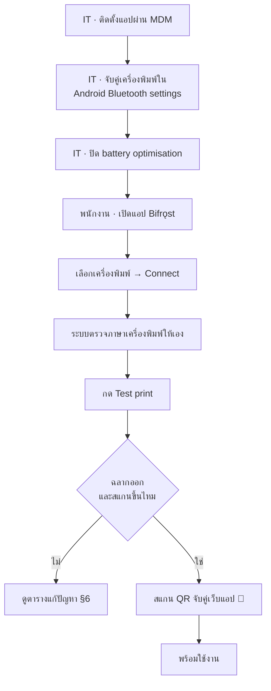
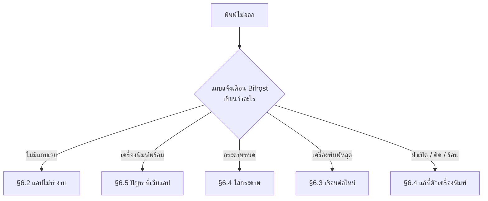

# 03 · คู่มือใช้งานและดูแลระบบ

> สำหรับพนักงานคลัง · IT support · หัวหน้ากะ
> ← กลับไปที่ [ภาพรวม](README.md)
> ส่วนที่กำกับ 🚧 คือขั้นตอนตามการออกแบบซึ่งจะมีในรุ่นสมบูรณ์ ยังไม่มีในรุ่นสาธิตปัจจุบัน

---

## 1. ใครทำอะไร

| บทบาท | ทำอะไร | บ่อยแค่ไหน |
| --- | --- | --- |
| **IT / ผู้ดูแลระบบ** | ติดตั้ง ตั้งค่าเครื่อง จับคู่ Bluetooth แก้ปัญหาที่พนักงานแก้เองไม่ได้ | ครั้งเดียวต่อเครื่อง + เมื่อมีปัญหา |
| **พนักงานคลัง** | เลือกเครื่องพิมพ์ ทดสอบพิมพ์ พิมพ์ฉลากระหว่างทำงาน ใส่กระดาษ | ทุกวัน |
| **หัวหน้ากะ** | ตรวจความพร้อมก่อนเริ่มกะ ตัดสินใจว่าจะเรียก IT เมื่อไร | ต้นกะ |

---

## 2. ภาพรวมทั้งกระบวนการ

---

## 3. ติดตั้งครั้งแรก — IT

ครั้งเดียวต่อเครื่อง ~10 นาทีถ้าทำมือ เกือบเป็นศูนย์ถ้าใช้ MDM

| # | ขั้นตอน | ทำอย่างไร | ถ้าข้ามจะเกิดอะไร |
| :-: | --- | --- | --- |
| 1 | จับคู่เครื่องพิมพ์กับ handheld | Android → Settings → Bluetooth | **แอปจะไม่เห็นเครื่องพิมพ์เลย** เพราะแสดงเฉพาะเครื่องที่จับคู่แล้ว |
| 2 | ติดตั้งแอป | MDM ผลัก `com.bearing.bifrost` แบบ silent | — |
| 3 | ให้สิทธิ์ | `BLUETOOTH_CONNECT`, `BLUETOOTH_SCAN`, `POST_NOTIFICATIONS` | แอปเปิดได้แต่มองไม่เห็นเครื่องพิมพ์และแจ้งเตือนไม่ได้ |
| 4 | **⚠ ปิด battery optimisation** | Settings → Apps → Bifrǫst → Battery → **Unrestricted** หรือ MDM policy | **สำคัญที่สุด** — Android จะฆ่าบริการและตัด Bluetooth เงียบ ๆ แอปดูปกติแต่พิมพ์ไม่ออกเป็นครั้งคราว |
| 5 | ตั้งค่า origin ล่วงหน้า 🚧 | `allowed_origins` ผ่าน MDM | พนักงานต้องสแกน QR จับคู่เอง |

### ค่าที่ตั้งผ่าน MDM ได้ 🚧

| คีย์ | ค่าเริ่มต้น | หมายเหตุ |
| --- | --- | --- |
| `listen_port` | `8437` | เปลี่ยนเฉพาะเมื่อพอร์ตชนกัน |
| `allowed_origins` | — | **ควรตั้ง** คั่นด้วยจุลภาค — ทำให้พนักงานเหลือขั้นตอนเดียวคือจับคู่ |
| `max_retry_attempts` | `5` | |
| `job_retention_days` | `30` | |
| `log_level` | `INFO` | ยกเป็น `DEBUG` เฉพาะตอนไล่ปัญหา |

### เครื่อง Xiaomi / Huawei / Oppo

ต้องเปิด **Autostart** เพิ่ม และล็อกแอปไว้ในหน้า recents เพราะระบบจัดการพลังงานของยี่ห้อเหล่านี้
ดุกว่ามาตรฐาน Android — เครื่อง rugged ของ Zebra, Honeywell, Urovo มีปัญหานี้น้อยกว่ามาก

---

## 4. ตั้งค่าเครื่องพิมพ์ครั้งแรก — พนักงาน

ครั้งเดียว ไม่เกิน 2 นาที ตรงกับหน้าจอจริงในรุ่นปัจจุบัน

| # | ทำ | หน้าจอแสดง | ถ้าผิดพลาด |
| :-: | --- | --- | --- |
| 1 | เปิดแอป **Bifrǫst** | ถ้ามีแถบเตือนสีเหลืองเรื่อง battery ให้กดปุ่มแล้วตั้ง Unrestricted | ไม่มีรายการเครื่องพิมพ์ → ยังไม่ได้ให้สิทธิ์ Bluetooth |
| 2 | เลือกเครื่องพิมพ์จากรายการ | รายชื่อเครื่องที่จับคู่ไว้ + ที่อยู่ MAC | รายการว่าง → กลับไปจับคู่ใน Android settings ก่อน |
| 3 | กด **Connect** | *Connecting…* → *Connected as CPCL* | ล้มเหลว → §6.3 |
| 4 | รอให้ระบบตรวจภาษาเอง | *Checking printer language…* → เติมภาษาที่พบพร้อมป้าย `← detected` | เครื่องไม่ตอบ → เลือกเอง: **CPCL** สำหรับ Zebra, **ESC/POS** สำหรับเครื่องใบเสร็จทั่วไป |
| 5 | ถ้าภาษาไม่ตรง กด **Switch** | ระบบตัดการเชื่อมต่อแล้วต่อใหม่ | — |
| 6 | กด **Test print** | *Sent N bytes* และฉลากทดสอบออกมา | §6 |
| 7 | **สแกนบาร์โค้ดบนฉลากทดสอบ** | เครื่องสแกนอ่านขึ้น | **อ่านไม่ขึ้น = ยังไม่ผ่าน** แม้ฉลากจะดูสวย → แจ้ง IT |
| 8 | จับคู่เว็บแอป 🚧 | Settings → Show pairing QR → สแกนด้วยเครื่องสแกนของ handheld | — |

> **ทำไมต้องสแกนฉลากทดสอบ ไม่ใช่แค่ดูด้วยตา** — บาร์โค้ดที่ความเข้มผิดหรือความกว้างเพี้ยนจะดู
> เหมือนฉลากปกติทุกประการ แต่สแกนไม่ขึ้น ถ้าปล่อยผ่านจะไปเจอตอนของอยู่บนชั้นแล้ว
> **การสแกนฉลากทดสอบคือด่านตัดสินว่าเครื่องนี้พร้อมใช้หรือไม่**

ฉลากทดสอบครอบคลุม **ข้อความ + บาร์โค้ด + QR + รูปภาพ** เพราะทั้งสี่พังแยกจากกันได้

---

## 5. งานประจำวัน

**สิ่งที่ไม่ต้องทำอีกต่อไป** — เดินไปสถานีพิมพ์ · พิมพ์เลขพาร์ทซ้ำด้วยมือ · เดินกลับ

### ตรวจก่อนเริ่มกะ — หัวหน้ากะ (30 วินาทีต่อเครื่อง)

| ตรวจ | ต้องได้ | ถ้าไม่ได้ |
| --- | --- | --- |
| แถบแจ้งเตือนของ Bifrǫst | มีอยู่ และบอกว่าเครื่องพิมพ์พร้อม | ไม่มี → เปิดแอปใหม่ · ยังไม่มีอีก → §6.2 |
| แถบเตือน battery บนหน้าแอป | **ต้องไม่มี** | มี → ตั้ง Unrestricted ทันที ไม่งั้นพิมพ์ไม่ออกกลางกะ |
| แบตเตอรี่เครื่องพิมพ์ | เกิน 50% | เปลี่ยนหรือชาร์จก่อนเริ่ม |
| ม้วนกระดาษ | เหลือพอทั้งกะ | เปลี่ยนก่อนเริ่ม ดีกว่าเปลี่ยนกลางงาน |

### ⚠ ข้อควรระวังในรุ่นสาธิตปัจจุบัน

| เรื่อง | สถานะตอนนี้ | แก้ในเฟส |
| --- | --- | :-: |
| **กดปุ่มพิมพ์สองครั้ง = ฉลากสองใบ** | ยังไม่มีระบบกันซ้ำ | 2 |
| ปิดแอปตอนมีงานค้าง = งานหาย | ยังไม่มีคิวถาวร | 2 |
| กระดาษหมดแล้วต้องสั่งพิมพ์ใหม่เอง | ยังไม่มีการลองใหม่อัตโนมัติ | 2 |

ในรุ่นสมบูรณ์ทั้งสามข้อจะหายไป — กดซ้ำกี่ครั้งก็พิมพ์ใบเดียว งานค้างรอดการรีบูต และเมื่อใส่กระดาษ
เสร็จงานจะพิมพ์ต่อเอง **โดยไม่ต้องกรอกข้อมูลซ้ำ**

---

## 6. แก้ปัญหา

### 6.1 เริ่มจากดูแถบแจ้งเตือน

### 6.2 แอปไม่ทำงาน (ไม่มีแถบแจ้งเตือน)

| # | ทำ | ถ้ายังไม่หาย |
| :-: | --- | --- |
| 1 | เปิดแอป Bifrǫst จากรายการแอป | ไม่มีแอป → แจ้ง IT ให้ติดตั้งใหม่ |
| 2 | ยืนยันว่าแถบแจ้งเตือนขึ้นแล้ว | ไปข้อ 3 |
| 3 | ตรวจว่าไม่มีแถบเตือนสีเหลืองเรื่อง battery | มี → ตั้ง Unrestricted |
| 4 | รีสตาร์ทเครื่อง ดูว่าแอปกลับมาเอง | ไม่กลับมา → แจ้ง IT |

> **สาเหตุอันดับหนึ่งของอาการ "พิมพ์ได้บ้างไม่ได้บ้าง" คือ battery optimisation**
> ให้ตรวจข้อ 3 ก่อนเสมอ และแก้ที่ระดับ MDM ไม่ใช่ทีละเครื่อง

### 6.3 เชื่อมต่อเครื่องพิมพ์ไม่ได้

| # | ตรวจ | แก้ |
| :-: | --- | --- |
| 1 | เครื่องพิมพ์เปิดอยู่ไหม | เปิด แล้วรอเชื่อมต่อเอง ~10 วินาที |
| 2 | อยู่ในระยะไม่กี่เมตรไหม | เข้าใกล้ |
| 3 | แบตเตอรี่เครื่องพิมพ์พอไหม | ชาร์จหรือเปลี่ยน |
| 4 | ยังจับคู่อยู่ใน Android settings ไหม | จับคู่ใหม่ แล้วเลือกซ้ำในแอป |
| 5 | **มีเครื่องอื่นต่ออยู่กับเครื่องพิมพ์นี้ไหม** | เครื่องพิมพ์มือถือรับได้ครั้งละ 1 การเชื่อมต่อ ให้ตัดของอีกเครื่องก่อน |

ถ้ายังไม่ได้: Android Settings → Bluetooth → **ลืมเครื่อง** → ปิด-เปิดเครื่องพิมพ์ → จับคู่ใหม่ →
เลือกซ้ำในแอป

### 6.4 ปัญหาที่ตัวเครื่องพิมพ์

| ข้อความที่เห็น | ทำอย่างไร | หมายเหตุ |
| --- | --- | --- |
| กระดาษหมด | ใส่ม้วนใหม่ ปิดฝาให้แน่นจนได้ยินคลิก | ในรุ่นสมบูรณ์ระบบพิมพ์ต่อเองในไม่กี่วินาที **ห้ามสั่งพิมพ์ซ้ำจากเว็บ** เพราะจะกลายเป็นงานที่สอง |
| ใส่กระดาษแล้วยังบอกว่าหมด | ตรวจว่าใส่กลับด้านไหม (ด้านความร้อนต้องหันเข้าหัวพิมพ์) · เช็ดช่องเซนเซอร์ | ยังไม่หาย → แจ้ง IT |
| ฝาเปิด | ปิดให้แน่น | แก้เองได้ |
| กระดาษติด | เปิดฝา ดึงออก ตรวจคราบกาวที่ลูกกลิ้ง | แก้เองได้ |
| ร้อนเกินไป | รอประมาณ 1 นาที | เกิดบ่อย = ตั้งความเข้มพิมพ์สูงเกินไป แจ้ง IT |
| แบตเตอรี่เครื่องพิมพ์ต่ำ | ชาร์จหรือเปลี่ยนก้อน | — |

### 6.5 เครื่องพิมพ์พร้อม แต่เว็บแอปสั่งพิมพ์ไม่ได้

| # | ตรวจ | ความหมาย |
| :-: | --- | --- |
| 1 | เปิด `http://127.0.0.1:8437/v1/status` ในเบราว์เซอร์ของเครื่อง | ไม่มีอะไรตอบ → แอปไม่ได้ฟังพอร์ต ให้เปิดแอปใหม่ |
| 2 | เว็บแอปขึ้นข้อความอะไร | *ยังไม่ได้จับคู่* → สแกน QR ใหม่ 🚧 |
| 3 | | error เรื่อง origin / `403` → **URL ของเว็บแอปเปลี่ยนไป** แจ้ง IT |
| 4 | URL เปลี่ยนไปไหม (http↔https, ชื่อโฮสต์, พอร์ต) | ต้องตรงกันทุกตัวอักษร |

> **สาเหตุอันดับหนึ่งของกลุ่มนี้คือ URL ของเว็บแอปเปลี่ยน** — เปลี่ยนจาก http เป็น https,
> เพิ่มพอร์ต หรือย้ายชื่อโฮสต์ ล้วนทำให้ไม่ตรงกับ allowlist

### 6.6 เมื่อไหร่ต้องเรียก IT และต้องบอกอะไร

**เรียกเมื่อ** — ทำตาม §6 ครบแล้วยังไม่หาย · เห็นรหัส `CONTENT_TOO_WIDE`, `INTERNAL_ERROR`,
`QUEUE_FULL` · ฉลากออกแต่**สแกนไม่ขึ้น**ทั้งที่เพิ่งเปลี่ยนม้วน · อาการเดิมเกิดซ้ำเกิน 2 ครั้งในกะเดียว

| ข้อมูลที่ต้องเตรียม | ตัวอย่าง | ทำไมต้องมี |
| --- | --- | --- |
| หมายเลขเครื่อง | HH-042 | ระบุเครื่อง |
| แถบแจ้งเตือนเขียนว่าอะไร | "เครื่องพิมพ์หลุดการเชื่อมต่อ" | คัดกลุ่มปัญหาได้ทันที |
| **รหัสข้อผิดพลาด** | `PRINTER_DISCONNECTED` | ชี้สาเหตุตรงที่สุด |
| ทำอะไรอยู่ตอนเกิด | "กดพิมพ์หลังสแกนบาร์โค้ด" | ตีกรอบขั้นตอนที่พัง |
| เกิดครั้งเดียวหรือซ้ำ | "3 ครั้งเช้านี้" | แยกเหตุบังเอิญจากเหตุเชิงระบบ |
| แถบเตือน battery มีไหม | มี / ไม่มี | ตัดสาเหตุอันดับหนึ่งออกได้ทันที |

รายการรหัสข้อผิดพลาดทั้งหมดอยู่ที่ [01 · ระบบทำงานอย่างไร §5](01-how-it-works.md)

---

## 7. สิ่งที่ห้ามทำ

| ห้าม | เพราะ |
| --- | --- |
| **สั่งพิมพ์ซ้ำจากเว็บเมื่อกระดาษหมด** | จะกลายเป็นงานที่สอง และรุ่นสมบูรณ์จะพิมพ์งานเดิมต่อให้เองอยู่แล้ว |
| **เปิด battery optimisation กลับ** | สาเหตุอันดับหนึ่งของอาการพิมพ์ไม่ออกเป็นครั้งคราว |
| **ปิดแอป Bifrǫst จากหน้า recents** | การเชื่อมต่อเครื่องพิมพ์จะหลุด ให้ปล่อยทำงานเบื้องหลังไว้ |
| **ต่อเครื่องพิมพ์กับ handheld เครื่องอื่นพร้อมกัน** | เครื่องพิมพ์มือถือรับได้ครั้งละ 1 การเชื่อมต่อ |
| **ปล่อยฉลากที่สแกนไม่ขึ้นไปถึงชั้นวาง** | ปัญหาจะไปโผล่ตอนตรวจนับ ซึ่งแก้ยากกว่าตอนพิมพ์มาก |

---

## 8. การอัปเดตและการปล่อยรุ่น

| สิ่งที่รอดจากการอัปเดต | สิ่งที่ต้องระวัง |
| --- | --- |
| การจับคู่เครื่องพิมพ์ · token · คิวงาน · ประวัติ · การตั้งค่า | **ห้ามทำ keystore หาย** — ถ้าหายต้องถอนและติดตั้งใหม่ทุกเครื่อง เสียการจับคู่และประวัติทั้งหมด เก็บสำรองไว้นอก repo และนอกเครื่องพัฒนา |

**การเปลี่ยนเทมเพลตฉลากคือการปล่อยที่ความเสี่ยงต่ำที่สุด** เพราะไม่แตะเส้นทางโค้ดใด ๆ
ปล่อยแค่ระยะแรกก็มักพอ — นี่คือกลไกที่ทำให้เปลี่ยนหน้าตาฉลากได้โดยไม่ต้องแตะเว็บแอป

---

## 9. เครื่องพิมพ์

### สิ่งที่เครื่องพิมพ์ต้องมี

| ข้อกำหนด | เหตุผล |
| --- | --- |
| Bluetooth Classic SPP (BLE ก็ได้แต่ไม่บังคับ) | SPP เสถียรและเร็วกว่าสำหรับงานพิมพ์ |
| พูด ESC/POS, CPCL หรือ ZPL | ภาษาที่มีไดรเวอร์รองรับ |
| พิมพ์ได้ทั้งฉลากไดคัทและม้วนต่อเนื่อง | หนึ่งเครื่องต่อพนักงานหนึ่งคน ไม่ใช่สองเครื่อง |
| ทนการใช้งานแบบคาดเอวทั้งกะ | สภาพแวดล้อมคลังสินค้า |
| เปลี่ยนแบตเตอรี่ได้ | กะยาวไม่ต้องหยุดชาร์จ |

### คำแนะนำ

| ลำดับ | รุ่น | หมายเหตุ |
| :-: | --- | --- |
| **1** | **Zebra ZQ521** (104 มม.) หรือ **ZQ511** (72 มม.) | ตอบครบทุกข้อ · CPCL + ZPL · เอกสารดีที่สุด · ZQ511 เบาและถูกกว่าถ้าฉลาก 72 มม. เพียงพอ |
| 2 | Honeywell RP4f | ทางเลือกรองที่รับได้ |
| ❌ | Brother RJ series | ผูกกับภาษาเฉพาะของผู้ผลิตมากเกินไป |
| ❌ | เครื่อง ESC/POS ราคาถูก (Xprinter, Goojprt) | ไม่ทนงานคลัง เอกสารไม่แน่นอน คุณภาพไม่สม่ำเสมอระหว่างล็อต |

**สถานะปัจจุบัน** — ทดสอบอยู่กับ **Zebra ZQ320** 1 เครื่อง (576 dots, 72 มม. พิมพ์ได้, 203 dpi)
ยังไม่ได้ตัดสินใจซื้อฝูง — ดู [04 · สถานะและแผนงาน](04-status-and-plan.md)

**แผนจัดซื้อที่เสนอ** — ซื้อประเมิน 1 เครื่อง (+1 เครื่องต่างยี่ห้อเพื่อพิสูจน์ว่าชั้นไดรเวอร์
ทำงานข้ามผู้ผลิตจริง) → ทดสอบหน้างาน → จึงสั่งฝูง

---

## อ่านต่อ

- [ภาพรวมระบบ](README.md) · [ระบบทำงานอย่างไร](01-how-it-works.md) · [คู่มือนักพัฒนา](02-developer-guide.md)
- คู่มือติดตั้งและ runbook ฉบับเต็มเดิม: `git show a76a494:Docs/06-operations/`
