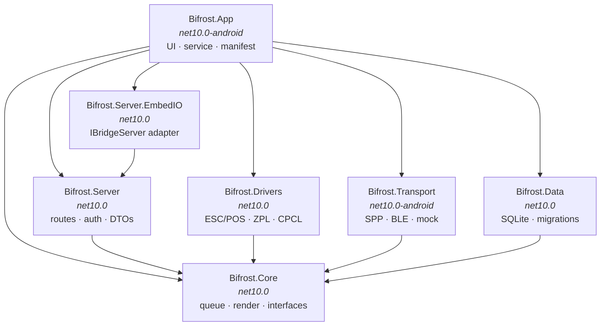

# Project Structure

| Field | Value |
| --- | --- |
| Document ID | IMP-02 |
| Version | 2.0 |
| Date | 2026-08-22 |
| Status | Approved |

> **Version 2.0** — restructured for .NET following
> [ADR-008](../03-design/02-adr/ADR-008-dotnet-for-android.md). The module graph and the dependency
> rule are unchanged in shape; Gradle modules become .NET projects, and the JVM/Android split becomes
> a target-framework split.

---

## 1. Repository layout

```
BifrǫstApp/
├── Docs/                            ← this documentation set
├── src/
│   ├── Bifrost.sln
│   ├── Directory.Build.props        ← shared compiler settings, analyzers
│   ├── Directory.Packages.props     ← central package versions
│   ├── Bifrost.Core/                ← queue, render, models, interfaces   net10.0
│   ├── Bifrost.Drivers/             ← ESC/POS, ZPL, CPCL                  net10.0
│   ├── Bifrost.Server/              ← routes, auth, DTOs                  net10.0
│   ├── Bifrost.Data/                ← SQLite, migrations, config          net10.0
│   ├── Bifrost.Server.EmbedIO/      ← IBridgeServer adapter               net10.0
│   ├── Bifrost.Transport/           ← SPP, BLE, mock                      net10.0-android
│   └── Bifrost.App/                 ← UI, service, manifest               net10.0-android
├── tests/
│   ├── Bifrost.Core.Tests/
│   ├── Bifrost.Drivers.Tests/
│   ├── Bifrost.Server.Tests/
│   ├── Bifrost.Data.Tests/
│   └── Bifrost.App.DeviceTests/     ← XHarness, on-device
├── sdk/                             ← the JavaScript SDK
│   ├── src/
│   ├── openapi.yaml                 ← API contract, source of generated types
│   └── package.json
├── schemas/                         ← JSON Schemas, shared by app and SDK
└── tools/
    ├── mock-printer/                ← standalone mock printer for manual testing
    └── scripts/
```

**One repository, not two.** The app and the SDK share an API contract that must change together; a
split repository would let them drift and would triple the ceremony for a single developer (D-16).

---

## 2. Project graph



| Project | TFM | Android API visible? | Contains |
| --- | --- | :-: | --- |
| `Bifrost.Core` | `net10.0` | **no** | Domain models, `PrintDocument`, queue logic, render pipeline, retry policy, driver/transport **interfaces** |
| `Bifrost.Drivers` | `net10.0` | **no** | `IPrinterDriver` implementations, layout engine, barcode encoding |
| `Bifrost.Server` | `net10.0` | **no** | Routes, auth interceptor, CORS, WebSocket hub, DTOs, `IBridgeServer` interface |
| `Bifrost.Server.EmbedIO` | `net10.0` | **no** | The **only** project that references EmbedIO |
| `Bifrost.Data` | `net10.0` | **no** | SQLite connection, Dapper queries, migration runner |
| `Bifrost.Transport` | `net10.0-android` | yes | `IPrinterTransport` implementations, `MockTransport` |
| `Bifrost.App` | `net10.0-android` | yes | Activities, AXML layouts, foreground service, DI composition root, manifest |

Only **two** projects can see Android. Everything else — including the entire HTTP server and every
printer driver — is ordinary .NET.

### 2.1 The dependency rule

**`Bifrost.Core` and `Bifrost.Drivers` must not depend on Android.** This is enforced by the target
framework, not by discipline:

```xml
<!-- Bifrost.Core.csproj -->
<PropertyGroup>
  <TargetFramework>net10.0</TargetFramework>   <!-- NOT net10.0-android -->
</PropertyGroup>
```

With no `-android` in the TFM the compiler cannot resolve `Android.*` types at all. A violation is a
build error, exactly as the pure-JVM Gradle module was in v1.0.

The payoff is the same: the queue, rendering, retry classification, and every driver are unit-testable
with no emulator (NFR-601). That keeps the suite fast enough to actually run, and it allows all of the
interesting logic to be built before a printer is purchased.

### 2.2 The EmbedIO containment rule

`Bifrost.Server` defines `IBridgeServer` and contains every route and the auth interceptor.
`Bifrost.Server.EmbedIO` implements `IBridgeServer` and is the **only** project permitted to
reference the EmbedIO package — enforced by a banned-symbols analyzer rule:

```xml
<!-- Directory.Build.props, applied to every project except Bifrost.Server.EmbedIO -->
<ItemGroup>
  <AdditionalFiles Include="$(MSBuildThisFileDirectory)BannedSymbols.txt" />
</ItemGroup>
```

```
# BannedSymbols.txt
N:EmbedIO; Reference EmbedIO only from Bifrost.Server.EmbedIO. See ADR-009.
```

This is what makes [ADR-009](../03-design/02-adr/ADR-009-embedded-http-server.md)'s escape route
real: replacing the server means writing one new adapter project, not auditing the codebase for
leaked types.

---

## 3. Namespace layout

### 3.1 `Bifrost.Core`

```
Bifrost.Core/
├── Model/
│   ├── PrintDocument.cs          IR — PrintBlock hierarchy
│   ├── Job.cs                    Job, JobState, JobError
│   ├── PrinterProfile.cs
│   ├── Capabilities.cs
│   └── PrinterError.cs           error hierarchy, carries Transient
├── Payload/
│   ├── PrintPayload.cs           Template | Dsl | Raw
│   ├── PayloadValidator.cs       FR-308
│   ├── TemplateResolver.cs       tier 1 → tier 2
│   ├── DslCompiler.cs            tier 2 → IR
│   └── Template.cs
├── Queue/
│   ├── IJobQueue.cs              implemented in Bifrost.Data
│   ├── PrintWorker.cs            single consumer per printer
│   ├── RetryPolicy.cs            transient/permanent classification
│   └── IdempotencyGuard.cs
├── Printing/
│   ├── IPrinterDriver.cs
│   ├── IPrinterTransport.cs
│   ├── DriverRegistry.cs
│   └── ConnectionManager.cs
├── Testing/
│   └── MockTransport.cs          see the note below
├── Events/
│   ├── BifrostEvent.cs
│   └── EventHub.cs               Channels-based fan-out
└── Threading/
    └── IStateStream.cs           StateFlow equivalent over Channels
```

### 3.2 `Bifrost.Drivers`

```
Bifrost.Drivers/
├── EscPos/EscPosDriver.cs · EscPosCommands.cs
├── Zpl/ZplDriver.cs
├── Cpcl/CpclDriver.cs
├── Layout/
│   ├── AbsoluteLayoutEngine.cs   shared by ZPL, CPCL, TSPL
│   └── BlockMeasurer.cs
└── Barcode/
    ├── SymbologyValidator.cs     check digits, character sets
    └── BitmapBarcodeRenderer.cs  ZXing.Net fallback where a printer lacks native barcodes
```

### 3.3 `Bifrost.Transport` *(Android)*

```
Bifrost.Transport/
├── Classic/SppTransport.cs
├── Ble/
│   ├── BleTransport.cs
│   ├── GattOperationQueue.cs     serialises every GATT call — DES-06 §7.3 rule 6
│   └── ChunkWriter.cs            MTU chunking + flow control
└── BluetoothPermissions.cs       API 29–35 permission model differences
```

> **`MockTransport` lives in `Bifrost.Core/Testing/`, not here.** This project targets
> `net10.0-android`, so a platform-free test project cannot reference it — which would defeat
> NFR-602, the requirement the mock exists to satisfy. It implements a Core interface and touches
> no Android API, so Core is where it belongs. Corrected during implementation.

`GattOperationQueue` and `ChunkWriter` are separate classes rather than private methods because they
encode the eight non-negotiable rules from
[DES-06 §7.3](../03-design/06-printer-abstraction.md), and rules that matter deserve a name and a
test file.

### 3.4 `Bifrost.Server`

```
Bifrost.Server/
├── IBridgeServer.cs              the abstraction — ADR-009
├── BridgeRequest.cs · BridgeResponse.cs
├── Interceptors/
│   ├── AuthInterceptor.cs        token + origin — one interception point
│   ├── CorsInterceptor.cs
│   └── ErrorMapper.cs            PrinterError → HTTP status + error body
├── Routes/
│   ├── StatusRoutes.cs · PairRoutes.cs · PrintRoutes.cs
│   ├── JobRoutes.cs · TemplateRoutes.cs · CapabilityRoutes.cs
│   └── EventsWebSocket.cs
└── Dto/                          wire types, System.Text.Json source-generated
```

### 3.5 `Bifrost.App` *(Android)*

```
Bifrost.App/
├── MainApplication.cs
├── Composition/                  DI registration — the composition root
├── Services/
│   ├── BridgeService.cs          foreground service, connectedDevice
│   ├── BootReceiver.cs           FR-408
│   └── BridgeNotification.cs
├── Activities/
│   ├── HomeActivity.cs · PrinterSetupActivity.cs · QueueActivity.cs
│   ├── HistoryActivity.cs · SettingsActivity.cs · PairingActivity.cs
│   └── FirstRunActivity.cs
├── Presenters/                   one per activity; no MVVM framework
├── Resources/
│   ├── layout/*.axml
│   ├── values/colors.xml · styles.xml
│   └── xml/network_security_config.xml
├── Assets/
│   ├── schemas/                  copied from /schemas at build
│   └── templates/
└── Properties/AndroidManifest.xml
```

Presenters rather than an MVVM framework: six screens, mostly displaying a state stream, do not
justify a binding layer.

---

## 4. SDK layout

**Unchanged** — the SDK talks HTTP to a contract, not to a runtime.

```
sdk/
├── src/
│   ├── index.ts                  public exports
│   ├── client.ts                 BifrostClient
│   ├── types.ts                  generated from openapi.yaml
│   ├── errors.ts                 BifrostError, error codes
│   ├── events.ts                 WebSocket + reconnection
│   ├── builder.ts                doc() DSL helper
│   ├── idempotency.ts            UUIDv4 generation
│   ├── storage.ts                localStorage token handling
│   └── testing/MockBifrostClient.ts
├── test/
└── openapi.yaml
```

`types.ts` is **generated** from `openapi.yaml`, so a contract change the SDK has not adopted becomes
a compile error rather than a runtime surprise.

---

## 5. Shared schemas

```
schemas/
├── print-request.schema.json
├── template-payload.schema.json
├── dsl-payload.schema.json
├── raw-payload.schema.json
├── element.schema.json
└── template-definition.schema.json
```

Consumed three ways:

1. Copied into `src/Bifrost.App/Assets/schemas/` at build time for runtime validation by
   JsonSchema.Net (FR-308)
2. Referenced by `openapi.yaml` for SDK type generation
3. Validated against every JSON example in `Docs/` by a CI step — which is what keeps the
   documentation from drifting away from the implementation

---

## 6. Build configuration

`Directory.Build.props` applies to every project:

```xml
<Project>
  <PropertyGroup>
    <LangVersion>13</LangVersion>
    <Nullable>enable</Nullable>
    <ImplicitUsings>enable</ImplicitUsings>
    <TreatWarningsAsErrors>true</TreatWarningsAsErrors>
    <EnforceCodeStyleInBuild>true</EnforceCodeStyleInBuild>
  </PropertyGroup>
</Project>
```

`Bifrost.App.csproj` release settings:

```xml
<PropertyGroup Condition="'$(Configuration)'=='Release'">
  <AndroidPackageFormat>apk</AndroidPackageFormat>
  <RuntimeIdentifiers>android-arm64</RuntimeIdentifiers>
  <PublishTrimmed>true</PublishTrimmed>
  <RunAOTCompilation>true</RunAOTCompilation>
  <AndroidEnableProfiledAot>true</AndroidEnableProfiledAot>
  <ApplicationId>com.bearing.bifrost</ApplicationId>
</PropertyGroup>
```

| Variant | Application ID | Purpose |
| --- | --- | --- |
| `Debug` | `com.bearing.bifrost.debug` | Development. Mock transport selectable in settings |
| `Release` | `com.bearing.bifrost` | MDM distribution. Trimmed, AOT, signed |

Distinct application IDs let debug and release builds coexist on one device — necessary when
diagnosing a field problem on the same handheld running production.

`android-arm64` only: the fleet is 64-bit, and a single-ABI APK is roughly half the size of a fat
one. This matters more under .NET than it did under Kotlin (see
[IMP-01 §6](01-tech-stack.md)).

---

## 7. Naming conventions

| Kind | Convention | Example |
| --- | --- | --- |
| Project | `Bifrost.<Area>` | `Bifrost.Drivers` |
| Namespace | Matches the folder path | `Bifrost.Drivers.Cpcl` |
| Class / file | PascalCase, one public type per file | `PrintWorker.cs` |
| Interface | `I` prefix — C# convention | `IPrinterDriver` |
| Implementation | Prefix with what makes it specific | `BleTransport`, `EscPosDriver` |
| Async method | `Async` suffix | `WriteAsync` |
| Test project | `<Project>.Tests` | `Bifrost.Core.Tests` |
| Test class | `<Subject>Tests` | `RetryPolicyTests` |
| Activity | `<Name>Activity` | `PrinterSetupActivity` |
| Layout | snake_case `.axml` | `activity_printer_setup.axml` |
| DTO | `<Name>Dto` | `PrintRequestDto` |
| TypeScript file | kebab-case | `mock-client.ts` |
| JSON Schema | kebab-case + `.schema.json` | `dsl-payload.schema.json` |

The `I` prefix is used here although v1.0's Kotlin conventions forbade it — it is the established C#
convention, and matching the language the team reads matters more than consistency with a superseded
document.

DTOs are suffixed and live in `Bifrost.Server` because wire types and domain types must be free to
diverge; collapsing them is how an API accidentally becomes a database schema.

---

## 8. Related documents

- [Technology Stack](01-tech-stack.md)
- [Coding Standards](03-coding-standards.md)
- [ADR-008 — .NET for Android](../03-design/02-adr/ADR-008-dotnet-for-android.md)
- [ADR-009 — EmbedIO behind an abstraction](../03-design/02-adr/ADR-009-embedded-http-server.md)
- [Architecture §4](../03-design/01-architecture.md)
