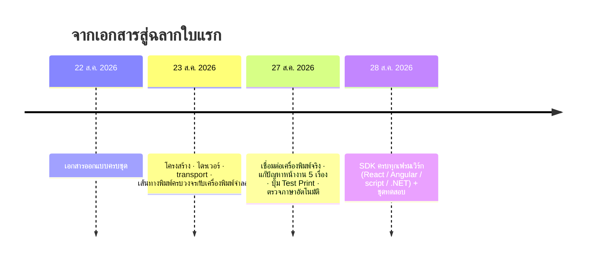
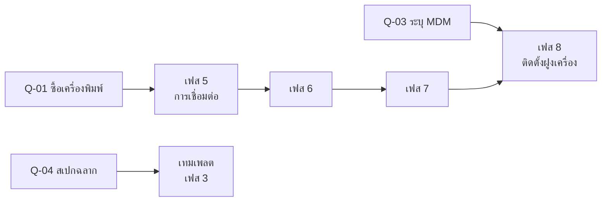

# 04 · สถานะและแผนงาน

> รายงานความคืบหน้าเพื่อโปรดทราบ และแผนงานที่เหลือ
> ← กลับไปที่ [ภาพรวม](README.md)

| | |
| --- | --- |
| วันที่ | 28 สิงหาคม 2026 |
| สถานะ | 🟢 **ต้นแบบใช้งานได้จริง (Proof of Concept ผ่าน)** |
| รุ่นปัจจุบัน | รุ่นสาธิต 0.2 |
| กำลังคน | ผู้พัฒนา 1 คน ทำงานร่วมกับ AI |

---

## 1. สรุปสำหรับผู้บริหาร

ต้นแบบตอบคำถามที่แพงที่สุดของโครงการไปแล้ว — **"เว็บเพจสั่งพิมพ์เครื่องพิมพ์ Bluetooth ได้จริงหรือไม่"**
คำตอบคือได้ และมีฉลากจริงเป็นหลักฐาน

งานที่เหลือคือการทำให้ **ทนทานพอใช้ในคลังจริงทุกวัน** ซึ่งเป็นงานที่คาดการณ์ได้ วางแผนไว้แล้ว
และมีเอกสารกำกับ

**สิ่งที่ขอ** — (1) รับทราบผลต้นแบบและอนุมัติเข้าสู่การพัฒนาเต็มรูปแบบตามแผน 18 สัปดาห์
(2) ตัดสินใจ 4 เรื่องใน §6

---

## 2. สิ่งที่ทำเสร็จแล้ว

### ไทม์ไลน์

### องค์ประกอบ

| ส่วนประกอบ | สถานะ | รายละเอียด |
| --- | :-: | --- |
| แอป Android + foreground service | ✅ | เลือกเครื่องพิมพ์ · เชื่อมต่อ · ตรวจภาษา · ทดสอบพิมพ์ · การเชื่อมต่อรอดเมื่อสลับไป Chrome |
| เว็บเซิร์ฟเวอร์ในเครื่อง | 🚧 | 2 จาก 10 endpoint |
| ไดรเวอร์ CPCL และ ESC/POS | ✅ | ข้อความ · บาร์โค้ด · QR · รูปภาพ |
| Bluetooth Classic (SPP) | ✅ | เชื่อมต่อ · เขียน · อ่านพร้อม timeout ที่ทำงานจริง |
| ตรวจภาษาเครื่องพิมพ์อัตโนมัติ | ✅ | ถามเครื่องพิมพ์แล้วเลือกไดรเวอร์ให้ |
| JavaScript / TypeScript SDK | ✅ | ครบตามสเปก รวมอะแดปเตอร์ React, Angular, `<script>` |
| ไคลเอนต์ .NET | ✅ | Blazor Server, Blazor WASM, MAUI, WPF, console |
| เครื่องพิมพ์จำลอง | ✅ | พัฒนาและทดสอบได้โดยไม่ต้องมีฮาร์ดแวร์ |

### หลักฐาน

| หลักฐาน | ผล |
| --- | --- |
| **ชุดทดสอบอัตโนมัติ** (รันจริง 28 ส.ค. 2026) | **190 เทสต์ ผ่านทั้งหมด 0 ล้มเหลว** |
| — Core + ไดรเวอร์ (C#) | 86 |
| — ไคลเอนต์ .NET | 32 |
| — SDK (TypeScript) | 72 |
| ฉลากจริงจากเครื่องพิมพ์จริง | ✅ Zebra ZQ320 — ข้อความ · บาร์โค้ด · QR · รูปภาพ |
| พิมพ์จากหน้าเว็บผ่าน Chrome บนเครื่องเดียวกัน | ✅ ผ่าน |

> **ทำไม 190 เทสต์นี้มีน้ำหนัก** — ไดรเวอร์ถูกทดสอบแบบ golden output คือเทียบไบต์ที่ส่งออก
> ทีละไบต์กับค่าที่ถูกต้อง ไม่ใช่แค่ "เรียกแล้วไม่ error" เพราะไบต์ผิดตัวเดียวในคำสั่งบาร์โค้ด
> = ฉลากที่สวยแต่สแกนไม่ขึ้น ซึ่งจะไปโผล่ที่ชั้นวาง ไม่ใช่ที่จอนักพัฒนา

### ปัญหาหน้างานที่พบและแก้แล้ว

ห้าเรื่องนี้คือเหตุผลที่ต้องทำต้นแบบก่อน แทนที่จะเชื่อเอกสารผู้ผลิตอย่างเดียว

| อาการที่เห็น | สาเหตุจริง | สถานะ |
| --- | --- | :-: |
| เครื่องพิมพ์พิมพ์คำสั่งออกมาเป็นตัวหนังสือ | เครื่องเป็น CPCL แต่ขับด้วย ESC/POS | ✅ |
| ปุ่มตรวจสอบค้าง ไม่ตอบกลับตลอดกาล | การอ่าน Bluetooth ไม่สนใจ timeout ที่ตั้งไว้ | ✅ |
| รายงานว่า "เครื่องพิมพ์ไม่ตอบ" ทั้งที่ตอบ | เปิดการเชื่อมต่อซ้อนสองเส้น เครื่องพิมพ์รับได้เส้นเดียว | ✅ |
| เว็บเพจสั่งพิมพ์ไม่ได้เลย | ตั้งค่า CORS ผิด 2 จุด | ✅ |
| ฉลากแรกออกมาเป็น `EscPos ? 576 dots ? 203 dpi` | มีอักขระนอก ASCII ปนอยู่ | ✅ |

> **บทเรียน** — สองข้อแรกให้ข้อสรุปผิดอันเดียวกันคือ "เครื่องพิมพ์ไม่ตอบ" ทั้งที่เครื่องพิมพ์ตอบตลอด
> อย่าเชื่อรายงานที่ระบบสร้างขึ้นเอง จนกว่าจะพิสูจน์ว่ากลไกที่สร้างรายงานนั้นถูกต้อง

---

## 3. สิ่งที่ยังไม่ได้ทำ

ต้นแบบ **ตั้งใจตัด** สิ่งเหล่านี้ออก เพื่อพิสูจน์ให้ได้ก่อนว่าไบต์ถึงกระดาษจริง
ทุกข้ออยู่ในแผนแล้ว ไม่ใช่ของที่ลืม

| สิ่งที่ยังไม่มี | ผลกระทบถ้าใช้งานจริงตอนนี้ | เฟส |
| --- | --- | :-: |
| คิวงานพิมพ์แบบถาวร (SQLite) | ปิดแอปแล้วงานค้างหาย | 2 |
| **การกันพิมพ์ซ้ำ** | กดปุ่มสองครั้ง = ฉลากสองใบ | 2 |
| การลองใหม่อัตโนมัติ | กระดาษหมดแล้วต้องสั่งใหม่เอง | 2 |
| ระบบเทมเพลตฉลาก (Tier 1) | เปลี่ยนหน้าตาฉลากต้องแก้โค้ดเว็บ | 3 |
| ไดรเวอร์ ZPL | รองรับเฉพาะ CPCL และ ESC/POS | 4 |
| Bluetooth LE | รองรับเฉพาะ Bluetooth Classic | 5 |
| การยืนยันตัวตน (token + origin) | โปรแกรมอื่นบนเครื่องเดียวกันสั่งพิมพ์ได้ | 6 |
| WebSocket แจ้งสถานะสด | เว็บต้องถามสถานะเอง | 6 |
| หน้าจอแอปครบชุด | มีเฉพาะหน้าจอสาธิต | 7 |

---

## 4. แผนงาน — 8 เฟส ประมาณ 18 สัปดาห์

ผู้พัฒนา 1 คน เต็มเวลา · ถ้าทำครึ่งเวลาประมาณ 36 สัปดาห์

| เฟส | ส่งมอบอะไร | ถือว่าจบเมื่อ |
| :-: | --- | --- |
| 1 | โครงสร้าง · โมเดล · เครื่องพิมพ์จำลอง · CI | เทสต์รันเป็น .NET ธรรมดาได้ |
| 2 | คิว SQLite · กันซ้ำ · ลองใหม่ | การรับประกันสองข้อที่สำคัญที่สุดผ่าน **ก่อนที่อะไรจะพิมพ์ได้** |
| 3 | IR · DSL compiler · เทมเพลต · การตรวจความถูกต้อง | Tier 1 กับ Tier 2 ให้ IR เหมือนกัน |
| 4 | ESC/POS · CPCL · ZPL · เครื่องมือจัดหน้า | golden-output ผ่านครบทั้งสามภาษา |
| 5 | SPP · BLE พร้อมการแบ่ง chunk · ตัวจัดการการเชื่อมต่อ | **ไบต์ที่ออกทาง BLE กับ SPP ต้องเหมือนกันทุกไบต์** |
| 6 | 10 endpoint · auth · WebSocket · SDK | ชุดเทสต์ API และ SDK ผ่าน |
| 7 | หน้าจอครบ · foreground service · first-run · diagnostics | ผ่านบน API 29, 31, 34 |
| 8 | ทดสอบหน้างาน · ทดสอบสมรรถนะ · ทยอยติดตั้ง | 15 สถานการณ์หน้างานผ่านครบ |

### หมุดหมาย

| หมุด | จบเฟส | สาธิตอะไรได้ | สถานะ |
| :-: | :-: | --- | :-: |
| M1 พิสูจน์ความน่าเชื่อถือ | 2 | ฆ่าโปรเซสหรือรีบูตแล้วงานยังอยู่ · สั่งซ้ำแล้วพิมพ์ใบเดียว | รอ |
| M2 ฉลากจริงใบแรก | 5 | ฉลากออกจากเครื่องพิมพ์จริงผ่าน Bluetooth | **✅ บรรลุแล้วล่วงหน้า** |
| M3 พิมพ์จากเบราว์เซอร์ครบวงจร | 6 | หน้าเว็บเรียก `print()` แล้วกระดาษออก | **✅ บรรลุแล้วล่วงหน้า** |
| M4 พนักงานใช้ได้เอง | 7 | พนักงานที่ไม่เคยอบรมตั้งค่าและพิมพ์ได้เอง | รอ |
| M5 ใช้งานจริงทั้งฝูงเครื่อง | 8 | อัตราสำเร็จ ≥ 99% บนเครื่อง 20–100 เครื่อง | รอ |

### M2 และ M3 บรรลุก่อนกำหนดหมายความว่าอะไร

| ✅ สิ่งที่ได้มาจริง | ⚠ สิ่งที่ไม่ได้หมายความ |
| --- | --- |
| ตามแผน M2 ควรเกิดสัปดาห์ที่ 11 และ M3 สัปดาห์ที่ 13 แต่เกิดในสัปดาห์แรก เพราะเลือกทำต้นแบบทะลุทุกชั้นก่อน | **ไม่ได้แปลว่าโครงการจะเสร็จเร็วขึ้น 10 สัปดาห์** |
| สิ่งที่ได้คือ **ความเสี่ยงที่ลดลง** — รู้แล้วว่าปลายทางเป็นไปได้จริง ไม่ใช่แค่บนกระดาษ | งานเฟส 2–7 ยังต้องทำครบทุกข้อ — คิวถาวร กันฉลากซ้ำ ยืนยันตัวตน หน้าจอครบ ทดสอบหน้างาน |

### ลำดับที่พึ่งพากัน

**มีเพียง Q-01 ที่อยู่บนเส้นทางวิกฤต** และแม้ช้าก็ยังกลบได้ด้วยการสลับเฟส 5 กับ 6 เพราะฝั่ง API
และ SDK ไม่พึ่งฮาร์ดแวร์เลย — นี่คือผลตอบแทนโดยตรงจากการแยกชั้นไดรเวอร์ออกมาตั้งแต่ต้น

---

## 5. ความเสี่ยง

| # | ความเสี่ยง | ผลกระทบ | การรับมือ | สถานะ |
| :-: | --- | :-: | --- | :-: |
| 1 | **ผู้พัฒนา 1 คน** — ป่วย ลา หรือย้ายงาน = โครงการหยุด | สูงมาก | เอกสารชุดนี้ + โค้ดที่มีคอมเมนต์อธิบายเหตุผล ทำให้คนอื่นรับช่วงต่อได้ | 🟡 |
| 2 | Android ปิดแอปเบื้องหลัง ทำให้การเชื่อมต่อหลุดเงียบ ๆ | สูง | แอปเตือนบนหน้าจอ + ตั้งค่าผ่าน MDM ตอนติดตั้ง | 🟢 |
| 3 | เฟส 5 (BLE) คือจุดที่โครงการลักษณะนี้มักพัง | กลาง–สูง | จัดเวลายาวที่สุดในบรรดาเฟสพัฒนา + มีกฎ 8 ข้อพร้อมเทสต์รายข้อ | 🟡 |
| 4 | เครื่องพิมพ์รุ่นอื่นที่ซื้อเพิ่มพูดภาษาที่ไม่รองรับ | กลาง | แยกชั้นไดรเวอร์ตั้งแต่วันแรก เพิ่มภาษาใหม่ = เพิ่มไฟล์เดียว | 🟢 |
| 5 | **ยังไม่ทราบว่าองค์กรใช้ MDM ตัวไหน** | กลาง | ถ้าไม่มี ต้องติดตั้งมือทีละเครื่อง 20–100 เครื่อง = หลายวัน | 🔴 |
| 6 | ทำ keystore สำหรับเซ็น APK หาย | สูง | สำรองไว้นอก repo และนอกเครื่องพัฒนา — ถ้าหายต้องถอนและติดตั้งใหม่ทุกเครื่อง เสียการจับคู่และประวัติ | 🟢 |

**ความเสี่ยงข้อ 1 สูงที่สุด และเป็นข้อเดียวที่ทีมแก้เองไม่ได้** — ต้องอาศัยการจัดสรรคนจากฝ่ายบริหาร

---

## 6. เรื่องที่ขอการตัดสินใจ

| รหัส | คำถาม | กระทบอะไร | ต้องการคำตอบภายใน |
| :-: | --- | --- | --- |
| **Q-01** | **จะซื้อเครื่องพิมพ์รุ่นใดเป็นมาตรฐาน และกี่เครื่อง** | เฟส 5 — ปัจจุบันทดสอบกับ Zebra ZQ320 ที่ยืมมา 1 เครื่อง | **ก่อนสัปดาห์ที่ 8** |
| Q-02 | เครื่อง handheld ในฝูงเป็น Android เวอร์ชันอะไรบ้าง | ขอบเขตการทดสอบเฟส 7 | ก่อนสัปดาห์ที่ 14 |
| **Q-03** | **องค์กรใช้ MDM ตัวไหน (หรือไม่มี)** | การติดตั้งเฟส 8 — ถ้าไม่มีต้องเผื่อเวลาติดตั้งมือ | ก่อนสัปดาห์ที่ 15 |
| Q-04 | ขนาดฉลากและชนิดวัสดุที่จะใช้จริง | การออกแบบเทมเพลตเฟส 3 | ก่อนสัปดาห์ที่ 5 |

### ข้อเสนอเพิ่มเติม

| # | ข้อเสนอ | เหตุผล |
| :-: | --- | --- |
| 1 | **จัดผู้พัฒนาสำรอง 1 คน อ่านโค้ดสัปดาห์ละครึ่งวัน** ไม่ต้องเขียนโค้ด | ลดความเสี่ยงสูงสุดของโครงการด้วยต้นทุนต่ำที่สุด |
| 2 | **ขอเครื่องพิมพ์ทดสอบเพิ่ม 1 เครื่อง ต่างยี่ห้อ** | พิสูจน์ว่าชั้นไดรเวอร์ทำงานข้ามผู้ผลิตจริง ก่อนสั่งซื้อจำนวนมาก |

---

## 7. ตัวเลขสรุป

| | |
| :-: | --- |
| **190** | เทสต์อัตโนมัติ ผ่านทั้งหมด |
| **2** | ไดรเวอร์พร้อมใช้ (CPCL, ESC/POS) |
| **2 / 10** | endpoint ที่ทำเสร็จ |
| **18** | สัปดาห์ถึงรุ่น v1.0 |
| **4** | เรื่องที่รอการตัดสินใจ |

---

## ช่องรับทราบ

| บทบาท | ชื่อ | ลายเซ็น | วันที่ |
| --- | --- | --- | --- |
| ผู้จัดทำ (ผู้พัฒนา) | | | 28 ส.ค. 2026 |
| หัวหน้าทีม | | | |
| ผู้บริหารสายงาน | | | |

---

← [ภาพรวมระบบ](README.md) · [ระบบทำงานอย่างไร](01-how-it-works.md) ·
[คู่มือนักพัฒนา](02-developer-guide.md) · [คู่มือใช้งานและดูแลระบบ](03-operations.md)
