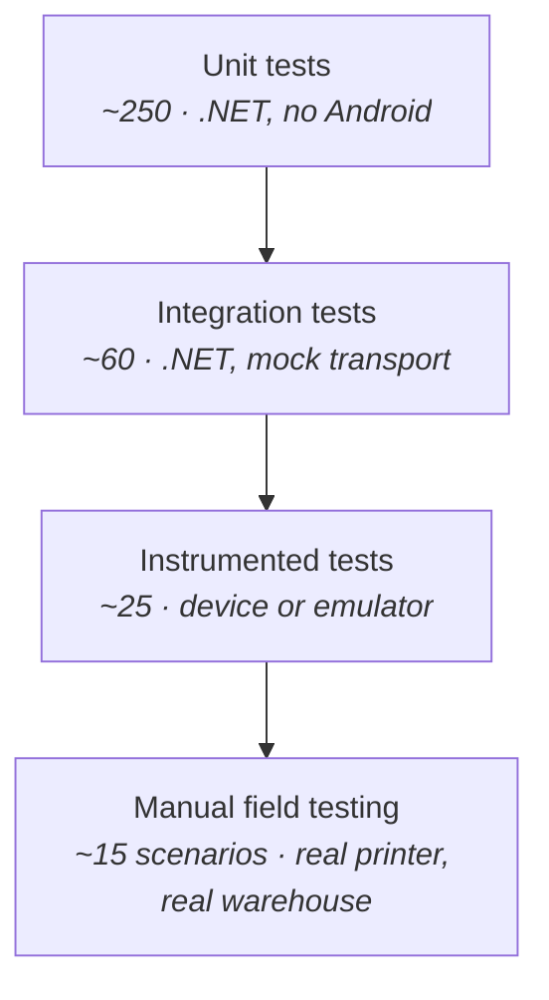
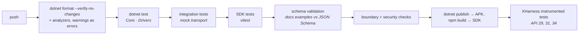

# Test Strategy

| Field | Value |
| --- | --- |
| Document ID | TST-01 |
| Version | 2.0 |
| Date | 2026-08-22 |
| Status | Approved |

> **Version 2.0** — toolchain updated for .NET ([ADR-008](../03-design/02-adr/ADR-008-dotnet-for-android.md)):
> xUnit instead of JUnit, `dotnet test` instead of Gradle, XHarness for on-device runs. **The strategy,
> the priorities, the mock harness, and all 15 field scenarios are unchanged** — they were derived
> from failure modes, not from a language.

---

## 1. Objectives and context

The team is one developer (D-16). The test strategy is therefore built around a single question:
**which failures would this project not survive?**

| Priority | What must be proven | Why |
| --- | --- | --- |
| 1 | **A job never prints twice** (NFR-202) | A duplicate sticker puts two identities on physical stock. Undetectable in software, expensive in the warehouse |
| 2 | **An accepted job is never lost** (NFR-201) | The operator would re-enter data they already entered — the exact problem this project exists to remove |
| 3 | **BLE output is never truncated** ([DES-06 §7.3](../03-design/06-printer-abstraction.md)) | The classic failure mode for chunked Bluetooth printing, and it produces plausible-looking half-labels |
| 4 | **Unauthorised callers cannot print** (FR-502, FR-503) | The asset protected is a physical printer, not data |
| 5 | Everything else | Correctness of layout, UI behaviour, ergonomics |

Everything below allocates effort against that ranking rather than pursuing uniform coverage.

---

## 2. Test pyramid



| Layer | Count | Runtime | Runs when |
| --- | --- | --- | --- |
| Unit | ~250 | < 30 s | Every save |
| Integration | ~60 | < 2 min | Every commit |
| Instrumented | ~25 | ~5 min | Every push |
| Manual field | ~15 | ~2 h | Before each release |

The pyramid is deliberately bottom-heavy. With one developer, a suite that takes ten minutes is a
suite that stops being run.

---

## 3. What is tested where

### 3.1 Unit — `Bifrost.Core`, `Bifrost.Drivers` (.NET, no Android — NFR-601)

| Area | Focus |
| --- | --- |
| `RetryPolicy` | Every `PrinterError` classified transient or permanent; backoff sequence exact |
| `IdempotencyGuard` | Window boundaries, replay, concurrent submission |
| `DslCompiler` | Every element type → IR; width measurement; overflow behaviour |
| `TemplateResolver` | Placeholder binding, missing fields, `omitIfEmpty`, defaults |
| `PayloadValidator` | Schema violations produce the correct `field` path |
| `SymbologyValidator` | Character sets and check digits per symbology |
| Drivers | **Golden-output tests** — `PrintDocument` in, exact bytes out |
| `AbsoluteLayoutEngine` | Y accumulation, alignment maths |

**Golden-output driver tests** are the highest-value tests in the suite. A command-language
regression is invisible in code review, invisible in a green functional test, and produces a label
that is subtly wrong — a barcode a scanner rejects six weeks later. Byte-exact assertions are the
only way to catch it.

```csharp
[Fact]
public void FR_605_Cpcl_driver_emits_correct_header_for_406_dot_label()
{
    var doc = new PrintDocument(WidthDots: 832, MediaType.LabelGap, [Text("6205-2RS")]);

    var bytes = new CpclDriver().Serialise(doc, Zq521Profile);

    var firstLine = Encoding.ASCII.GetString(bytes).Split("\r\n")[0];
    Assert.Equal("! 0 200 200 406 1", firstLine);
}
```

### 3.2 Integration — .NET with `MockTransport` (NFR-602)

Whole paths, no hardware:

| Scenario | Verifies |
| --- | --- |
| `POST /v1/print` → mock printer receives bytes | End-to-end pipeline |
| Auth plugin against every endpoint | FR-502, FR-503 |
| Queue drains in FIFO order | FR-105 |
| Retry with `FailNTimesThenSucceed` | FR-106, backoff timing |
| `TruncateAt` scenario | BLE flow-control regression guard |
| Idempotency replay across a simulated restart | NFR-202 |
| WebSocket event ordering | FR-203 |
| SQLite queue survives simulated process death | NFR-201 |

Because [ADR-009](../03-design/02-adr/ADR-009-embedded-http-server.md) puts EmbedIO behind
`IBridgeServer`, integration tests dispatch `BridgeRequest` objects straight through the interceptor
and route table. The complete request pipeline — auth, CORS, routing, serialisation — is exercised
**with no socket opened**, so these run at unit-test speed and need no Android.

That the security tests in [§6 of the test cases](02-test-cases.md) run this fast is a direct
consequence of the abstraction being there for an unrelated reason.

### 3.3 Instrumented — device or emulator

Only what genuinely requires Android:

| Area | Why it cannot be a plain .NET test |
| --- | --- |
| Bluetooth permission flows on API 29, 31, 33, 35 | Real permission model |
| Foreground service lifecycle and notification | Real service |
| Boot recovery (FR-408) | Real broadcast |
| EncryptedSharedPreferences | Real Keystore |
| Android Views UI flows | Real rendering |
| Battery-optimisation detection | Real power manager |

### 3.4 Manual field testing

Reserved for what no harness reproduces: a real printer, real media, real distance, real gloves.
See §6.

---

## 4. The mock printer harness

The single most important piece of test infrastructure. It is what allows the entire system to be
built and verified **before a printer is purchased** (Q-01, D-07).

Two forms:

| Form | Use |
| --- | --- |
| `MockTransport` in `Bifrost.Transport` | Automated tests. Asserts on emitted bytes |
| `tools/mock-printer/` standalone | Manual testing. Renders received commands to a PNG preview |

### 4.1 Scenarios

```csharp
public abstract record MockScenario
{
    public sealed record Ideal : MockScenario;
    public sealed record OutOfPaper : MockScenario;
    public sealed record CoverOpen : MockScenario;
    public sealed record DisconnectAfter(int Bytes) : MockScenario;
    public sealed record SlowWrite(int BytesPerSecond) : MockScenario;
    public sealed record FailNTimesThenSucceed(int N) : MockScenario;
    public sealed record TruncateAt(int Bytes) : MockScenario;
}
```

`TruncateAt` exists solely to reproduce the BLE flow-control failure from
[DES-06 §7.3](../03-design/06-printer-abstraction.md) deterministically. That failure is
intermittent on real hardware, dependent on printer buffer size and timing, and therefore almost
impossible to reproduce on demand in the field. Making it reproducible converts the project's
highest technical risk into a regression test.

The standalone harness renders received command bytes into a PNG approximating the printed output —
enough to catch layout errors during development without consuming media.

---

## 5. Device and printer matrix

### 5.1 Android versions

| API | Version | Priority | Covers |
| --- | --- | --- | --- |
| 29 | 10 | **must** | Minimum supported; legacy Bluetooth permissions |
| 31 | 12 | **must** | Runtime `BLUETOOTH_CONNECT` — the permission model change |
| 33 | 13 | should | `POST_NOTIFICATIONS` runtime permission |
| 34 | 14 | **must** | Mandatory foreground service types |
| 35 | 15 | should | Current target; tightened background launch rules |

APIs 29, 31, and 34 are mandatory because each introduced a behaviour change this app depends on.

### 5.2 Printers

Finalised once Q-01 is answered. Minimum coverage:

| Class | Transport | Language | Purpose |
| --- | --- | --- | --- |
| Chosen production model | BT Classic | CPCL or ZPL | Primary target |
| Any BLE-capable printer | BLE | any | Exercises chunking and flow control on real hardware |
| Low-cost ESC/POS unit | BT Classic | ESC/POS | Verifies graceful degradation where `StatusQuery()` is unsupported |

The third is deliberately a cheap printer. Expensive printers answer status queries and behave well;
cheap ones are where the write-only, no-status code path is actually exercised.

---

## 6. Field test scenarios

Run before each release on real hardware, in the warehouse. Each maps to a failure that only physical
conditions produce.

| # | Scenario | Expected |
| --- | --- | --- |
| F-01 | Print 50 labels back to back | All print; queue stays empty; no slowdown |
| F-02 | Remove media mid-job | Amber state, clear message, auto-resume on reload, **one** label |
| F-03 | Switch the printer off mid-job | Job marked `INTERRUPTED`, **not** auto-retried (DES-07 §6.1) |
| F-04 | Walk out of Bluetooth range and back | Reconnects within 10 s; queue resumes |
| F-05 | Let the printer battery run flat | Warned before failure; recovers on battery swap |
| F-06 | Tap Print repeatedly while the printer is out of paper | Exactly one label after media is loaded |
| F-07 | Reboot the handheld with jobs queued | Queue drains automatically, no operator action |
| F-08 | Disable Wi-Fi entirely, then print | Works normally (NFR-204) |
| F-09 | Leave idle 8 hours, then print | Still connected; no reconnection delay |
| F-10 | Print, then scan the label with the device scanner | Barcode and QR both read first time |
| F-11 | Operate wearing warehouse gloves | Every control usable |
| F-12 | Use the app in cold storage | Screen legible; no touch failures |
| F-13 | Untrained operator does first-run setup with the one-page sheet | Completed in under 3 minutes (NFR-503) |
| F-14 | Force-stop the app, then print from the web page | Clear "bridge not running" message, not a silent failure |
| F-15 | Print the widest and longest label the templates define | No clipping, no misfeed on the following label |

**F-10 is not optional.** A label that prints but does not scan is the defect this project could
otherwise ship without noticing — and it is exactly what idea 6.2 (print verification) is designed
to catch in production.

---

## 7. Non-functional testing

| Requirement | Method | Target |
| --- | --- | --- |
| NFR-101 latency p95 | Timestamp 100 jobs, submit → `PRINTED` | ≤ 3 s |
| NFR-102 ack latency | 1000 requests, measure ack | p95 ≤ 150 ms |
| NFR-104 reconnect time | 20 power cycles, measure recovery | ≤ 10 s |
| NFR-106 idle battery | Charge to 100%, leave connected 8 h | ≤ 3% |
| NFR-107 body size | Submit 2 MB + 1 byte | `413` |
| NFR-203 success rate | 500-job soak in warehouse conditions | ≥ 99% |
| NFR-205 hostile payload | Fuzz `POST /v1/print` (~10k malformed bodies) | No crash; queue consistent |
| FR-109 queue cap | Submit 600 jobs | `429` after 500; app stable |
| NFR-604 coverage | `dotnet test --collect:"XPlat Code Coverage"` on `Bifrost.Core` and `Bifrost.Drivers` | ≥ 70% lines |

Security tests are enumerated in [DES-08 §8](../03-design/08-security-design.md) and appear as
section 6 of [Test Cases](02-test-cases.md).

---

## 8. CI pipeline



Five CI steps encode rules that would otherwise decay silently:

| Check | Guards |
| --- | --- |
| Every JSON example in `Docs/` validates against `schemas/` | Documentation drifting from implementation |
| Generated diagnostics bundle contains no active token | NFR-304 |
| SDK `dependencies` is empty; manifest has no `INTERNET` | FR-703, NFR-306 |
| `Bifrost.Core` / `.Drivers` build clean without an Android TFM | The core/platform boundary ([IMP-02 §2.1](../04-implementation/02-project-structure.md)) |
| No `EmbedIO` symbol outside `Bifrost.Server.EmbedIO` | The server abstraction stays real ([ADR-009](../03-design/02-adr/ADR-009-embedded-http-server.md)) |

The last two exist because both boundaries are load-bearing and both are invisible at review time —
a stray `using` compiles fine locally and only bites when the abstraction is needed.

---

## 9. Traceability

Every requirement in [REQ-02](../02-requirements/02-srs.md) has at least one test case in
[TST-02](02-test-cases.md). Coverage is verified by a script that cross-references requirement IDs in
the SRS against IDs appearing in test names, and the build fails if a `Must have` requirement has no
test.

| Requirement group | Primary test layer |
| --- | --- |
| FR-1xx queue | Integration |
| FR-2xx status, capabilities, events | Integration |
| FR-3xx payload, rendering | Unit |
| FR-4xx app UI | Instrumented + manual |
| FR-5xx security | Integration + manual |
| FR-6xx transport, drivers | Unit + field |
| FR-7xx SDK | Vitest |
| NFR-1xx performance | Performance suite |
| NFR-2xx reliability | Integration + field |
| NFR-3xx security | Integration + manual |
| NFR-4xx compatibility | Instrumented (device matrix) |
| NFR-5xx usability | Manual field |

---

## 10. Entry and exit criteria

**Entry to release testing**

- All `Must have` requirements implemented
- Unit and integration suites green
- No known defect of severity 1 or 2

**Exit — release approved**

- All 15 field scenarios pass on production hardware
- Non-functional targets in §7 met
- Every security test in [DES-08 §8](../03-design/08-security-design.md) passes
- Coverage of `Bifrost.Core` and `Bifrost.Drivers` ≥ 70%
- Runbook verified: each documented symptom reproduced and the stated fix works

The last criterion matters more than it appears. A runbook written from design intent rather than
from reproduced failures is a document nobody can use at 06:00 when the shift has started and
nothing prints.

---

## 11. Related documents

- [Test Cases](02-test-cases.md)
- [Software Requirements Specification](../02-requirements/02-srs.md)
- [Printer Abstraction §10](../03-design/06-printer-abstraction.md)
- [Security Design §8](../03-design/08-security-design.md)
