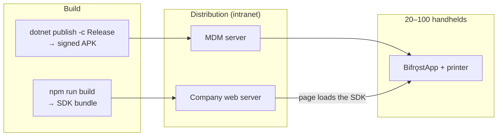

# Deployment Guide

| Field | Value |
| --- | --- |
| Document ID | OPS-01 |
| Version | 2.0 |
| Date | 2026-08-22 |
| Status | Approved |
| Audience | IT Support |

> **Version 2.0** — build commands updated for .NET
> ([ADR-008](../03-design/02-adr/ADR-008-dotnet-for-android.md)). MDM rollout, managed
> configuration, battery-optimisation handling, and every operator-facing step are **unchanged** —
> those are Android concerns, not toolchain concerns.

---

## 1. Overview

Two artefacts reach the fleet by two different paths:



There is no Play Store and no public CDN — the network is intranet-only (D-02).

---

## 2. Prerequisites

| Item | Requirement |
| --- | --- |
| Handhelds | Android 10 (API 29) or later (NFR-401) |
| Printers | One per handheld, paired in Android Bluetooth settings |
| MDM | Any platform able to push an APK and set managed configuration |
| Web server | Serves the application and the SDK bundle over the intranet |
| Signing keystore | Held by the developer, backed up **outside** the repository |

---

## 3. Building

### 3.1 Android

```bash
cd src
dotnet publish Bifrost.App/Bifrost.App.csproj \
    -c Release \
    -f net10.0-android \
    -p:AndroidKeyStore=true \
    -p:AndroidSigningKeyStore=../keystore/bifrost-release.keystore \
    -p:AndroidSigningKeyAlias=bifrost \
    -p:AndroidSigningKeyPass=env:BIFROST_KEY_PASS \
    -p:AndroidSigningStorePass=env:BIFROST_STORE_PASS

# → Bifrost.App/bin/Release/net10.0-android/publish/com.bearing.bifrost-Signed.apk
```

Passwords are read from environment variables, never committed and never passed on the command line
where they would land in shell history.

**Losing this keystore means the fleet cannot be updated in place** — every device would need an
uninstall and reinstall, losing pairing and job history. Back it up somewhere that survives the loss
of the development machine.

### 3.2 SDK

```bash
cd sdk
npm ci
npm run build

# → dist/bifrost.esm.js  dist/bifrost.umd.js  dist/index.d.ts
```

Copy the bundle to the web server and reference it from the application:

```html
<script src="/assets/bifrost.umd.js"></script>
```

### 3.3 Pre-release checklist

- [ ] Version bumped in `Bifrost.App.csproj` (`ApplicationVersion`, `ApplicationDisplayVersion`) and `package.json`
- [ ] Full test suite green ([TST-01 §10](../05-testing/01-test-strategy.md) exit criteria)
- [ ] Field scenarios F-01 … F-15 passed on production hardware
- [ ] APK signed with the release keystore
- [ ] SDK bundle size within budget (≤ 12 KB gzip)
- [ ] Release notes written for IT

---

## 4. First deployment

### 4.1 Per-device preparation

Before the APK is pushed, each handheld needs:

1. The printer **paired in Android Bluetooth settings** — the app lists bonded devices only (FR-401)
2. Battery optimisation exempted for `com.bearing.bifrost` (see §5)
3. Notifications permitted for the app (API 33+)

Steps 2 and 3 can be set centrally by MDM, and should be — doing them by hand across 100 devices is
where a rollout loses a day.

### 4.2 MDM push

| Setting | Value |
| --- | --- |
| Package | `com.bearing.bifrost` |
| Install type | Silent / forced |
| Auto-update | Enabled |
| Battery optimisation | Exempt |
| Permissions | Grant `BLUETOOTH_CONNECT` and `POST_NOTIFICATIONS` where the MDM supports pre-granting |

### 4.3 Managed configuration

Where the MDM supports it, these are set centrally (NFR-702) and appear locked in the app UI
([DES-09 §5.6](../03-design/09-ui-ux-spec.md)):

| Key | Type | Default | Notes |
| --- | --- | --- | --- |
| `listen_port` | int | `8437` | Change only if the port conflicts |
| `allowed_origins` | string | — | Comma-separated. **Set this** — it pre-authorises the web app |
| `max_retry_attempts` | int | `5` | |
| `job_retention_days` | int | `30` | |
| `log_level` | string | `INFO` | Raise to `DEBUG` only while diagnosing |

Pre-setting `allowed_origins` means the operator's only setup step is pairing — the origin is already
trusted.

### 4.4 Operator setup

The app's first-run flow (FR-409) guides four steps; the operator needs no instruction beyond a
one-page sheet (NFR-503):

1. Grant permissions
2. Confirm battery optimisation is off
3. Select the printer, confirm connection
4. Tap **Test print** and check the label

Then, once, pair the web app: open **Settings → Show pairing QR**, focus the web app's pairing field,
and scan the code with the handheld's scanner.

---

## 5. Battery optimisation

**The single most important deployment step.** Android's battery optimisation will kill the
foreground service and silently drop the printer connection — the app looks healthy and prints fail
intermittently ([R-03](../07-project/02-risk-register.md)).

| Path | Method |
| --- | --- |
| Preferred | MDM policy exempting `com.bearing.bifrost` |
| Fallback | The app detects the state and deep-links to the correct system screen during first run |
| Verification | Home screen shows a warning banner while optimisation is active |

Aggressive OEM power managers — Xiaomi, Huawei, Oppo — need additional per-vendor allowances beyond
the standard Android setting. Rugged handhelds from Zebra, Honeywell, and Urovo are generally
better-behaved, which is one more reason the fleet is standardised on them (D-13).

---

## 6. Updates

### 6.1 What survives an update

| Data | Survives? |
| --- | :-: |
| Pairing token and allowlist | ✓ |
| Printer profile | ✓ |
| Queued and pending jobs | ✓ |
| Job history | ✓ |
| Settings | ✓ |

An in-place update over the same signing key preserves everything. SQLite migrations are versioned
and tested **in both directions**; a destructive migration is never used in a release build.

### 6.2 Staged rollout

| Stage | Scope | Duration | Gate |
| --- | --- | --- | --- |
| 1 | 2 devices, one shift | 1 day | No new errors in diagnostics |
| 2 | ~10% of the fleet | 2–3 days | Print success rate holds ≥ 99% |
| 3 | Remainder | — | — |

For a fleet of 20–100 devices supported by one person, a staged rollout is not bureaucracy — it is
the difference between two operators affected by a regression and all of them.

### 6.3 Rollback

1. Push the previous APK version through the MDM
2. Data is preserved, provided no schema migration ran
3. If a migration did run, the rollback also needs the previous schema — **which is why a release
   containing a migration must be staged more slowly**, and why migrations are tested in both
   directions

---

## 7. Web application integration

One-time work by the web developer:

```html
<script src="/assets/bifrost.umd.js"></script>
```

```js
const bifrost = new Bifrost.BifrostClient();

// 1. detect the bridge — hide printing entirely if absent
if (!(await bifrost.isAvailable())) hidePrintUi();

// 2. reflect live printer state (US-504)
bifrost.on('printer.state_changed', ({ state }) => {
  printButton.disabled = state !== 'READY';
});

// 3. print
const r = await bifrost.print({
  tier: 'template',
  template: 'part-label',
  data: { partNo, lot, qty },
});
if (!r.ok) toast(r.error.message);
```

**Origin must match the allowlist exactly** — scheme, host, and port. `http://intranet.company.local`
and `http://intranet.company.local:80` are different strings. This is the most common cause of a
`403` after an otherwise clean deployment.

---

## 8. Templates

Templates ship inside the APK as assets and are seeded into the database on first run.

| Task | Method |
| --- | --- |
| Add or change a template | Edit `app/src/main/assets/templates/`, bump `version`, release |
| Verify | `GET /v1/templates` lists the new version |
| Roll back | Deploy the previous APK; older template versions remain in the database |

A template change is a fast, low-risk release: it touches no code path, so stage 1 of the rollout is
usually sufficient. This is the mechanism that satisfies G-7 — label layout changes without touching
the web application.

---

## 9. Post-deployment verification

Per device, or per sample for large batches:

- [ ] App appears and starts
- [ ] Notification shows **Printer ready**
- [ ] `GET /v1/status` from the browser returns `200`
- [ ] Test print produces a correct, **scannable** label
- [ ] A print from the actual web app succeeds
- [ ] Battery optimisation confirmed off
- [ ] Reboot the device; the app restarts and reconnects unattended

Fleet-level, after a week:

- [ ] Print success rate ≥ 99% (M-1)
- [ ] No recurring error code across devices
- [ ] Support ticket volume at or below expectation (M-5)

---

## 10. Decommissioning a device

1. Regenerate the token in-app, or wipe the device via MDM — the token is device-local, so nothing
   else is affected
2. Remove the printer's Bluetooth pairing
3. Uninstall, which removes all job history and configuration

---

## 11. Related documents

- [Runbook](02-runbook.md)
- [Hardware Recommendation](03-hardware-recommendation.md)
- [Security Design](../03-design/08-security-design.md)
- [Test Strategy](../05-testing/01-test-strategy.md)
