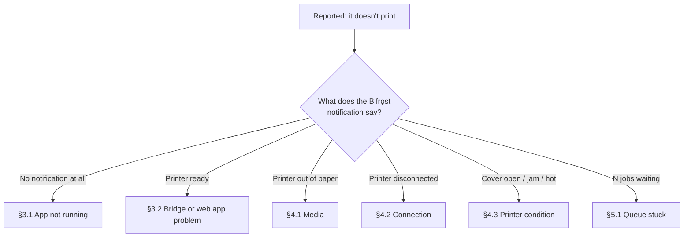

# Runbook

| Field | Value |
| --- | --- |
| Document ID | OPS-02 |
| Version | 1.0 |
| Date | 2026-08-22 |
| Status | Approved |
| Audience | IT Support — usable over the phone |

---

## 1. How to use this document

Written to be read aloud during a support call. Start at §2, follow the branch, and read the numbered
steps to the operator.

**First question, always:** *"What does the Bifrǫst notification say?"*

The persistent notification carries the state in words ([DES-09 §4](../03-design/09-ui-ux-spec.md)),
so the answer usually identifies the fault before anything else is asked.

---

## 2. Triage

---

## 3. Bridge problems

### 3.1 No notification — the app is not running

**Symptom** — no Bifrǫst notification; the web app reports *"Print bridge not running"*.

| Step | Ask the operator to | If it fails |
| --- | --- | --- |
| 1 | Open BifrǫstApp from the app list | Not installed → redeploy via MDM |
| 2 | Confirm the notification appears | Continue to step 3 |
| 3 | Check **Settings → Battery** shows no warning banner | Battery optimisation is on → §3.3 |
| 4 | Reboot the device; confirm the app restarts on its own | Boot recovery failing → collect diagnostics |

**Most common cause:** battery optimisation killed the service. Go to §3.3.

### 3.2 Printer ready but the web app cannot print

**Symptom** — notification says *Printer ready*; the web app shows an error or its Print button is
disabled.

| Step | Check | Meaning |
| --- | --- | --- |
| 1 | Open `http://127.0.0.1:8437/v1/status` in the device's browser | No response → the app is not listening; restart it |
| 2 | What error does the web app show? | *Web app is not paired* → §6.1 |
| 3 | | `403` / origin error → §6.2 |
| 4 | Confirm the web page URL matches the allowlist **exactly** | Scheme, host, and port must all match |
| 5 | Ask whether the web app URL changed recently | A changed origin needs re-adding to the allowlist |

**Most common cause:** the web app's origin changed — a new hostname, http → https, or a port added —
and no longer matches the allowlist.

### 3.3 Service keeps stopping

**Symptom** — printing works, then stops after the device has been idle; the notification disappears.

| Step | Action |
| --- | --- |
| 1 | Android **Settings → Apps → Bifrǫst → Battery → Unrestricted** |
| 2 | On Xiaomi / Huawei / Oppo, also enable **Autostart** and lock the app in the recents view |
| 3 | Apply the MDM battery-optimisation exemption fleet-wide so it cannot recur |
| 4 | Confirm the Home screen no longer shows the battery warning banner |

**This is the most likely cause of intermittent field failures**
([R-03](../07-project/02-risk-register.md)). Fix it at the MDM level rather than device by device.

---

## 4. Printer problems

### 4.1 Out of paper

**Symptom** — amber notification, *"Printer out of paper"*.

1. Load media and close the cover firmly
2. Wait — printing resumes automatically within a few seconds
3. Optionally tap **I've loaded paper** on the Home screen

**Nothing is lost.** Queued jobs retry on their own. Do **not** ask the operator to re-send from the
web app — that creates a second job, and only the idempotency key prevents a duplicate label.

If it still reports out-of-paper with media loaded:

| Cause | Fix |
| --- | --- |
| Media loaded the wrong way round | Thermal side must face the printhead |
| Gap sensor dirty | Wipe the sensor window |
| Wrong media type for the setting | Die-cut labels need gap mode; receipt roll needs continuous |

### 4.2 Printer disconnected

**Symptom** — red notification, *"Printer not connected"*.

| Step | Ask | Then |
| --- | --- | --- |
| 1 | Is the printer switched on? | Switch it on; reconnects within 10 s |
| 2 | Is it within a few metres? | Move closer |
| 3 | Is the printer battery charged? | Charge or swap |
| 4 | Is it paired in Android Bluetooth settings? | Re-pair there, then reselect in Printer setup |
| 5 | Is another device connected to it? | Mobile printers accept one connection at a time |

Persistent failure to connect:

1. Android **Settings → Bluetooth** → forget the printer
2. Power-cycle the printer
3. Pair again in Android settings
4. Reselect it in BifrǫstApp → Printer setup

### 4.3 Cover open, jam, overheated

| Message | Action |
| --- | --- |
| *Printer cover is open* | Close it firmly until it clicks |
| *Paper jam* | Open the cover, remove the jammed media, check for adhesive residue on the roller |
| *Printer is too hot* | Wait about a minute. Repeated overheating means the print density is set too high, or the duty cycle exceeds the printer's rating |

All three are transient: the queue resumes on its own once cleared.

---

## 5. Queue problems

### 5.1 Jobs are stuck

**Symptom** — notification shows N jobs waiting; nothing prints.

| Step | Check | Action |
| --- | --- | --- |
| 1 | Open **Queue** | Read the state of the first job |
| 2 | State is `RETRY_SCHEDULED` with an error | Fix the printer cause per §4 |
| 3 | State is `SENDING` and unchanged for over a minute | Printer is not acknowledging → power-cycle it |
| 4 | Every job is `FAILED` after 5 attempts | Fix the underlying cause, then reprint from History |
| 5 | Queue is at 500 | Something has been broken for hours. Fix the printer, then let it drain |

### 5.2 A label printed but is wrong or unreadable

| Symptom | Cause | Fix |
| --- | --- | --- |
| Faint or patchy print | Low battery, or a dirty printhead | Charge; clean the printhead with a cleaning pen |
| Barcode will not scan | `moduleWidth` too small, or media too glossy | Increase `moduleWidth` to 3; switch to matt media |
| Content cut off at the edge | Print width configured wider than the media | Check **Printer setup → capabilities** against the actual media |
| Text overlaps the next label | Wrong media type — continuous set for die-cut media | Set the media type correctly |
| Blank label fed through | Media loaded thermal-side down | Reload it the other way up |

### 5.3 The same label printed twice

**This should not happen** (NFR-202). If it does, it is a defect and needs investigating, not
working around.

1. Export diagnostics immediately (**Settings → Diagnostics → Export**)
2. Check the two job IDs in History
3. If they have **different** idempotency keys, the web app sent two distinct jobs — a web app defect
4. If they share a key, it is a Bifrǫst defect — escalate with the diagnostics bundle attached

The most common benign explanation is that the operator used **Reprint** from History, which
deliberately creates a new job (US-502) and correctly bypasses deduplication.

---

## 6. Pairing and access

### 6.1 Web app is not paired

**Symptom** — the web app reports *"Web app is not paired"* or `UNAUTHORIZED`.

1. In BifrǫstApp, open **Settings → Show pairing QR**
2. In the web app, open the pairing screen and focus the pairing field
3. Scan the QR with the handheld's scanner
4. Confirm the web app reports success

| Problem | Cause | Fix |
| --- | --- | --- |
| *Pairing expired* | The QR is older than 5 minutes | Generate a fresh code |
| *Pairing already used* | Single-use code already consumed | Generate a fresh code |
| Nothing happens on scan | The pairing field is not focused | Tap the field first, then scan |
| Scanner types into the wrong field | Focus was elsewhere | Clear the field, refocus, scan again |

### 6.2 Origin not allowed

**Symptom** — `403 ORIGIN_NOT_ALLOWED`.

1. **Settings → Origins** shows the allowlist
2. Compare it to the web app's URL — scheme, host, and port must match exactly
3. Add the correct origin, or set it centrally by MDM for the whole fleet

`http://wms.company.local` ≠ `https://wms.company.local` ≠ `http://wms.company.local:8080`. All three
are different origins. A fleet-wide `403` after a web deployment nearly always means the application
moved to a new URL.

---

## 7. Diagnostics

### 7.1 Collecting a bundle

Ask the operator to: **Settings → Diagnostics → Export**, then share the file by any available means.

It contains no pairing token and no print payload content
([DES-08 §7.2](../03-design/08-security-design.md)), so it is safe to send over any channel.

### 7.2 Reading it

| Section | Look for |
| --- | --- |
| `app` | Version — is the device on the current release? |
| `permissions` | Any denied permission, especially `BLUETOOTH_CONNECT` |
| `battery` | `optimisationEnabled: true` → §3.3, and it is probably the whole answer |
| `printer` | Language and capabilities — do they match the physical printer? |
| `jobs` | Repeating error codes reveal the pattern faster than the log does |
| `log` | Auth failures, connection drops, transmit timeouts |

### 7.3 Interpreting error codes

| Code | Meaning | Section |
| --- | --- | --- |
| `PRINTER_OUT_OF_PAPER` | Media empty | §4.1 |
| `PRINTER_DISCONNECTED` | Bluetooth link lost | §4.2 |
| `TRANSMIT_TIMEOUT` | Printer stopped acknowledging | §4.2, then power-cycle |
| `CONTENT_TOO_WIDE` | Label design exceeds the printer's width | Developer — the template needs changing |
| `ORIGIN_NOT_ALLOWED` | Allowlist mismatch | §6.2 |
| `UNAUTHORIZED` | Token missing or revoked | §6.1 |
| `QUEUE_FULL` | 500 jobs pending — broken for hours | §5.1 |
| `INTERRUPTED` | Process died mid-transmission | May or may not have printed. **Ask the operator to look at the printer** |

`INTERRUPTED` is deliberately never auto-retried
([DES-07 §6.1](../03-design/07-job-lifecycle.md)) — the software cannot know whether paper moved, but
the person holding the printer can.

---

## 8. Escalation

| Level | Handles | Path |
| --- | --- | --- |
| 1 — Operator | Media, cover, jam, printer power | This runbook, §4 |
| 2 — IT Support | Pairing, allowlist, battery, deployment, connection | This runbook, §3 §5 §6 |
| 3 — Developer | Duplicate prints, crashes, rendering defects, unknown codes | Diagnostics bundle + job IDs + steps to reproduce |

**Escalate to level 3 immediately, without troubleshooting, for:**

- Any duplicate print with a shared idempotency key (§5.3)
- Any app crash
- Any error code not listed in §7.3
- Any case where a job reports `PRINTED` but no label appeared

The last is the most serious symptom in the system: it means the acknowledgement path is lying, and
every reliability guarantee rests on it.

---

## 9. Preventive maintenance

| Task | Frequency |
| --- | --- |
| Clean the printhead | Weekly, or after each media roll |
| Clean the gap sensor | Weekly |
| Check printer battery health | Monthly |
| Verify a printed barcode scans first time | Weekly spot check |
| Review print success rate across the fleet | Monthly |
| Review app version consistency | After each release |

The weekly scan check is the cheapest defence against the failure mode that costs the most: labels
that print acceptably today, degrade quietly, and are discovered unreadable weeks later at picking.

---

## 10. Related documents

- [Deployment Guide](01-deployment-guide.md)
- [UI/UX Specification §6](../03-design/09-ui-ux-spec.md) — the operator message catalogue
- [Job Lifecycle](../03-design/07-job-lifecycle.md)
- [Local API Specification §4](../03-design/03-local-api-spec.md) — full error reference
