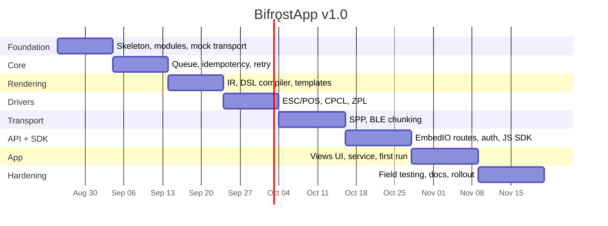
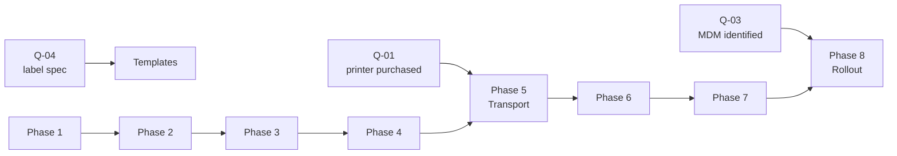

# Roadmap

| Field | Value |
| --- | --- |
| Document ID | PRJ-01 |
| Version | 2.0 |
| Date | 2026-08-22 |
| Status | Approved |
| Capacity | One developer, AI-assisted (D-16) |

> **Version 2.0** — technology names updated for .NET
> ([ADR-008](../03-design/02-adr/ADR-008-dotnet-for-android.md)). **Phase order, durations, and the
> 18-week total are unchanged.** The sequencing is driven by what is uncertain — the printer (Q-01) —
> not by the language, and the team remains one developer.
>
> One estimate moved *inside* Phase 6: with EmbedIO the routing layer is more manual than Ktor's
> would have been, but the auth interceptor and WebSocket hub are equivalent, and the phase already
> carried 2.5 weeks. No net change.

---

## 1. Sequencing principle

The order below is driven by one rule: **build outward from what is uncertain.**

The printer has not been purchased (D-07), so the driver boundary is the last thing that can be
verified against reality. Everything upstream of it — the queue, idempotency, the API, the render
pipeline — is fully determined by decisions already made and can be built and tested against
`MockTransport` immediately.

That is why `MockTransport` is built first, in Phase 1. It converts the hardware decision from a
blocker into a scheduled event.

---

## 2. Phases

| # | Phase | Duration | Delivers | Exit criteria |
| :-: | --- | :-: | --- | --- |
| 1 | **Foundation** | 2 wk | Solution skeleton, domain models, `MockTransport`, CI | `MockTransport` records bytes; unit tests run as plain .NET |
| 2 | **Core reliability** | 2 wk | SQLite queue, `PrintWorker`, `IdempotencyGuard`, `RetryPolicy` | TC-104 … TC-119 green — the guarantees hold before anything can print |
| 3 | **Rendering** | 2 wk | `PrintDocument` IR, DSL compiler, template resolver, validation | TC-301 … TC-322 green; tier 1 and tier 2 produce identical IR |
| 4 | **Drivers** | 2 wk | ESC/POS, CPCL, ZPL, layout engine, barcode validation | Golden-output tests pass for all three languages |
| 5 | **Transport** | 2.5 wk | SPP, BLE with chunking and flow control, `ConnectionManager` | TC-401 … TC-418; **byte-identical output over BLE and SPP** |
| 6 | **API + SDK** | 2.5 wk | EmbedIO adapter, routes, auth interceptor, WebSocket hub, SDK | TC-601 … TC-620 and TC-701 … TC-715 green |
| 7 | **Application** | 2.5 wk | Views UI, foreground service, first-run flow, diagnostics | TC-501 … TC-520 green on API 29, 31, 34 |
| 8 | **Hardening** | 2.5 wk | Field testing, performance, runbook validation, rollout | All 15 field scenarios pass; exit criteria in [TST-01 §10](../05-testing/01-test-strategy.md) |

**Total: approximately 18 weeks** of single-developer effort to a deployed v1.0.

---

## 3. Phase detail

### Phase 1 — Foundation *(2 weeks)*

| Task | Output |
| --- | --- |
| Repository, .NET solution and projects, central package versions | [IMP-02](../04-implementation/02-project-structure.md) layout |
| Domain models — `PrintDocument`, `Job`, `PrinterError` | `Bifrost.Core`, targets `net10.0` — no Android |
| `IPrinterDriver` and `IPrinterTransport` interfaces | The abstraction boundary, defined before any implementation |
| `MockTransport` with all scenarios | Hardware-free testing from day one |
| CI pipeline | Lint, unit tests, schema validation |
| SDK skeleton, `openapi.yaml` | Type generation working |

**Why first:** the interfaces and the mock are what allow the following six phases to proceed without
a printer.

### Phase 2 — Core reliability *(2 weeks)*

| Task | Requirement |
| --- | --- |
| SQLite schema, Dapper queries, migration runner | [DES-07 §7](../03-design/07-job-lifecycle.md) |
| `JobQueue` — durable, FIFO, capacity-capped | FR-103, FR-105, FR-109 |
| `PrintWorker` single-consumer loop | ADR-005 |
| `IdempotencyGuard` with the 24-hour window | FR-102, NFR-202 |
| `RetryPolicy` — classification and backoff | FR-106, FR-107 |
| Crash and restart recovery | [DES-07 §6](../03-design/07-job-lifecycle.md) |

**Why second:** the two guarantees that matter most (NFR-201, NFR-202) are cheap to build now and
extremely expensive to retrofit once rendering, transport, and UI all depend on the queue's
semantics.

### Phase 3 — Rendering *(2 weeks)*

DSL compiler, template resolver, JSON Schema validation, barcode symbology validation, width
measurement. All plain .NET, all unit-testable with no Android.

### Phase 4 — Drivers *(2 weeks)*

`AbsoluteLayoutEngine` first (shared by CPCL and ZPL), then ESC/POS, CPCL, ZPL. Golden-output tests
throughout — see [TST-01 §3.1](../05-testing/01-test-strategy.md) for why byte-exact assertions are
non-negotiable here.

### Phase 5 — Transport *(2.5 weeks — the highest-risk phase)*

| Task | Note |
| --- | --- |
| `SppTransport` (RFCOMM) | Straightforward |
| `GattOperationQueue` — serialised GATT operations | [DES-06 §7.3](../03-design/06-printer-abstraction.md) rule 6 |
| `ChunkWriter` — MTU chunking with flow control | **Where this class of project usually fails** |
| `ConnectionManager` — reconnection, status polling | FR-603, FR-608 |
| Permission handling across API 29–35 | NFR-402 |

Allocated the longest duration of any implementation phase. The eight rules in
[DES-06 §7.3](../03-design/06-printer-abstraction.md) each get a named test, and the `TruncateAt`
mock scenario makes the intermittent real-hardware failure deterministic.

**This phase needs real hardware.** Q-01 must be resolved before it begins.

### Phase 6 — API and SDK *(2.5 weeks)*

EmbedIO adapter behind `IBridgeServer`, auth interceptor, all routes, WebSocket hub, then the TypeScript SDK with mock client and
bundling.

### Phase 7 — Application *(2.5 weeks)*

Foreground service, boot receiver, notification, then the Android Views screens, first-run flow, and
diagnostics export.

### Phase 8 — Hardening *(2.5 weeks)*

| Week | Focus |
| --- | --- |
| 1 | Field scenarios F-01 … F-15 on real hardware in the warehouse |
| 1–2 | Performance suite against the NFR targets |
| 2 | **Runbook validation** — reproduce every documented symptom and confirm the stated fix works |
| 2–3 | Staged rollout: 2 devices → 10% → fleet |

Runbook validation is listed as a deliverable, not a formality. A runbook written from design intent
rather than from reproduced failures is unusable at 06:00 when a shift has started and nothing
prints.

---

## 4. Milestones

| ID | Milestone | After | Demonstrable |
| --- | --- | :-: | --- |
| M1 | **Reliability proven** | Phase 2 | Jobs survive process kill and reboot; replayed keys print once — all against the mock |
| M2 | **First real label** | Phase 5 | A physical label prints from a test harness over Bluetooth |
| M3 | **End-to-end from a browser** | Phase 6 | A web page calls `bifrost.print()` and paper comes out |
| M4 | **Operator-ready** | Phase 7 | An untrained operator completes setup and prints, unaided |
| M5 | **Deployed** | Phase 8 | Running on the fleet, ≥ 99% success rate |

M1 lands before anything can physically print. That is intentional: proving the guarantees against a
mock is far cheaper than diagnosing a duplicate label in a warehouse.

---

## 5. Critical path and dependencies

| Dependency | Needed by | Consequence if late |
| --- | --- | --- |
| **Q-01 — printer purchased** | Phase 5, week 9 | Phases 1–4 are unaffected. Phase 5 stalls; reorder Phase 6 ahead of it to absorb the delay |
| Q-02 — fleet Android versions | Phase 7 testing | Test matrix widens to cover all of API 29–35 |
| Q-03 — MDM platform | Phase 8 | Manual deployment across 20–100 devices — days of work |
| Q-04 — label specification | Template authoring, Phase 3 | Ship with a placeholder template; revise later |

**Only Q-01 is genuinely on the critical path**, and even it can be absorbed by swapping Phases 5 and
6 — the API and SDK have no hardware dependency. This flexibility is the direct payoff of
[ADR-007](../03-design/02-adr/ADR-007-printer-language-abstraction.md).

---

## 6. Release plan

### v1.0 — MVP

Everything in [REQ-01 §6.1](../02-requirements/01-prd.md). 22 user stories, 116 points.

### v1.1 — *approximately 6 weeks after v1.0*

| Feature | Effort | Rationale |
| --- | :-: | --- |
| Print verification loop (US-503) | 8 pts | Highest-value deferred item. Needs field data on scanner integration first |
| Preview API (FR-202) | 5 pts | Cheap once the render pipeline is stable |
| TSPL driver (FR-606) | 5 pts | Only if non-Zebra label hardware is purchased |
| Custom URL scheme fallback (FR-104) | 3 pts | Only if loopback HTTP is ever blocked by policy |

Print verification is deliberately **not** in v1.0. It depends on how the chosen handheld's scanner
delivers input, which cannot be designed reliably before the hardware is in hand — and shipping it
half-right would train operators to skip it.

### Backlog

Multi-printer routing · USB OTG · Wi-Fi/TCP transport · per-user auth · in-app template editor ·
image element · MDM config push · fleet telemetry.

---

## 7. Estimation notes

| Factor | Effect |
| --- | --- |
| One developer, no coordination overhead | Faster than a team per unit of work |
| AI assistance on boilerplate, tests, drivers | Meaningful acceleration on repetitive code |
| No prior BLE printing experience assumed | Phase 5 padded accordingly |
| Documentation already complete | Design decisions do not need re-litigating mid-build |
| No parallelism available | A blocked phase blocks everything downstream |

The estimates assume roughly full-time effort. At half time, expect nearer 36 weeks. The phase
boundaries are the natural places to pause, because each ends with something demonstrable rather than
half-finished.

---

## 8. Progress tracking

| Signal | Where |
| --- | --- |
| Requirement completion | Test cases passing in [TST-02](../05-testing/02-test-cases.md) |
| Phase completion | Exit criteria in §2 |
| Decisions taken | ADRs in [03-design/02-adr/](../03-design/02-adr/) |
| Risks | [Risk Register](02-risk-register.md), reviewed at each phase boundary |
| Open questions | [DISC-02 §5](../01-discovery/02-stakeholder-interview.md) |

The test suite is the progress report. A requirement is done when its test passes — not when the code
was written, and not when it worked once by hand.

---

## 9. Related documents

- [Product Requirements](../02-requirements/01-prd.md)
- [User Stories](../02-requirements/03-user-stories.md)
- [Risk Register](02-risk-register.md)
- [Test Strategy](../05-testing/01-test-strategy.md)
