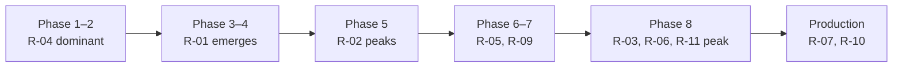

# Risk Register

| Field | Value |
| --- | --- |
| Document ID | PRJ-02 |
| Version | 2.0 |
| Date | 2026-08-22 |
| Status | Approved |
| Review cadence | At each roadmap phase boundary |

> **Version 2.0** — rescored after [ADR-008](../03-design/02-adr/ADR-008-dotnet-for-android.md).
> The platform change **reduced** the project's highest people risk (R-04) by putting the codebase in
> the organisation's own language, and **added** three technology risks: R-16 (third-party server
> dependency, High), R-17 (APK size and cold start), R-18 (thinner community). R-02 and R-03 are
> unchanged — they are properties of the Android platform, not of the language calling it.

---

## 1. Scoring

**Likelihood** — 1 rare · 2 unlikely · 3 possible · 4 likely · 5 near-certain
**Impact** — 1 negligible · 2 minor · 3 moderate · 4 major · 5 severe
**Score** = likelihood × impact

| Score | Band | Response |
| --- | --- | --- |
| 15–25 | **Critical** | Active mitigation required now; tracked weekly |
| 8–14 | **High** | Mitigation planned and owned |
| 4–7 | **Medium** | Monitored; contingency identified |
| 1–3 | **Low** | Accepted |

---

## 2. Register

| ID | Risk | L | I | Score | Band |
| --- | --- | :-: | :-: | :-: | --- |
| **R-01** | Purchased printer does not support a planned language | 3 | 4 | **12** | High |
| **R-02** | BLE chunking and flow control produce corrupt output | 4 | 5 | **20** | **Critical** |
| **R-03** | Android battery optimisation silently kills the service | 4 | 4 | **16** | **Critical** |
| **R-04** | Single-developer capacity — illness, reassignment, departure | 3 | 5 | **15** | **Critical** |
| **R-05** | Device or browser policy blocks loopback HTTP | 2 | 5 | **10** | High |
| **R-06** | Labels print but scan unreliably in the field | 3 | 4 | **12** | High |
| **R-07** | Duplicate prints reach production | 2 | 5 | **10** | High |
| **R-08** | Schedule slips past the operational window | 3 | 3 | **9** | High |
| **R-09** | Older Android versions in the fleet behave differently | 3 | 3 | **9** | High |
| **R-10** | Web app origin changes, breaking the allowlist fleet-wide | 3 | 3 | **9** | High |
| **R-11** | Operators reject the workflow | 2 | 4 | **8** | High |
| **R-12** | Media switching between labels and receipts is impractical | 3 | 3 | **9** | High |
| **R-13** | EmbedIO or a dependency has an Android-specific defect | 2 | 3 | **6** | Medium |
| **R-14** | MDM cannot set managed configuration | 2 | 2 | **4** | Medium |
| **R-15** | Signing keystore lost | 1 | 5 | **5** | Medium |
| **R-16** | Third-party embedded server unmaintained or defective, with no supported alternative on Android | 3 | 4 | **12** | High |
| **R-17** | .NET for Android APK size or cold start misses target on rugged hardware | 3 | 2 | **6** | Medium |
| **R-18** | Thin community and documentation for .NET for Android without MAUI | 3 | 2 | **6** | Medium |

---

## 3. Critical risks

### R-02 — BLE chunking and flow control produce corrupt output · **20**

**Description.** Writing a payload larger than the negotiated MTU without correct per-chunk
acknowledgement causes the printer's buffer to overrun. Output truncates mid-label. The failure is
intermittent, depends on printer buffer size and timing, and — crucially — **produces a label that
looks plausible**, so it can pass a casual test and fail in production.

Identified in research as the standard failure mode for this class of project.

**Mitigation**

| Action | Where |
| --- | --- |
| Eight non-negotiable rules, each with a named test | [DES-06 §7.3](../03-design/06-printer-abstraction.md) |
| `WRITE_TYPE_DEFAULT` with per-chunk acknowledgement — never `NO_RESPONSE` | Rule 1 |
| All GATT operations serialised through `GattQueue` | Rule 6 |
| `TruncateAt` mock scenario makes the failure deterministic | [TST-01 §4.1](../05-testing/01-test-strategy.md) |
| TC-408: byte-identical output required over BLE and SPP | [TST-02](../05-testing/02-test-cases.md) |
| Longest phase allocation in the roadmap (2.5 weeks) | [PRJ-01 §3](01-roadmap.md) |
| Code comments naming the document, so the rules are not "optimised" away | [IMP-03 §9](../04-implementation/03-coding-standards.md) |

**Contingency.** If BLE proves unreliable on the chosen hardware, restrict v1.0 to Bluetooth Classic
SPP. Most mobile printers support it, and the transport abstraction makes this a configuration
decision rather than a rewrite.

---

### R-03 — Battery optimisation silently kills the service · **16**

**Description.** Android kills the foreground service to save power. The Bluetooth connection drops
without notification. The app appears healthy; prints fail intermittently and unpredictably. OEM
power managers — Xiaomi, Huawei, Oppo — are more aggressive than stock Android and require additional
per-vendor allowances.

**Mitigation**

| Action | Where |
| --- | --- |
| Foreground service typed `connectedDevice`, as required from Android 14 | FR-407 |
| First-run flow detects the state and deep-links to the correct system screen | FR-409 |
| Home screen shows a persistent warning banner while optimisation is active | [DES-09 §5.8](../03-design/09-ui-ux-spec.md) |
| MDM policy exemption applied fleet-wide at deployment | [OPS-01 §5](../06-operations/01-deployment-guide.md) |
| Battery state reported in the diagnostics bundle | FR-406 |
| Runbook §3.3 addresses it as a named symptom | [OPS-02](../06-operations/02-runbook.md) |
| Rugged handhelds (D-13) are better-behaved than consumer phones | Hardware choice |

**Contingency.** If the fleet MDM cannot exempt the app, add a periodic WorkManager health check that
restarts the service when it is found stopped.

---

### R-04 — Single-developer capacity · **15**

**Description.** One developer (D-16) is a single point of failure for the entire project. Illness,
reassignment, or departure stops it. There is no second person with context.

**Mitigation**

| Action | Where |
| --- | --- |
| **The app is written in the organisation's language.** [ADR-008](../03-design/02-adr/ADR-008-dotnet-for-android.md) moved the platform to .NET for exactly this reason — a Kotlin codebase in a .NET organisation has a permanent maintainer count of one | [ADR-008](../03-design/02-adr/ADR-008-dotnet-for-android.md) |
| This documentation set — 35 documents covering the full lifecycle | `Docs/` |
| Every architectural decision recorded with its rejected alternatives, **including the superseded ones** | 9 ADRs |
| Requirement IDs traced from SRS through stories to test cases | NFR-605 |
| Conventional stack with no exotic dependencies | [IMP-01](../04-implementation/01-tech-stack.md) |
| Code comments naming the document behind each non-obvious constraint | [IMP-03 §9](../04-implementation/03-coding-standards.md) |
| Phase boundaries produce demonstrable increments, not half-finished work | [PRJ-01 §2](01-roadmap.md) |

**Two things mitigate R-04, and the language is the larger of them.** Documentation lets a
newcomer understand the project; a familiar language lets the organisation actually staff it. The
platform change scored higher against this risk than anything else available.

**Contingency.** Phases 1–4 produce `Bifrost.Core` and `Bifrost.Drivers`, which target `net10.0` with
no Android dependency — ordinary C# any .NET developer can read. If handover becomes necessary
mid-project, complete the current phase before pausing.

---

## 4. High risks

### R-01 — Printer does not support a planned language · **12**

The purchase decision (Q-01) is open. If the chosen model speaks only a proprietary language, a new
driver is needed.

**Mitigation.** The driver abstraction exists before any driver
([ADR-007](../03-design/02-adr/ADR-007-printer-language-abstraction.md)), so a new language costs one
`PrinterDriver` implementation and nothing else (FR-610). The hardware recommendation
([OPS-03](../06-operations/03-hardware-recommendation.md)) restricts the shortlist to models speaking
CPCL, ZPL, or ESC/POS, and recommends buying one evaluation unit before the fleet order.

**Contingency.** A new driver is roughly one week given the abstraction and the golden-output test
pattern.

---

### R-05 — Loopback HTTP blocked by policy · **10**

Low likelihood — Chrome exempts loopback from mixed-content blocking and this is settled behaviour —
but the impact is total: the bridge becomes unreachable.

**Mitigation.** `bifrost://print?job=<base64>` deep-link fallback is specified (FR-104), so printing
degrades rather than stops. Verified early: TC-101 runs in Phase 6, well before rollout.

**Contingency.** Implement FR-104 fully — it is already specified and estimated at 3 points.

---

### R-06 — Labels print but scan unreliably · **12**

A label can print acceptably and still fail to scan: `moduleWidth` too small, glossy media, low
battery producing faint output, or a dirty printhead. The defect is discovered weeks later at
picking, when the cause is untraceable.

**Mitigation**

| Action | Where |
| --- | --- |
| Symbology validation rejects unscannable data at submit time | FR-309, TC-309 … TC-312 |
| Field scenario F-10 requires scanning every printed label | [TST-01 §6](../05-testing/01-test-strategy.md) |
| Media guidance: matt, not gloss; test adhesion on real surfaces | [OPS-03 §7.2](../06-operations/03-hardware-recommendation.md) |
| Weekly scan spot-check in preventive maintenance | [OPS-02 §9](../06-operations/02-runbook.md) |
| **Print verification loop** closes the gap permanently | FR-405, v1.1 |

**Contingency.** Prioritise FR-405 into v1.0 if field testing shows scan failures.

---

### R-07 — Duplicate prints reach production · **10**

Low likelihood given the design, severe impact: two bins claiming one identity is a data-integrity
fault in the physical warehouse.

**Mitigation.** Idempotency is designed into the API and the queue, not bolted onto retry
([DES-07 §5](../03-design/07-job-lifecycle.md)). The `UNIQUE` constraint enforces it at the database
level, so concurrency cannot defeat it. Interrupted `SENDING` jobs are deliberately **not**
auto-retried ([DES-07 §6.1](../03-design/07-job-lifecycle.md)). Tests TC-104 … TC-107 and TC-118 are
all P1 and land in Phase 2, before anything can physically print.

**Contingency.** [OPS-02 §5.3](../06-operations/02-runbook.md) treats any duplicate as an immediate
level-3 escalation with diagnostics attached — never as something to work around.

---

### R-08 — Schedule slip · **9**

18 weeks single-developer. Phase 5 (transport) carries the most uncertainty.

**Mitigation.** Phases end with demonstrable increments, so slip is visible early rather than at the
end. Phases 5 and 6 can be swapped if the printer arrives late. v1.1 scope is already separated, so
descoping does not require renegotiating what MVP means.

---

### R-09 — Android version differences · **9**

The fleet's exact versions are unknown (Q-02). API 29–35 spans two Bluetooth permission models,
mandatory foreground service types, and runtime notification permissions.

**Mitigation.** APIs 29, 31, and 34 are mandatory in the test matrix
([TST-01 §5.1](../05-testing/01-test-strategy.md)) because each introduced a behaviour change this
app depends on. `BluetoothPermissions` isolates the differences in one class.

---

### R-10 — Origin change breaks the fleet · **9**

If the web application moves to a new hostname, adds a port, or migrates HTTP → HTTPS, every device's
allowlist stops matching and printing fails fleet-wide with `403`.

**Mitigation.** `allowed_origins` is settable by MDM (NFR-702), so a fleet-wide fix is one push.
[OPS-02 §6.2](../06-operations/02-runbook.md) names this as a distinct symptom with the exact
comparison to make.

**Contingency.** Coordinate any web application URL change with an allowlist update pushed **first**.

---

### R-16 — Third-party embedded server dependency · **12**

**Description.** ASP.NET Core does not run on Android — there is no `Microsoft.AspNetCore.App`
runtime pack for `android-arm64`, and it is an acknowledged product gap rather than a configuration
error. The HTTP + WebSocket server on the critical path is therefore a third-party library whose
maintenance is outside our control, chosen from a small field.

This risk was **created** by the platform decision. It did not exist under Ktor, which is
first-party for Kotlin.

**Mitigation**

| Action | Where |
| --- | --- |
| EmbedIO accessed only through `IBridgeServer`; routes, auth, and CORS reference no server type | [ADR-009](../03-design/02-adr/ADR-009-embedded-http-server.md) |
| Banned-symbols analyzer fails the build on any `EmbedIO` reference outside the adapter project | [IMP-02 §2.2](../04-implementation/02-project-structure.md) |
| CI check enforces the boundary on every push | [TST-01 §8](../05-testing/01-test-strategy.md) |
| GenHTTP identified as the ready alternative, already evaluated | [ADR-009](../03-design/02-adr/ADR-009-embedded-http-server.md) |
| EmbedIO chosen specifically for its Xamarin.Android track record over a more modern API | [ADR-009](../03-design/02-adr/ADR-009-embedded-http-server.md) |

**Contingency.** Swapping to GenHTTP means one new `IBridgeServer` implementation and one line in the
composition root. Estimated at two to three days, precisely because the abstraction was built before
it was needed.

---

### R-17 — APK size or cold start misses target · **6**

**Description.** .NET for Android carries a runtime Kotlin does not. The APK budget rose from 15 MB
to 30 MB, and cold start — NFR-105, ≤ 3 s to listening — is tighter than it was.

**Mitigation.** Release builds enable `PublishTrimmed`, `RunAOTCompilation`, profiled AOT, and
single-ABI (`android-arm64`) packaging ([IMP-02 §6](../04-implementation/02-project-structure.md)).
Both metrics are measured in CI (TC-805, TC-814) rather than discovered at rollout.

**Contingency.** If cold start misses, defer non-essential initialisation: the server and printer
connection come up first; history and settings can load lazily. If size misses, the fleet is
MDM-distributed on Wi-Fi, so a larger APK costs installation time rather than user experience.

---

### R-18 — Thin community for .NET for Android without MAUI · **6**

**Description.** Most .NET mobile documentation and community answers assume MAUI. Plain .NET for
Android has fewer worked examples, and Android-specific problems are usually answered in Kotlin.

**Mitigation.** The Android API surface is identical — `BluetoothSocket`, `BluetoothGatt`,
`ServiceInfo.ForegroundServiceTypeConnectedDevice` are the same types with C# casing — so official
Android documentation applies directly and a Kotlin answer translates mechanically. Every non-obvious
platform constraint is captured in [DES-06](../03-design/06-printer-abstraction.md) and referenced
from code comments ([IMP-03 §9](../04-implementation/03-coding-standards.md)), so the project does
not depend on re-finding those answers.

**Contingency.** None needed — this is a friction risk, not a blocking one.

---

### R-11 — Operators reject the workflow · **8**

If setup is confusing or errors are opaque, operators revert to walking to the print station and the
project delivers nothing regardless of technical quality.

**Mitigation.** Guided first run under 3 minutes (NFR-503); plain-English messages with an action, not
error codes (NFR-501); the notification carries state without opening the app (NFR-502); F-13
validates setup with an untrained operator. The amber/red distinction in
[DES-09 §3](../03-design/09-ui-ux-spec.md) is specifically designed so operators learn in one shift
what they can fix themselves.

---

### R-12 — Media switching is impractical · **9**

One printer must handle both labels and receipts (D-08). If operators must physically change media
several times an hour, the workflow fails for reasons no software can fix.

**Mitigation.** [OPS-03 §7.1](../06-operations/03-hardware-recommendation.md) requires confirming
media-change time and auto-detection before purchase. The app supports the switch via
`options.mediaType`.

**Contingency.** Revisit D-08 — issue two printers to high-volume operators. The app already supports
multi-printer routing in its backlog and the per-printer consumer model assumes it.

---

## 5. Medium risks

| ID | Risk | Mitigation |
| --- | --- | --- |
| R-13 | EmbedIO or a dependency misbehaves on Android | Every dependency confirmed `netstandard2.0` or `net10.0-android` before adoption ([IMP-01 §7](../04-implementation/01-tech-stack.md)); the server is swappable via `IBridgeServer` ([ADR-009](../03-design/02-adr/ADR-009-embedded-http-server.md)) |
| R-14 | MDM cannot set managed configuration | Every setting is also available in the app UI; deployment falls back to per-device setup |
| R-15 | Signing keystore lost | Backed up outside the repository and off the development machine. Loss means every device needs uninstall and reinstall, losing pairing and history ([OPS-01 §3.1](../06-operations/01-deployment-guide.md)) |

---

## 6. Risk over time

| Stage | Dominant risk | Why |
| --- | --- | --- |
| Phases 1–2 | R-04 capacity, R-18 | Nothing demonstrable yet; the project exists only in one person's head and these documents. Early .NET-for-Android friction lands here too |
| Phases 3–4 | R-01 hardware | The driver decision approaches without the printer decided |
| Phase 5 | **R-02 BLE** | The technical peak of the project |
| Phases 6–7 | R-05, R-09, R-16, R-17 | Platform behaviour meets reality; the server library and the APK budget are exercised for the first time |
| Phase 8 | R-03, R-06, R-11 | Field conditions expose what no test harness reproduces |
| Production | R-07, R-10 | Rare but severe: duplicates and fleet-wide origin breakage |

---

## 7. Review

Reviewed at each phase boundary ([PRJ-01 §2](01-roadmap.md)). At each review:

1. Rescore every open risk — likelihood usually falls as work is completed
2. Close risks whose mitigation is verified by a passing test
3. Add risks discovered during the phase
4. Escalate anything that has entered the Critical band

| Risk | Closes when |
| --- | --- |
| R-02 | TC-406 and TC-408 pass on real BLE hardware |
| R-01 | The chosen printer prints correctly via an implemented driver |
| R-07 | TC-104 … TC-107 and TC-118 pass, and no field duplicate occurs in the first month |
| R-05 | TC-101 succeeds from the production web app origin |
| R-03 | One week of fleet operation with no unexplained disconnects |
| R-16 | EmbedIO carries the full endpoint suite in Phase 6 with no boundary violation in CI |
| R-17 | TC-805 and TC-814 pass on production hardware |

---

## 8. Related documents

- [Roadmap](01-roadmap.md)
- [Printer Abstraction §7.3](../03-design/06-printer-abstraction.md)
- [Test Strategy](../05-testing/01-test-strategy.md)
- [Runbook](../06-operations/02-runbook.md)
