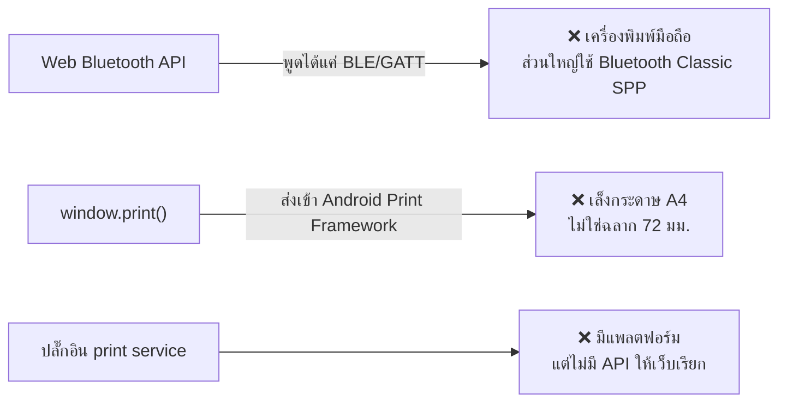
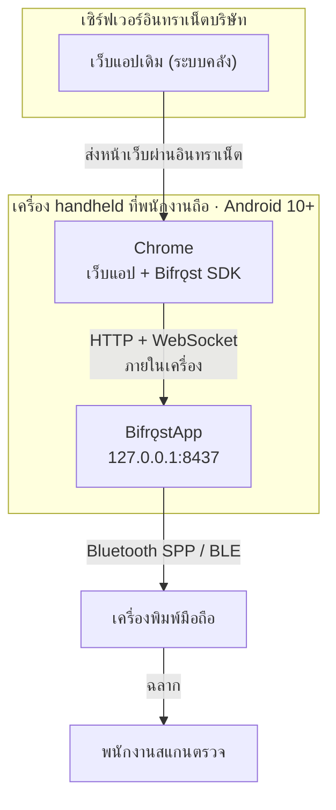
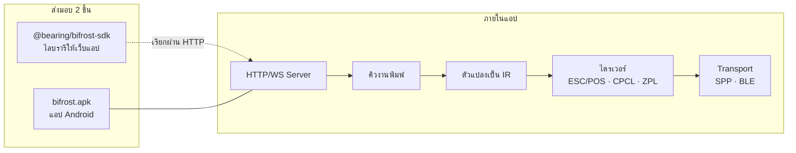

# BifrǫstApp — ภาพรวมระบบ

> **ให้เว็บแอปสั่งพิมพ์เครื่องพิมพ์ Bluetooth ได้ด้วยคำสั่งเดียว** — ไม่ใช้คลาวด์ ไม่ผูกกับผู้ขายรายใด และไม่มีฉลากซ้ำ

| | |
| --- | --- |
| เวอร์ชันเอกสาร | 3.0 (รวบเอกสาร 40 ฉบับเหลือ 5) |
| วันที่ | 28 สิงหาคม 2026 |
| สถานะ | ต้นแบบใช้งานได้จริง — 190 เทสต์ผ่าน, ฉลากจริงออกจาก Zebra ZQ320 |
| แพลตฟอร์ม | .NET for Android (C#) + TypeScript SDK |
| เจ้าของ | Bearing Team |

---

## สารบัญ

| # | เอกสาร | อ่านเมื่อ |
| :-: | --- | --- |
| — | **ภาพรวม** (ไฟล์นี้) | อยากรู้ว่าระบบคืออะไร ตัดสินใจอะไรไว้บ้าง |
| 01 | [ระบบทำงานอย่างไร](01-how-it-works.md) | ต้องรู้ API, รูปแบบข้อมูล, วงจรงานพิมพ์, ความปลอดภัย |
| 02 | [คู่มือนักพัฒนา](02-developer-guide.md) | จะเพิ่มปุ่มพิมพ์ในเว็บ หรือจะแก้ตัวแอป |
| 03 | [คู่มือใช้งานและดูแลระบบ](03-operations.md) | ติดตั้ง ใช้งาน หรือแก้ปัญหาหน้างาน |
| 04 | [สถานะและแผนงาน](04-status-and-plan.md) | รายงานหัวหน้า / อยากรู้ว่าเหลืออะไร |

---

## 1. ปัญหา

พนักงานคลังทำงานบนเว็บแอปผ่านเครื่องมือถือ และต้องพิมพ์ฉลากลงเครื่องพิมพ์ที่คาดเอว
**แต่เบราว์เซอร์เข้าถึงเครื่องพิมพ์นั้นไม่ได้**



**ผลที่เกิดขึ้นทุกวัน** — สแกนพาร์ทที่ชั้นวาง → **เดินไปสถานีพิมพ์** → **พิมพ์เลขพาร์ทซ้ำด้วยมือ** →
สั่งพิมพ์ → **เดินกลับ** (3 ใน 5 ขั้นคือความสูญเปล่า)

### ทำไมไม่ซื้อของสำเร็จรูป

| ทางเลือก | ทำไมใช้ไม่ได้ |
| --- | --- |
| QZ Tray | สถาปัตยกรรมถูกต้องที่สุด แต่**ไม่มีรุ่นสำหรับ Android** |
| PrintNode / CloudPRNT | ต้องต่ออินเทอร์เน็ต + คิดเงินรายเครื่อง ขัดกับนโยบายเครือข่ายภายใน |
| SDK ของผู้ผลิตเครื่องพิมพ์ | ผูกสถาปัตยกรรมกับยี่ห้อเดียว ทั้งที่ยังไม่ได้ตัดสินใจซื้อรุ่นไหน |

---

## 2. ทางออก

แอป Android ที่รันเซิร์ฟเวอร์เล็ก ๆ อยู่ในเครื่องเอง รับ HTTP จากเบราว์เซอร์บนเครื่องเดียวกัน
แล้วขับเครื่องพิมพ์ผ่าน Bluetooth



### สามข้อที่ต้องเข้าใจตรงกันทั้งทีม

| ข้อเท็จจริง | ผลที่ตามมา |
| --- | --- |
| **เบราว์เซอร์กับเครื่องพิมพ์ต้องอยู่เครื่องเดียวกัน** | เป็นการออกแบบ ไม่ใช่ข้อจำกัดชั่วคราว — และเป็นเหตุผลที่ไม่ต้องมี relay ไม่ต้องมีใบรับรอง |
| **เซิร์ฟเวอร์บริษัทไม่เคยคุยกับ Bifrǫst โดยตรง** | มันแค่ส่งหน้าเว็บมา การสั่งพิมพ์เกิดที่เบราว์เซอร์ · C# ฝั่งเซิร์ฟเวอร์เรียก `127.0.0.1` **ไม่ได้** |
| **ไม่ใช้อินเทอร์เน็ตเลย** | APK รุ่นจริงไม่มีแม้แต่สิทธิ์ `INTERNET` และมีเทสต์ตรวจทุกครั้งที่ build |

> Chrome ถือว่า `127.0.0.1` เป็น trustworthy origin หน้า **HTTPS จึงเรียกได้โดยไม่โดนบล็อก
> mixed-content** และไม่ต้องติดตั้งใบรับรองบนเครื่อง

---

## 3. องค์ประกอบที่ส่งมอบ



| โมดูล | หน้าที่ | พึ่ง Android? |
| --- | --- | :-: |
| `Bifrost.Core` | โมเดลข้อมูล, DSL compiler, เครื่องพิมพ์จำลอง | ✗ |
| `Bifrost.Drivers` | ESC/POS, CPCL, ZPL, เครื่องมือจัดหน้า | ✗ |
| `Bifrost.Server` | นิยาม route ของ API | ✗ |
| `Bifrost.Server.EmbedIO` | อะแดปเตอร์ไปยังไลบรารีเซิร์ฟเวอร์ (สลับได้) | ✗ |
| `Bifrost.Transport` | Bluetooth SPP, ตรวจภาษาเครื่องพิมพ์ | ✓ |
| `Bifrost.App` | หน้าจอ + foreground service | ✓ |
| `sdk/` | TypeScript SDK + อะแดปเตอร์ React / Angular / `<script>` | — |
| `clients/dotnet/` | ไคลเอนต์ .NET (Blazor, MAUI, WPF) | — |

**กฎเหล็ก: `Core`, `Drivers`, `Server` ห้ามมี `using Android`** — เพราะโค้ดที่ไม่พึ่ง Android รันเทสต์
บนเครื่องพัฒนาได้ในไม่ถึงวินาที ส่วนที่พึ่ง Android ต้องเสียบเครื่องจริงทุกครั้ง มีสคริปต์
`tools/scripts/verify-boundaries.sh` ตรวจอัตโนมัติ

---

## 4. การตัดสินใจสำคัญ

ทุกข้อผ่านการเทียบทางเลือกแล้ว เก็บไว้เพื่อไม่ให้ถูกรื้อโดยไม่รู้เหตุผลเดิม

| # | เรื่อง | เลือก | เพราะ |
| :-: | --- | --- | --- |
| 1 | **โครงสร้างเครือข่าย** | เซิร์ฟเวอร์ loopback `127.0.0.1:8437` | ไม่ใช่ cloud relay (ต้องต่อเน็ต) ไม่ใช่ LAN service (ต้องค้นหาอุปกรณ์) — เบราว์เซอร์กับเครื่องพิมพ์อยู่เครื่องเดียวกันอยู่แล้ว |
| 2 | **แพลตฟอร์ม** | .NET for Android (C#) ไม่ใช้ MAUI | เดิมเลือก Kotlin จากความเหมาะทางเทคนิค แต่ภาษาที่องค์กรดูแลต่อได้สำคัญกว่า เมื่อมีผู้พัฒนาคนเดียว · MAUI ไม่คุ้มสำหรับ 6 หน้าจอ |
| 3 | **เว็บเซิร์ฟเวอร์** | EmbedIO หลัง `IBridgeServer` | **ASP.NET Core ไม่มี runtime pack สำหรับ Android** · ห่อด้วย abstraction ไว้เพื่อสลับตัวได้ |
| 4 | **รูปแบบ payload** | 3 ระดับ → โครงสร้างกลางเดียว | เทมเพลตสำหรับ 90% ของงาน · DSL สำหรับ layout ที่ผันแปร · raw เป็นทางออกฉุกเฉิน |
| 5 | **คิวงาน** | SQLite + ผู้บริโภคคนเดียว | รอดจากแอปพังและการรีบูต · ส่งทีละงานเป็นคุณสมบัติเชิงโครงสร้าง ไม่ใช่ข้อจำกัด |
| 6 | **กันฉลากซ้ำ** | `Idempotency-Key` หน้าต่าง 24 ชม. | ฉลากซ้ำคือความคลาดเคลื่อนของข้อมูลสต็อก ไม่ใช่ปัญหาความสวยงาม |
| 7 | **ความปลอดภัย** | Origin allowlist + bearer token, จับคู่ด้วย QR | โปรแกรมใดก็ตามบนเครื่องเดียวกันเข้าถึงพอร์ต loopback ได้ · handheld มีเครื่องสแกนอยู่แล้ว ไม่ต้องพิมพ์รหัส 43 ตัว |
| 8 | **ไดรเวอร์** | นิยาม `IPrinterDriver` / `IPrinterTransport` ก่อนเขียนตัวจริง | ตอนตัดสินใจยังไม่ได้ซื้อเครื่องพิมพ์ — ทำให้งาน 4 เฟสแรกเดินได้โดยไม่ต้องรอฮาร์ดแวร์ |

> **สองข้อที่เคยตัดสินใจแล้วเปลี่ยน** — เดิมเลือก Kotlin (เปลี่ยนเป็น .NET) และ Ktor (เปลี่ยนเป็น
> EmbedIO) ทั้งสองครั้ง **สถาปัตยกรรมไม่เปลี่ยนเลย** เปลี่ยนแค่ไลบรารีที่มาเติมในช่องเดิม

---

## 5. ค่าคงที่ของระบบ

ค่าอ้างอิงกลาง เอกสารหรือโค้ดที่ระบุค่าเหล่านี้ต้องตรงกับตารางนี้

| ค่า | ค่าที่กำหนด |
| --- | --- |
| ที่อยู่ที่ฟัง | `127.0.0.1` เท่านั้น ไม่เคยเป็น `0.0.0.0` |
| พอร์ต | `8437` |
| คำนำหน้า API | `/v1` — เปลี่ยนแบบ breaking ต้องขึ้น `/v2` |
| Android package | `com.bearing.bifrost` |
| SDK package | `@bearing/bifrost-sdk` |
| Min / Target SDK | 29 (Android 10) / 36 |
| Token จับคู่ | 32 ไบต์ (256 บิต) base64url |
| QR จับคู่ | อายุ 5 นาที ใช้ได้ครั้งเดียว |
| หน้าต่างกันซ้ำ | 24 ชั่วโมง |
| ลองใหม่สูงสุด | 5 ครั้ง — ถ่วงเวลา 2 วิ · 8 วิ · 30 วิ · 120 วิ · 300 วิ |
| คิวสูงสุด | 500 งาน |
| เก็บประวัติ | 30 วัน หรือ 1000 งาน แล้วแต่ถึงก่อน |
| ขนาด request สูงสุด | 2 MB |
| Timeout ต่องาน | 30 วินาที |
| BLE MTU | เจรจาถึง 512 ไบต์ ถอยลงมาที่ 23 ถ้าล้มเหลว |
| เก็บ log | 7 วัน สูงสุด 10 MB หมุนไฟล์ |

---

## 6. ขอบเขต

| ✅ ทำ | ❌ ไม่ทำ (และเหตุผล) |
| --- | --- |
| พิมพ์ฉลากและใบเสร็จจากเว็บด้วยคำสั่งเดียว | สร้างหรือแทนที่เว็บแอปของบริษัท — Bifrǫst เป็นสะพาน ไม่ใช่ระบบงาน |
| ทนต่อ Wi-Fi หลุด เครื่องพิมพ์ดับ และแอปรีสตาร์ท | พิมพ์จากเครื่องอื่นที่ไม่ใช่เครื่องที่รันแอป — โครงสร้างเครื่องเดียวคือหัวใจของการทำให้ง่าย |
| รับประกันว่างานเดิมไม่ถูกพิมพ์ซ้ำ | รองรับ iOS — ฝูงเครื่องเป็น Android ล้วน |
| รองรับ Bluetooth Classic SPP และ BLE หลายยี่ห้อ | คลาวด์ บัญชีผู้ใช้ หรือ telemetry — เครือข่ายเป็นอินทราเน็ตล้วน |
| ติดตั้งและตรวจสอบได้บนเครื่อง 20–100 เครื่องโดยคนเดียว | ข้อความภาษาไทยบนฉลาก — เนื้อหาเป็นอังกฤษและตัวเลข |
| นักพัฒนาเว็บไม่ต้องรู้จัก ESC/POS, ZPL, CPCL | ยืนยันตัวตนรายบุคคลและ audit trail — เลื่อนไปก่อน เครื่องอยู่ในความควบคุมทางกายภาพ |
| เปลี่ยนหน้าตาฉลากได้โดยไม่ต้อง deploy เว็บ | ขายเชิงพาณิชย์ — ใช้ภายในองค์กรเดียว |

---

## 7. ตัวชี้วัดความสำเร็จ

| ตัวชี้วัด | เป้าหมาย |
| --- | --- |
| อัตราพิมพ์สำเร็จ | ≥ 99% |
| เวลาตั้งแต่กดจนกระดาษออก (p95) | ≤ 3 วินาที |
| **ฉลากซ้ำ** | **0** |
| เวลาที่นักพัฒนาเว็บใช้เพิ่มปุ่มพิมพ์ 1 หน้า | ≤ 30 นาที |
| ปัญหาที่พนักงานแก้เองได้ | ≥ 90% |
| การเดินไปสถานีพิมพ์ | เป็นศูนย์ |

---

## 8. คำศัพท์

| คำ | ความหมาย |
| --- | --- |
| **Bridge** | ตัวแอป Android ที่รับ HTTP แล้วขับเครื่องพิมพ์ |
| **Loopback / `127.0.0.1`** | ที่อยู่ที่วนกลับมาที่เครื่องตัวเอง ไม่ออกไปข้างนอก |
| **SPP** | Serial Port Profile — Bluetooth Classic แบบสายอนุกรม ใช้กับเครื่องพิมพ์มือถือส่วนใหญ่ |
| **BLE / GATT** | Bluetooth Low Energy — คนละโปรโตคอลกับ SPP ต้องส่งข้อมูลเป็นชิ้นเล็ก |
| **ESC/POS · CPCL · ZPL** | ภาษาคำสั่งเครื่องพิมพ์ คนละตระกูล คุยข้ามกันไม่ได้ |
| **IR (`PrintDocument`)** | โครงสร้างข้อมูลกลางที่ทุก payload ยุบลงมาก่อนถึงไดรเวอร์ |
| **Idempotency** | การรับประกันว่าส่งคำสั่งเดิมซ้ำกี่ครั้งก็เกิดผลครั้งเดียว |
| **Foreground service** | บริการ Android ที่มีการแจ้งเตือนค้าง เพื่อไม่ให้ระบบฆ่าทิ้งเมื่อสลับแอป |
| **MDM** | ระบบบริหารอุปกรณ์ ใช้ติดตั้งแอปลงเครื่องจำนวนมากพร้อมกัน |
| **Golden-output test** | เทสต์ที่เทียบไบต์ที่ไดรเวอร์ส่งออกทีละไบต์กับค่าที่ถูกต้อง |

---

## 9. หมายเหตุเรื่องเอกสาร

เอกสารชุดนี้ **รวบจาก 40 ไฟล์ (11,000 บรรทัด) เหลือ 5 ไฟล์** เมื่อ 28 ส.ค. 2026
รายละเอียดที่ตัดออก — สเปก API ทีละฟิลด์, ADR ฉบับเต็ม 9 ฉบับ, test case 147 รายการ, user story 23
เรื่อง, SRS 106 ข้อ — **ยังอยู่ครบใน git ที่ commit `a76a494`** เรียกดูได้ด้วย

```bash
git show a76a494:Docs/03-design/03-local-api-spec.md
git checkout a76a494 -- Docs/          # ถ้าต้องการกู้กลับมาทั้งหมด
```

สิ่งที่เก็บไว้คือส่วนที่ใช้ตัดสินใจและใช้ทำงานจริง สิ่งที่ตัดคือรายละเอียดที่โค้ดกับเทสต์เป็น
แหล่งความจริงที่แม่นกว่าอยู่แล้ว
